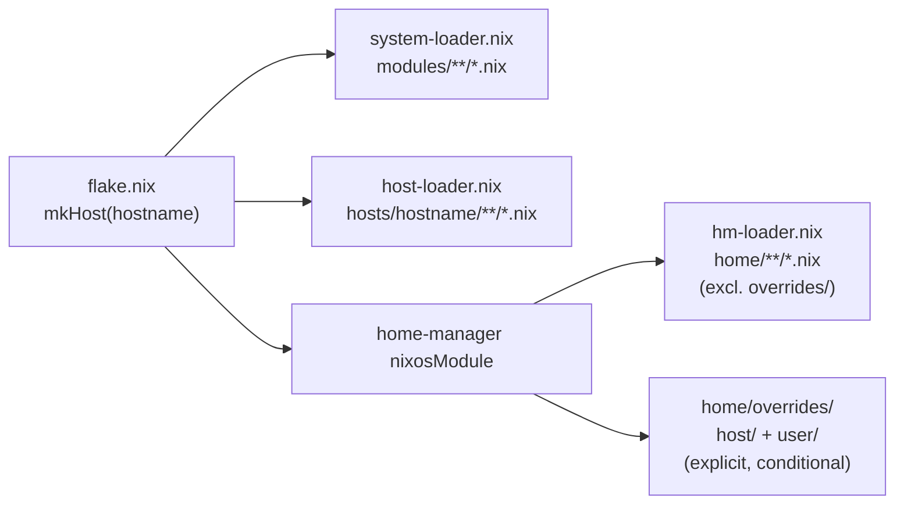

## NixOS Configuration

Modular NixOS flake with automatic module loading for multiple hosts.

## Quick Start

```bash
git clone --depth=1 https://github.com/telometto/nix-config.git
cd nix-config
sudo nixos-rebuild switch --flake .#<hostname>
```

## Features

- **Auto-loaded modules** — Drop files in [modules/](modules/) or [home/](home/)
  and they're automatically imported
- **Role-based defaults** — Enable `sys.role.desktop` or `sys.role.server` for
  sensible defaults
- **Per-host toggles** — Enable users and services per machine with `sys.*`
  options

## Loader Fan-out



## Repository Structure

| Directory | Purpose |
|-----------|---------|
| [modules/](modules/) | System modules (`sys.*` options) — auto-loaded |
| [home/](home/) | Home Manager modules (`hm.*` options) — auto-loaded |
| [hosts/](hosts/) | Host configurations — auto-loaded per host |
| [vms/](vms/) | Legacy MicroVM definitions (24 VMs, migration source inventory) |
| [containers/](containers/) | Rootless Podman containers (Home Manager modules) |
| [lib/](lib/) | Shared helpers (Traefik, Grafana, constants) |
| [dashboards/](dashboards/) | Grafana dashboard JSON files |
| [docs/](docs/) | Documentation |

## Host Configuration

```nix
# hosts/<hostname>/<hostname>.nix
{
  sys.role.desktop.enable = true;      # or sys.role.server.enable
  sys.desktop.flavor = "kde";          # gnome, kde, hyprland
  sys.users.zeno.enable = true;        # enable users per host
  sys.services.tailscale.enable = true;
}
```

## Hosts

| Host | Role | Desktop | Description |
|------|------|---------|-------------|
| snowfall | Desktop | KDE | Primary workstation; AMD GPU, distributed builds, monitoring stack |
| blizzard | Server | — | Home server; ZFS, NFS, MicroVM/KubeVirt migration host, Tailscale subnet router |
| avalanche | Desktop | GNOME | ThinkPad P51; nixos-hardware module, iwlwifi+BT workaround |
| kaizer | Desktop | KDE | External access; NVIDIA GPU, multi-user (gianluca+frankie), Java |

## Common Commands

| Command | Description |
|---------|-------------|
| `sudo nixos-rebuild switch --flake .#<host>` | Apply configuration |
| `nix build .#nixosConfigurations.<host>.config.system.build.toplevel` | Build only |
| `nix fmt` | Format repository |
| `nix flake check` | Run checks |

## Lockfile Maintenance

- Incremental lock updates run automatically every 3 hours via
  `.github/workflows/update-nix-lock.yml`.
- Auto-merge for lockfile PRs is gated on successful `Flake Check` and
  `Configuration Validation` checks.
- Full lock recreation runs monthly (and manually) via
  `.github/workflows/update-nix-lock-recreate.yml` using
  `nix flake update --recreate-lock-file`.

## Documentation

| Document | Description |
|----------|-------------|
| [Tutorial: Provision Host](docs/tutorial-provision-host.md) | Set up a new machine |
| [How-To: Add Hosts and Users](docs/how-to-add-host-and-users.md) | Add new hosts/users |
| [Reference: Architecture](docs/reference-architecture.md) | Options and stack quick reference |
| [Reference: CI](docs/reference-ci.md) | CI workflows reference |
| [KubeVirt Migration Plan](docs/kubevirt-migration-plan.md) | MicroVM-to-KubeVirt migration tracker |
| [KubeVirt Operations](docs/kubevirt-operations.md) | KubeVirt/Flux/Cilium operations runbook |
| [Explanation: Design](docs/explanation-design.md) | Design decisions and rationale |
| [Architecture Blueprint](docs/Project_Architecture_Blueprint.md) | Full system architecture |

See [docs/README.md](docs/README.md) for the complete documentation index.
