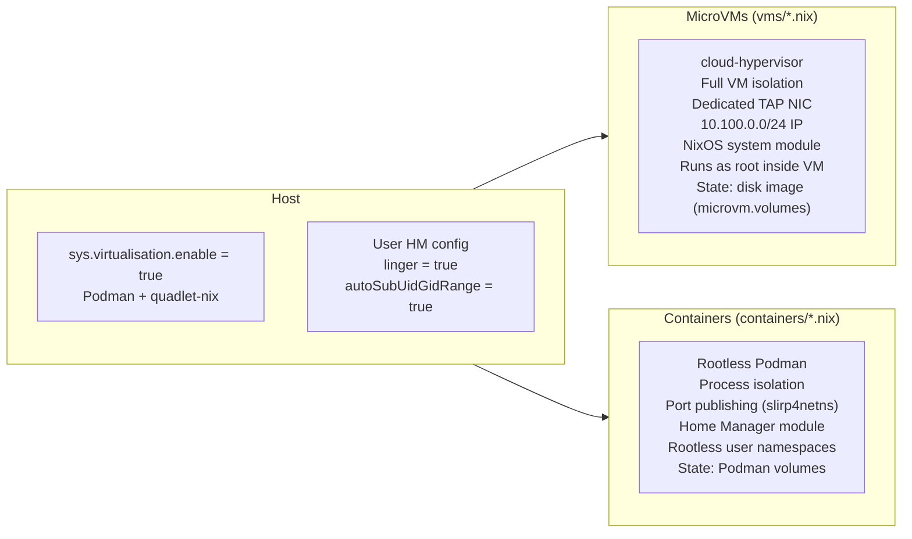

## Podman Containers (quadlet-nix)

Declarative Podman container definitions using
[quadlet-nix](https://github.com/SEIAROTg/quadlet-nix). Containers in this
directory are **Home Manager modules** designed for rootless operation under a
specific user via `virtualisation.quadlet.containers`.

______________________________________________________________________

### Containers vs MicroVMs

Both approaches run on the same host, but they serve different purposes and
have different isolation and management models:



| Aspect | MicroVMs | Containers |
|--------|----------|------------|
| Isolation | Full VM (cloud-hypervisor) | Rootless Podman pod/container |
| Network | Dedicated TAP, `10.100.0.0/24` IP | Port publishing (slirp4netns/bridge) |
| Config | System NixOS module (`vms/*.nix`) | Home Manager module (`containers/*.nix`) |
| Privilege | Runs as root inside VM | Rootless (user namespaces) |
| State | disk image (`microvm.volumes`) | Podman volumes |
| Best for | Isolated services needing a full OS | Desktop apps, lightweight services, upstream images |
| Host requirement | `sys.virtualisation.microvm.*` | `sys.virtualisation.enable` |

______________________________________________________________________

### Available Containers

| Option | File | Port(s) | Purpose |
|--------|------|---------|---------|
| `services.ollama-container.enable` | [ollama.nix](ollama.nix) | 11434 | Standalone LLM server (ROCm/AMD or CPU image) |
| `services.immich-machine-learning-container.enable` | [immich-machine-learning.nix](immich-machine-learning.nix) | 3003 | Standalone Immich ML worker (CUDA/NVIDIA or CPU image) |
| `services.subgen-container.enable` | [subgen.nix](subgen.nix) | 11027 | Whisper-based subtitle generator (CPU or AMD GPU) |
| `services.lingarr.enable` | [subtitle-stack.nix](subtitle-stack.nix) | 11025 | Full subtitle translation pipeline (lingarr + libretranslate + ollama + subgen as a pod) |
| `services.subgen.enable` | [subtitle-stack.nix](subtitle-stack.nix) | 11027 | Subgen as part of the subtitle-stack pod |
| `services.nominatim-container.enable` | [nominatim.nix](nominatim.nix) | 11080 | OpenStreetMap geocoding API (mediagis/nominatim) |

**`ollama.nix`** — Standalone LLM inference server. Supports ROCm (AMD GPU) or
CPU-only image selection. Usable on any host that has Podman. Enable via
`services.ollama-container.enable = true` in a user's HM config.

**`immich-machine-learning.nix`** — Standalone Immich machine-learning worker.
Supports CUDA (NVIDIA GPU) or CPU-only image selection. Intended for keeping
Immich's server/database/storage on a MicroVM while offloading ML inference to a
GPU-capable host. Enable via
`services.immich-machine-learning-container.enable = true` in a user's HM config.

**`subgen.nix`** — Whisper-based automatic subtitle generation. Supports CPU
or AMD GPU acceleration. Enable via `services.subgen-container.enable = true`.

**`subtitle-stack.nix`** — Full subtitle translation pipeline as a Podman pod.
Each container is conditional: `lingarr` spawns when `services.lingarr.enable = true`;
`subgen` spawns when `services.subgen.enable = true`; `libretranslate` and `ollama`
spawn only when lingarr is enabled and `services.lingarr.libretranslate.enable` /
`services.lingarr.ollama.enable` are true (both default to true). The pod itself is
active when either `services.lingarr.enable` or `services.subgen.enable` is set.

**`nominatim.nix`** — OpenStreetMap geocoding API backed by PostgreSQL 16. Runs
the `mediagis/nominatim` image as a standalone container. The initial start
downloads and imports the configured PBF file (Norway by default, ~1.5 GB
download / ~50 GB on-disk); this can take several hours — `TimeoutStartSec` is
set to `infinity` to accommodate this. Incremental OSM updates via replication
are enabled by default. The image uses default rootless Podman userns (no
`keep-id`) because its entrypoint runs as container-root to create the
`nominatim` system user and initialize the PostgreSQL cluster before dropping
privileges — this is safe; container-root maps to the host user with zero host
privilege. **Version upgrades** (e.g. 5.3 → 5.4) require running
`nominatim admin --migrate` inside the container before the new image can serve
requests; skipping this step will cause startup failures.

______________________________________________________________________

### Architecture

Container modules are imported into a user's Home Manager configuration and run
as rootless Podman Quadlet systemd user services.

**Host requirements:**

- `sys.virtualisation.enable = true` — enables Podman and quadlet-nix
- Owning user needs `linger = true` (systemd user service persistence across
  logout) and `autoSubUidGidRange = true` (rootless namespace UIDs)

```
┌─────────────────────────────────────────┐
│  Host (e.g. blizzard)                   │
│  └── sys.virtualisation.enable = true   │
│      └── Podman + quadlet-nix           │
│                                         │
│  User: zeno (linger, autoSubUidGidRange)│
│  └── Home Manager                       │
│      └── virtualisation.quadlet         │
└─────────────────────────────────────────┘
         │
         ├── ollama-container (services.ollama-container.enable)
         │   └── ollama (:11434)
         │
         ├── subgen-container (services.subgen-container.enable)
         │   └── subgen (:11027)
         │
         ├── nominatim-container (services.nominatim-container.enable)
         │   └── nominatim-standalone (:11080)
         │
         └── subtitle-stack
             ├── lingarr        (:11025)  ← services.lingarr.enable
             ├── libretranslate (:11026)
             ├── ollama         (:11434)
             └── subgen         (:11027)  ← services.subgen.enable
```

______________________________________________________________________

### Creating a New Container Module

1. Create `containers/<name>.nix` as a Home Manager module:

```nix
{ lib, config, ... }:
let
  cfg = config.services.<name>;
in
{
  options.services.<name> = {
    enable = lib.mkEnableOption "<name> container";
  };

  config = lib.mkIf cfg.enable {
    virtualisation.quadlet.containers.<name> = {
      autoStart = true;
      containerConfig = {
        image = "registry/image:tag";
        publishPorts = [ "8080:80" ];
        volumes = [ "/host/path:/container/path" ];
        environments = {
          SOME_VAR = "value";
        };
        userns = "keep-id";
      };
    };
  };
}
```

2. Wire into the host NixOS config by adding the import to
   `home-manager.users.<name>.imports` (typically in
   `hosts/<hostname>/virtualisation/containers.nix`):

```nix
# hosts/<hostname>/virtualisation/containers.nix
{ VARS, ... }:
let
  username = VARS.users.zeno.user;
in
{
  users.users.${username} = {
    linger = true;
    autoSubUidGidRange = true;
  };

  home-manager.users.${username} = {
    imports = [ ../../../containers/<name>.nix ];
    services.<name>.enable = true;
  };
}
```

3. Build and switch:

```bash
sudo nixos-rebuild switch --flake .#<hostname>
```

______________________________________________________________________

### Container Options (quadlet-nix)

Each container in `virtualisation.quadlet.containers.<name>` supports:

- `containerConfig.image` — OCI image to run
- `containerConfig.publishPorts` — Port mappings (`"host:container"` strings)
- `containerConfig.volumes` — Volume mounts (`"src:dst"` strings)
- `containerConfig.environments` — Environment variables (attrset)
- `containerConfig.environmentFiles` — Paths to env files
- `containerConfig.networks` — Network names (e.g., `[ "host" ]`)
- `containerConfig.userns` — User namespace mode (e.g., `"keep-id"`)
- `containerConfig.podmanArgs` — Extra CLI flags for `podman run`
- `containerConfig.devices` — Device passthrough (e.g., `[ "/dev/dri" ]`)
- `containerConfig.shmSize` — Shared memory size (e.g., `"4g"`)
- `autoStart` — Start on boot (default per quadlet-nix)
- `unitConfig` — Systemd unit config (Requires, After, etc.)
- `serviceConfig` — Systemd service config (Restart, TimeoutStartSec, etc.)

See [quadlet-nix options](https://seiarotg.github.io/quadlet-nix) for the
full reference.

______________________________________________________________________

### Related Documentation

- [System Modules](../modules/README.md) — Module conventions
- [MicroVM Configurations](../vms/README.md) — VM-based alternative
- [Blizzard host](../hosts/blizzard/) — Server running both VMs and containers
