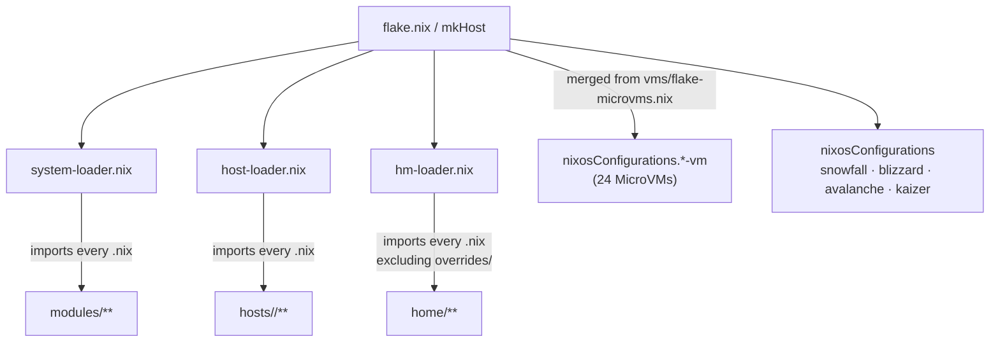
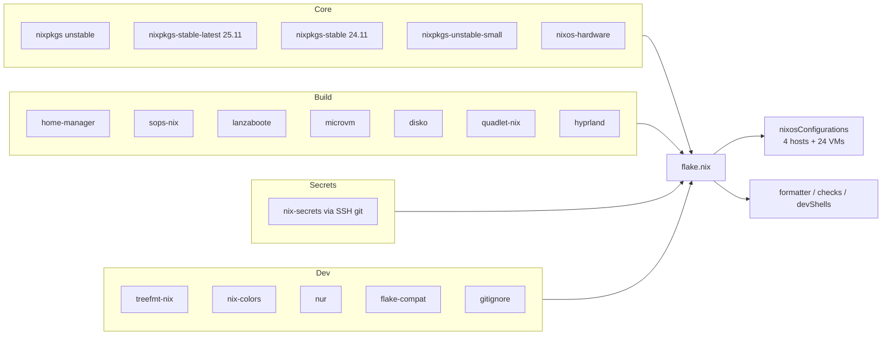
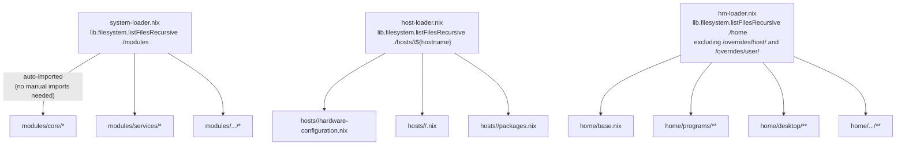
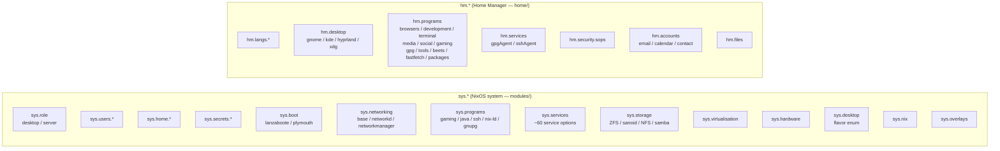
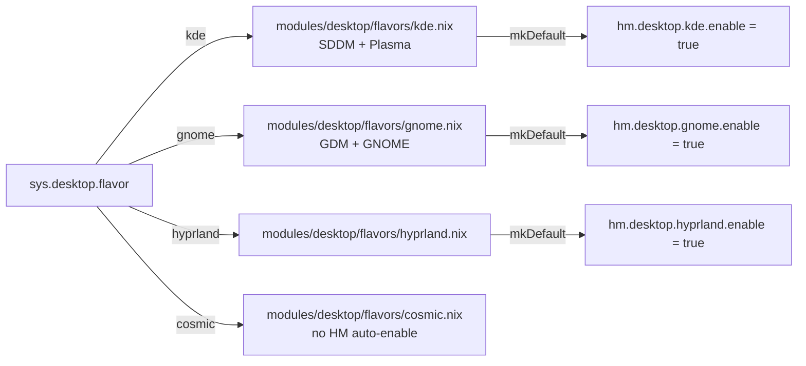
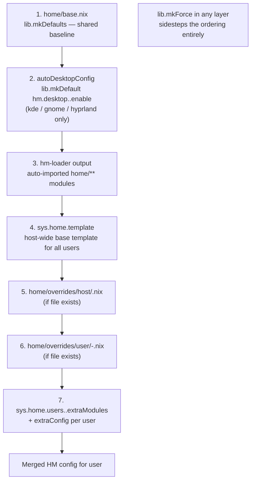
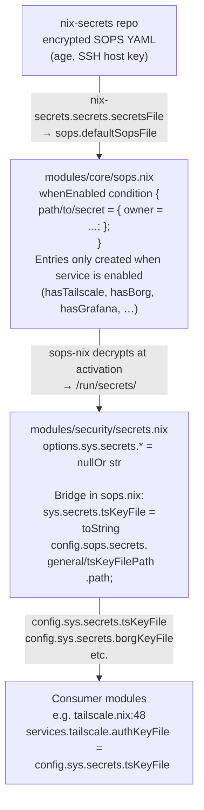
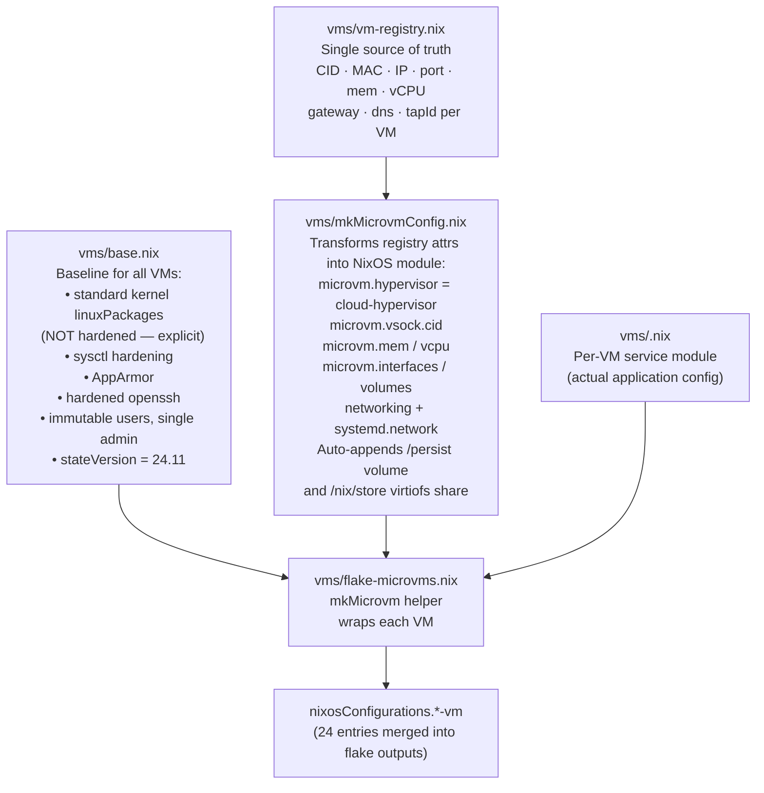
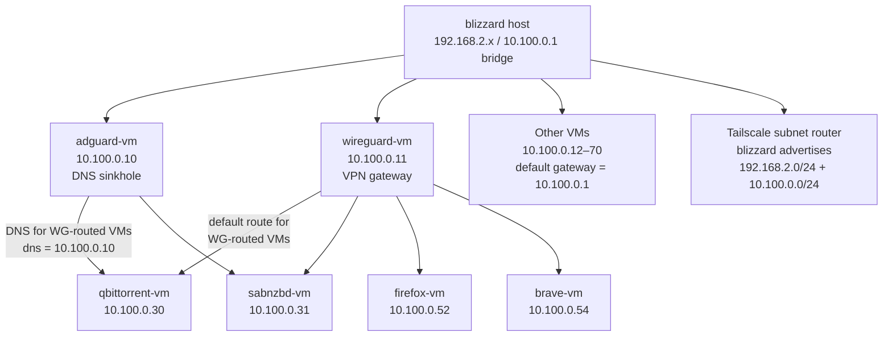

# Project Architecture Blueprint

> **Last verified: 2026-04-27**
>
> **Project Type:** NixOS Flake Configuration
>
> **Architecture Pattern:** Modular Auto-Loading with Role-Based Composition

______________________________________________________________________

## 1. Executive Summary

This repository implements a modular NixOS flake configuration for 4 physical hosts and 24 MicroVMs.
The design centres on three auto-loading mechanisms that eliminate manual `imports` lists, a
two-namespace option system (`sys.*` / `hm.*`), role files that bundle machine-class defaults,
and a layered Home Manager precedence stack that allows fine-grained per-user overrides without
forking configuration.

The diagram below shows how the single entry point (`flake.nix`) fans out to every host and VM
through the loader trio.



______________________________________________________________________

## 2. Flake Structure

### Outputs

| Output | Value |
|--------|-------|
| `nixosConfigurations` | 4 named hosts + 24 `-vm` entries (merged from `vms/flake-microvms.nix`) |
| `formatter.x86_64-linux` | treefmt wrapper (nixfmt, shfmt, yamlfmt, mdformat, jsonfmt, ruff) |
| `checks.x86_64-linux.formatting` | treefmt formatting check |
| `devShells.x86_64-linux.default` | nil, nixfmt, deadnix, statix, sops, ssh-to-age |

There are no `homeConfigurations`, `packages`, `apps`, or `templates` outputs.

### mkHost

`mkHost hostname extraModules` calls `nixpkgs.lib.nixosSystem` and always includes:

| Module | Source |
|--------|--------|
| `./system-loader.nix` | repo |
| `./host-loader.nix` | repo |
| `inputs.disko.nixosModules.disko` | disko input (included; not actively used — see §13) |
| `inputs.home-manager.nixosModules.home-manager` | home-manager |
| `inputs.sops-nix.nixosModules.sops` | sops-nix |
| `inputs.lanzaboote.nixosModules.lanzaboote` | lanzaboote |
| `inputs.microvm.nixosModules.host` | microvm |
| `inputs.quadlet-nix.nixosModules.quadlet` | quadlet-nix |

`specialArgs` passed to every module: `inputs`, `system`, `VARS`, `consts`, `self`, `hostname`.

### Flake input groups



______________________________________________________________________

## 3. Module Architecture

### Directory layout

```
modules/
├── core/           NixOS users, sops bridge, home-users wiring, locale, nix settings, overlays
├── boot/           Plymouth splash, lanzaboote Secure Boot
├── desktop/        base.nix (sys.desktop.flavor enum), flavors/ (gnome, kde, hyprland, cosmic)
├── hardware/       NVIDIA, openrazer, AMD
├── networking/     base, networkd, networkmanager, nfs-client
├── programs/       gaming+Steam, GnuPG, ssh, java, nix-ld
├── security/       secrets option declarations (sys.secrets.*), SSH hardening
├── services/       ~60 service modules (grafana, tailscale, traefik, etc.)
├── storage/        ZFS, sanoid, NFS server, Samba
├── virtualisation/ microvm host integration
├── role-desktop.nix  desktop role defaults
└── role-server.nix   server role defaults

home/
├── base.nix          shared mkDefaults for all users
├── desktop/          gnome, kde, hyprland, xdg modules
├── files/            managed dotfiles and themes
├── langs/            language toolchains (hm.langs.*)
├── programs/         browsers, development, terminal, media, social, gaming, gpg, tools, beets, fastfetch, packages
├── security/         sops HM integration
├── services/         gpgAgent, sshAgent
└── overrides/
    ├── host/         <hostname>.nix — all users on that host
    └── user/         <username>-<hostname>.nix — specific user on specific host

hosts/
├── snowfall/         desktop/KDE, AMD GPU, Prometheus+Grafana+Traefik+Cloudflare, distributed-builds
├── blizzard/         server, ZFS+NFS+Samba, MicroVM host, Tailscale subnet router, CrowdSec, k3s
├── avalanche/        desktop/GNOME, ThinkPad P51, nixos-hardware, iwlwifi patches
└── kaizer/           desktop/KDE, two users, NVIDIA, Java Temurin 8/17/21, Italian locale

vms/                  MicroVM definitions (one .nix per VM + infrastructure files)
lib/                  Nix helper functions (traefik, grafana, constants)
containers/           quadlet-nix Home Manager container modules
```

### Loader mechanics



The override files (`home/overrides/host/` and `home/overrides/user/`) are **not** auto-imported;
they are injected explicitly by `modules/core/home-users.nix` per user per host.

______________________________________________________________________

## 4. Option Namespaces

All custom options live under two top-level namespaces. Neither namespace collides with upstream
NixOS or Home Manager options.



______________________________________________________________________

## 5. Role Architecture

Roles bundle opinionated defaults for a machine class. A host sets exactly one role (or neither).

```mermaid
flowchart TD
    RD["sys.role.desktop.enable = true\nrole-desktop.nix"]
    RS["sys.role.server.enable = true\nrole-server.nix"]

    RD --> RD1[sys.boot.lanzaboote.enable]
    RD --> RD2[sys.boot.plymouth.enable]
    RD --> RD3[sys.networking.base.enable]
    RD --> RD4[sys.networking.networkmanager.enable]
    RD --> RD5[sys.programs.gaming.enable\nsys.programs.java.enable\nsys.programs.ssh.enable]
    RD --> RD6[sys.services.openssh.enable\nsys.services.pipewire.enable\nsys.services.printing.enable\nsys.services.flatpak.enable\nsys.services.tailscale.enable]
    RD --> RD7[sys.virtualisation.enable]
    RD --> RD8[sys.home.enable]
    RD --> RD9["sys.services.autoUpgrade.enable = false"]

    RS --> RS1[sys.boot.lanzaboote.enable]
    RS --> RS2["sys.boot.plymouth — NOT enabled"]
    RS --> RS3[sys.networking.base.enable]
    RS --> RS4[sys.networking.networkd.enable]
    RS --> RS5[sys.programs.ssh.enable]
    RS --> RS6[sys.services.openssh.enable\nsys.services.tailscale.enable]
    RS --> RS7["sys.services.autoUpgrade.enable\ndates = monthly\nsshKeyPath = /root/.ssh/nix-config-deploy"]
    RS --> RS8[sys.home.enable]
    RS --> RS9["gaming / audio / flatpak / virtualisation — NOT enabled"]
```



Key differences between roles:

| Feature | Desktop | Server |
|---------|---------|--------|
| Plymouth boot splash | yes | no |
| Network stack | NetworkManager | systemd-networkd |
| Gaming + Steam | yes | no |
| Pipewire audio | yes | no |
| Flatpak | yes | no |
| Virtualisation (containers/VMs) | yes | no |
| Auto-upgrade | explicitly disabled | monthly |

______________________________________________________________________

## 6. Desktop Flavors

`sys.desktop.flavor` is an enum defined in `modules/desktop/base.nix`:

```
none | gnome | kde | hyprland | cosmic
```

Each value activates the matching `modules/desktop/flavors/<flavor>.nix` (display manager, DE
packages, system integration).

Home Manager auto-enablement applies **only** to `kde`, `gnome`, and `hyprland`. `cosmic` is
present in the enum but `hm.desktop.cosmic.enable` is **not** auto-set — it must be enabled
manually.



______________________________________________________________________

## 7. Home Manager Configuration

### Integration wiring

`modules/home-manager-integration.nix` sets global HM options:

- `useGlobalPkgs = true`, `useUserPackages = true`
- `backupFileExtension = "backup"`
- `sharedModules`: sops-nix HM, hyprland HM, quadlet-nix HM
- `extraSpecialArgs`: `inputs`, `VARS`, `hostName`

`modules/core/home-users.nix` discovers every `sys.users.<name>.enable = true` user and builds
a per-user config from the 7-layer precedence stack below.

### 7-layer precedence stack (lowest to highest)



`home/overrides/host/ssh-common.nix` is a shared SSH config fragment imported manually — it is
not named after a hostname and therefore bypasses the auto-override path.

### Home Manager option categories

| Category | Sub-keys |
|----------|----------|
| `hm.langs` | language toolchains |
| `hm.desktop` | gnome, kde, hyprland, xdg |
| `hm.programs` | browsers, development, terminal, media, social, gaming, gpg, tools, beets, fastfetch, packages |
| `hm.services` | gpgAgent, sshAgent |
| `hm.security` | sops |
| `hm.accounts` | email, calendar, contact |
| `hm.files` | managed dotfiles |

______________________________________________________________________

## 8. Secrets Architecture

Secrets flow through three distinct layers so that consumer modules never touch SOPS primitives
directly.



The `whenEnabled` guard in `sops.nix` means no `sops.secrets` entry is created (and no `/run/secrets/`
path is expected at runtime) unless the corresponding service is actually enabled.

______________________________________________________________________

## 9. MicroVM Architecture

### Build pipeline



Note: MicroVMs use `cloud-hypervisor` as the hypervisor. They do **not** use `system-loader.nix`
and therefore do not inherit host-only modules.

### VM inventory

| VM | IP | Port | RAM | vCPU | Notes |
|----|-----|------|-----|------|-------|
| adguard | 10.100.0.10 | 11010 | 3 GB | 1 | DNS sinkhole |
| wireguard | 10.100.0.11 | 56943 | 512 MB | 1 | VPN gateway |
| searx | 10.100.0.12 | 11012 | 2 GB | 1 | Meta-search |
| flaresolverr | 10.100.0.13 | 11013 | 512 MB | 1 | Cloudflare bypass |
| prowlarr | 10.100.0.20 | 11020 | 1 GB | 1 | Indexer aggregator |
| sonarr | 10.100.0.21 | 11021 | 1 GB | 1 | TV PVR |
| radarr | 10.100.0.22 | 11022 | 1 GB | 1 | Movie PVR |
| bazarr | 10.100.0.23 | 11023 | 1 GB | 1 | Subtitles |
| readarr | 10.100.0.24 | 11024 | 1 GB | 1 | Books PVR |
| lidarr | 10.100.0.26 | 11028 | 1 GB | 1 | Music PVR |
| qbittorrent | 10.100.0.30 | 11030 | 2 GB | 1 | Torrent — WG-routed |
| sabnzbd | 10.100.0.31 | 11031 | 1 GB | 1 | Usenet — WG-routed |
| overseerr | 10.100.0.40 | 11040 | 1 GB | 1 | Media requests |
| ombi | 10.100.0.41 | 11041 | 1 GB | 1 | Media requests (legacy) |
| tautulli | 10.100.0.42 | 11042 | 1 GB | 1 | Plex stats |
| actual | 10.100.0.51 | 11051 | 1 GB | 1 | Actual Budget |
| firefox | 10.100.0.52 | 11052 | 4 GB | 4 | Browser VM — WG-routed |
| brave | 10.100.0.54 | 11054 | 4 GB | 4 | Browser VM — WG-routed |
| gitea | 10.100.0.50 | 11050 | 2 GB | 2 | Git forge |
| matrix-synapse | 10.100.0.60 | 11060 | 4 GB | 4 | Matrix homeserver |
| paperless | 10.100.0.61 | 11061 | 8 GB | 4 | Document management |
| firefly | 10.100.0.62 | 11062 | 2 GB | 2 | Personal finance |
| firefly-importer | 10.100.0.63 | 11063 | 512 MB | 1 | Firefly data import |
| immich | 10.100.0.70 | 11070 | 8 GB | 4 | Photo library |

______________________________________________________________________

## 10. Network Topology

All MicroVMs live on the `10.100.0.0/24` subnet bridged to the `blizzard` host. Four VMs route
all egress traffic through the WireGuard VM rather than using the default gateway.



WG-routed VMs (qbittorrent, sabnzbd, firefox, brave) set `gateway = 10.100.0.11` in the
vm-registry. qbittorrent and sabnzbd also use `dns = 10.100.0.10` (adguard).

______________________________________________________________________

## 11. Library Helpers

| File | Exports | Purpose |
|------|---------|---------|
| `lib/constants.nix` | `{ tailscale.suffix = "mole-delta.ts.net"; }` | Loaded once as `consts` in `flake.nix`; shared strings across all modules |
| `lib/traefik.nix` | `mkSecurityHeaders`, `mkRoutes`, `mkReverseProxyOptions`, `mkTraefikDynamicConfig`, `mkCfTunnelAssertion`, `defaultPermissionsPolicy`, `defaultCsp` | Generates Traefik router/middleware config and Cloudflare tunnel assertions |
| `lib/grafana-dashboards.nix` | `fetchGrafanaDashboard`, `community.*`, `custom.*`, `all` | Fetches Grafana.com dashboards by ID; bundles community (node-exporter-full, kubernetes-cluster) and custom (arr-services, zfs-overview, power-consumption, ups-monitoring, electricity-prices) sets |
| `lib/grafana.nix` | `prometheusDatasource`, `mkRow`, `mkGauge`, `mkStat`, `mkTimeseries`, `mkBargauge`, `mkTarget`, `mkDashboard`, default field configs | Nix-native Grafana panel/dashboard builders |

See `lib/README.md` for the full API reference.

______________________________________________________________________

## 12. Host Reference

| Host | Role | Desktop | Key features |
|------|------|---------|--------------|
| `snowfall` | desktop | KDE | AMD GPU, openrazer, distributed-builds server, Prometheus + Grafana + Traefik + Cloudflare tunnel |
| `blizzard` | server | none | ZFS + NFS + Samba, full monitoring stack, MicroVM host, Tailscale subnet router (192.168.2.0/24 + 10.100.0.0/24), CrowdSec, k3s |
| `avalanche` | desktop | GNOME | ThinkPad P51, nixos-hardware, iwlwifi BT coexistence patches |
| `kaizer` | desktop | KDE | Two users (gianluca + frankie), lanzaboote **disabled**, NVIDIA, Java Temurin 8/17/21, Italian locale |

### Host file pattern

Every `.nix` file under `hosts/<hostname>/` is auto-imported by `host-loader.nix` — no explicit
`imports` list needed for files local to the host directory.

```nix
# hosts/<hostname>/<hostname>.nix
{ lib, ... }: {
  networking = {
    hostName = lib.mkForce "<hostname>";
    hostId   = lib.mkForce "<8-char-hex>";
  };

  sys = {
    role.server.enable = true;   # or role.desktop.enable
    users.zeno.enable  = true;

    services.tailscale.enable = true;
  };
}
```

______________________________________________________________________

## 13. Security Architecture

### Secure Boot (lanzaboote)

- `modules/boot/secureboot.nix`: `sys.boot.lanzaboote.enable` sets `boot.lanzaboote.enable = true`
  with `pkiBundle = "/etc/secureboot"`.
- Both roles enable it by default. `sbctl` is added to system packages.
- Exception: `kaizer` explicitly disables lanzaboote.

### Secrets (sops-nix)

- Encrypted with age, using the SSH host key (`/etc/ssh/ssh_host_ed25519_key`) as the age identity.
- `sops.secrets` entries are created conditionally — only when the consuming service is enabled
  (see §8). No dangling secret paths at runtime.
- Consumer modules read `config.sys.secrets.*` path strings; they never reference `sops.secrets`
  directly.

### MicroVM hardening

- **Kernel**: `pkgs.linuxPackages` — standard (NOT hardened). Hardening is applied via sysctl, not
  kernel variant.
- **sysctl**: kernel hardening flags set in `vms/base.nix`.
- **AppArmor**: enabled on all VMs.
- **Kernel modules**: bluetooth, uvcvideo (and others) blacklisted.
- **SSH**: hardened openssh config, `PermitRootLogin = no`, keys only.
- **Users**: immutable, single `admin` user per VM.

### Auto-upgrade

- `modules/services/auto-upgrade.nix` (`sys.services.autoUpgrade`).
- Server role: `dates = "monthly"`, uses a dedicated deploy SSH key at `/root/.ssh/nix-config-deploy`.
- Desktop role: explicitly disabled (`enable = false`).

### Disko (disk management)

- Disko is included in `mkHost` but is **not actively used**. Only `hosts/snowfall/disko.nix`
  exists and it is commented out as "on hold". Disks are managed manually via
  `hardware-configuration.nix`.

______________________________________________________________________

## 14. Build and Validation

### Commands

| Task | Command |
|------|---------|
| Format all files | `nix fmt` |
| Run flake checks (includes format check) | `nix flake check` |
| Check with trace on failure | `nix flake check --show-trace` |
| Build without switching | `nix build .#nixosConfigurations.<host>.config.system.build.toplevel` |
| Apply to current host | `sudo nixos-rebuild switch --flake .#<hostname>` |
| Test without switching | `sudo nixos-rebuild test --flake .#<hostname>` |
| Dry run (show what changes) | `nixos-rebuild dry-run --flake .#<hostname>` |

Hosts: `snowfall`, `blizzard`, `avalanche`, `kaizer`.

### Formatter chain (`nix fmt`)

treefmt-nix orchestrates the following formatters in one pass:

| Formatter | Targets |
|-----------|---------|
| `nixfmt` | `*.nix` |
| `shfmt` | shell scripts (2-space indent) |
| `yamlfmt` | `*.yaml`, `*.yml` |
| `mdformat` | `*.md` |
| `jsonfmt` | `*.json` |
| `ruff` | `*.py` |

Excluded paths: `.github/workflows/`, `*.lock`, `result*`, `images/`, `.direnv/`.

### Dev shell

`devShells.x86_64-linux.default` provides: `nil`, `nixfmt`, `deadnix`, `statix`, `sops`,
`ssh-to-age`.

______________________________________________________________________

## 15. Extension Patterns

### Add a system module

1. Create `modules/<category>/<name>.nix`.
1. Define `options.sys.<category>.<name>.enable = lib.mkEnableOption "...";` (and any other options).
1. Implement `config = lib.mkIf cfg.enable { ... };`.
1. Done — `system-loader.nix` picks it up automatically.

### Add a Home Manager module

1. Create `home/<category>/<name>.nix`.
1. Define `options.hm.<category>.<name>.enable = lib.mkEnableOption "...";`.
1. Implement `config = lib.mkIf cfg.enable { ... };`.
1. Done — `hm-loader.nix` picks it up automatically.

### Add a new host

1. Create `hosts/<hostname>/`.
1. Add `hardware-configuration.nix` (from `nixos-generate-config`).
1. Add `<hostname>.nix` with `sys.role.*`, user enables, and any service toggles.
1. Optionally add `packages.nix` for host-specific packages.
1. Register in `flake.nix`: `<hostname> = mkHost "<hostname>" [];`

### Add a user

1. Add the user to `nix-secrets` (`VARS.users.<username>`).
1. Enable per-host: `sys.users.<username>.enable = true;` in the host file.
1. Optionally add `home/overrides/user/<username>-<hostname>.nix` for per-user HM tweaks.

### Add a service VM

1. Add an entry to `vms/vm-registry.nix` (CID, MAC, IP, port, mem, vcpu, gateway).
1. Create `vms/<name>.nix` with the service NixOS config.
1. Register the VM in `vms/flake-microvms.nix`.
1. If the VM needs secrets, add a `whenEnabled has<Name>` block in `modules/core/sops.nix`.

### Add host-wide HM overrides

1. Create `home/overrides/host/<hostname>.nix`.
1. Any `hm.*` options set there apply to every user on that host.
1. Use `lib.mkForce` when you need to override a value set at a lower precedence layer.

______________________________________________________________________

*Last verified against source: 2026-04-27*
