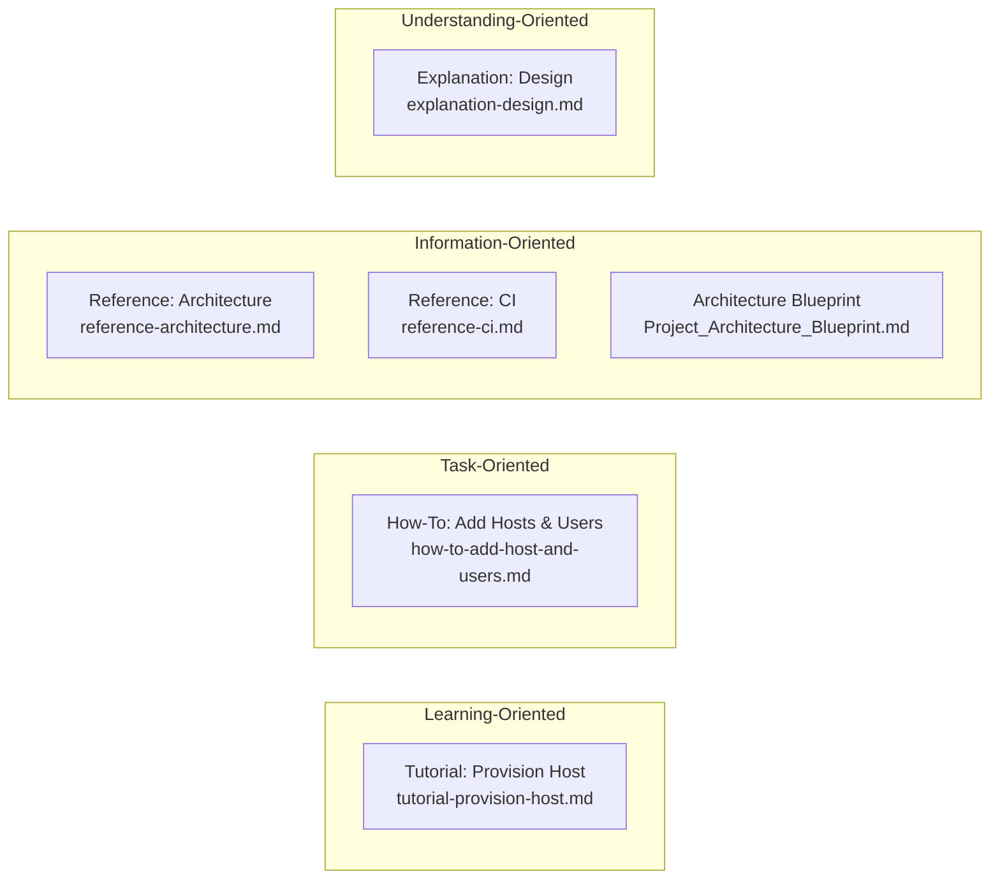

## Documentation

Project documentation organized using the
[Diátaxis framework](https://diataxis.fr/).

### Documentation Types

| Type | Purpose | Audience |
|------|---------|----------|
| **Tutorials** | Learning-oriented, step-by-step | New users |
| **How-To Guides** | Task-oriented, problem-solving | Users with specific goals |
| **Reference** | Information-oriented, accurate | Users needing details |
| **Explanation** | Understanding-oriented, context | Users wanting deeper knowledge |

### Doc Map

### Available Documentation

#### Tutorials

- [tutorial-provision-host.md](tutorial-provision-host.md) —
  Set up a new machine from scratch

#### How-To Guides

- [how-to-add-host-and-users.md](how-to-add-host-and-users.md) —
  Add new hosts and users to the configuration
- [kubevirt-migration-plan.md](kubevirt-migration-plan.md) —
  Track the MicroVM-to-KubeVirt execution plan and per-VM cutover checklist
- [kubevirt-operations.md](kubevirt-operations.md) —
  Operate and troubleshoot the KubeVirt/Flux/Cilium stack on `blizzard`

#### Reference

- [reference-architecture.md](reference-architecture.md) —
  Quick reference for options and patterns
- [reference-ci.md](reference-ci.md) —
  CI workflows, checks, and automation
- [Project_Architecture_Blueprint.md](Project_Architecture_Blueprint.md) —
  Comprehensive architecture documentation

#### Explanation

- [explanation-design.md](explanation-design.md) — Design decisions and rationale

### Quick Links

| Task | Document |
|------|----------|
| Set up a new machine | [Tutorial: Provision Host](tutorial-provision-host.md) |
| Add a new user | [How-To: Add Hosts and Users](how-to-add-host-and-users.md) |
| Migrate MicroVMs to KubeVirt | [KubeVirt Migration Plan](kubevirt-migration-plan.md) |
| Operate KubeVirt on blizzard | [KubeVirt Operations Runbook](kubevirt-operations.md) |
| Understand the architecture | [Architecture Blueprint](Project_Architecture_Blueprint.md) |
| Find option namespaces | [Reference: Architecture](reference-architecture.md) |
| Learn why things work this way | [Explanation: Design](explanation-design.md) |

### Directory READMEs

Additional documentation is embedded in key directories:

- [modules/README.md](../modules/README.md) — System modules overview
- [modules/services/README.md](../modules/services/README.md) — Available services
- [modules/core/README.md](../modules/core/README.md) — Core module details
- [home/README.md](../home/README.md) — Home Manager modules
- [hosts/README.md](../hosts/README.md) — Host configurations
- [vms/README.md](../vms/README.md) — MicroVM configurations
- [containers/README.md](../containers/README.md) — Container definitions
- [lib/README.md](../lib/README.md) — Library functions
- [dashboards/README.md](../dashboards/README.md) — Grafana dashboards

### Contributing to Documentation

When updating documentation:

1. **Match the type** — Tutorials teach, how-tos solve, references inform,
   explanations contextualize
1. **Keep it current** — Update docs when code changes
1. **Test instructions** — Verify commands and examples work
1. **Link related docs** — Help users discover relevant information
