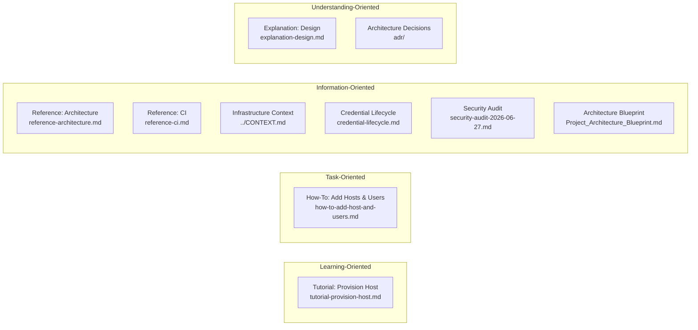

## Documentation

Project documentation organized using the
[Diátaxis framework](https://diataxis.fr/).

### Documentation Types

| Type | Purpose | Audience |
|------|---------|----------|
| **Tutorials** | Learning-oriented, step-by-step | New users |
| **How-To Guides** | Task-oriented, problem-solving | Users with specific goals |
| **Reference** | Information-oriented, accurate | Users needing details |
| **Explanation** | Understanding-oriented, context | Users wanting deeper knowledge |

### Doc Map

```mermaid
flowchart LR
    subgraph Learning["Learning-Oriented"]
        T["Tutorial: Provision Host\ntutorial-provision-host.md"]
    end
    subgraph Task["Task-Oriented"]
        HT["How-To: Add Hosts & Users\nhow-to-add-host-and-users.md"]
    end
    subgraph Reference["Information-Oriented"]
        RA["Reference: Architecture\nreference-architecture.md"]
        RC["Reference: CI\nreference-ci.md"]
        CTX["Infrastructure Context\n../CONTEXT.md"]
        CL["Credential Lifecycle\ncredential-lifecycle.md"]
        SA["Security Audit\nsecurity-audit-2026-06-27.md"]
        BP["Architecture Blueprint\nProject_Architecture_Blueprint.md"]
    end
    subgraph Understanding["Understanding-Oriented"]
        EX["Explanation: Design\nexplanation-design.md"]
        ADR["Architecture Decisions\nadr/"]
    end
```

### Available Documentation

#### Tutorials

- [tutorial-provision-host.md](tutorial-provision-host.md) —
  Set up a new machine from scratch

#### How-To Guides

- [how-to-add-host-and-users.md](how-to-add-host-and-users.md) —
  Add new hosts and users to the configuration

#### Reference

- [reference-architecture.md](reference-architecture.md) —
  Quick reference for options and patterns
- [CONTEXT.md](../CONTEXT.md) —
  Canonical infrastructure domain language
- [reference-ci.md](reference-ci.md) —
  CI workflows, checks, and automation
- [credential-lifecycle.md](credential-lifecycle.md) —
  Password, SSH key, SOPS recipient, and service secret lifecycle policy
- [roadmap.md](roadmap.md) —
  Curated repo-wide initiatives, priorities, dependencies, relevant paths, and planning links
- [2026-08-14-blizzard-paranoid-nixos-handoff.md](2026-08-14-blizzard-paranoid-nixos-handoff.md) —
  Gated Blizzard paranoid-NixOS deployment, host/VM hardening, and recovery-state handoff
- [security-roadmap-implementation-order.md](security-roadmap-implementation-order.md) —
  Branch, pull-request, merge-gate, and implementation order for the current security roadmap
- [matrix-hardening-plan.md](matrix-hardening-plan.md) —
  Staged Matrix baseline, backup, observability, and OIDC implementation handoff
- [service-mail-architecture.md](service-mail-architecture.md) —
  Proton Mail, SimpleLogin, SMTP submission, and inbound IMAP trust boundaries
- [security-audit-2026-05-13.md](security-audit-2026-05-13.md) —
  Static security audit findings and remediation roadmap
- [security-audit-2026-06-27.md](security-audit-2026-06-27.md) —
  Local-first security audit and hardening pass
- [deployment-audit-2026-08-08-microvm-networking.md](deployment-audit-2026-08-08-microvm-networking.md) —
  Live Blizzard MicroVM audit, enforcement gate, and follow-up findings
- [2026-08-18-blizzard-microvm-enforce-audit.md](2026-08-18-blizzard-microvm-enforce-audit.md) —
  Finalized Blizzard MicroVM enforce-mode audit, counter evidence, and seven-day closure
- [Project_Architecture_Blueprint.md](Project_Architecture_Blueprint.md) —
  Comprehensive architecture documentation

#### Explanation

- [explanation-design.md](explanation-design.md) — Design decisions and rationale
- [adr/0001-model-public-http-publication-as-instance-intent.md](adr/0001-model-public-http-publication-as-instance-intent.md) — Why standard public HTTP publication is modeled as instance intent
- [adr/0002-enforce-host-owned-microvm-network-policy.md](adr/0002-enforce-host-owned-microvm-network-policy.md) — Why MicroVM identity and lateral access are enforced by the host
- [architecture-risks-and-improvements.md](architecture-risks-and-improvements.md) — Known risks and improvement backlog
- [security-audit-2026-06-01.md](security-audit-2026-06-01.md) — Security audit report (2026-06-01)

#### Operations

- [sops-setup-guide.md](sops-setup-guide.md) — How to set up SOPS secrets and age keys
- [scrutiny.md](scrutiny.md) — Provision, verify, and rotate the Scrutiny InfluxDB token
- [blackbox-monitoring.md](blackbox-monitoring.md) — Configure, verify, and recover public HTTP/TLS availability probes
- [immich-backup.md](immich-backup.md) — Provision, operate, and restore the Immich offsite backup
- [pocket-id.md](pocket-id.md) — Deploy, bootstrap, operate, and recover the Pocket ID provider
- [immich.md](immich.md) — Provision, migrate, rotate, and recover Immich OAuth
- [sandfly.md](sandfly.md) — Restrict Tailscale SSH, enable Sandfly targets,
  verify, and roll back
- [troubleshooting-trigger-vm.md](troubleshooting-trigger-vm.md) — Troubleshooting the trigger MicroVM

### Quick Links

| Task | Document |
|------|----------|
| Set up a new machine | [Tutorial: Provision Host](tutorial-provision-host.md) |
| Add a new user | [How-To: Add Hosts and Users](how-to-add-host-and-users.md) |
| Understand the architecture | [Architecture Blueprint](Project_Architecture_Blueprint.md) |
| Find option namespaces | [Reference: Architecture](reference-architecture.md) |
| Use the canonical infrastructure language | [Infrastructure Context](../CONTEXT.md) |
| Review architecture decisions | [Public HTTP Publication ADR](adr/0001-model-public-http-publication-as-instance-intent.md) |
| Review MicroVM network isolation | [Host-Owned MicroVM Network Policy ADR](adr/0002-enforce-host-owned-microvm-network-policy.md) |
| Review final Blizzard MicroVM enforcement | [Blizzard MicroVM enforce-mode audit](2026-08-18-blizzard-microvm-enforce-audit.md) |
| Review credential lifecycle | [Credential Lifecycle](credential-lifecycle.md) |
| Track implementation initiatives | [Project Roadmap](roadmap.md) |
| Resume Blizzard paranoid-NixOS hardening | [Blizzard paranoid-NixOS handoff](2026-08-14-blizzard-paranoid-nixos-handoff.md) |
| Follow the security roadmap | [Security Roadmap Implementation Order](security-roadmap-implementation-order.md) |
| Plan Matrix hardening | [Matrix Hardening Plan](matrix-hardening-plan.md) |
| Review service mail boundaries | [Service Mail Architecture](service-mail-architecture.md) |
| Back up or restore Immich | [Immich Backup Operations](immich-backup.md) |
| Operate Scrutiny | [Scrutiny Operations](scrutiny.md) |
| Operate public availability probes | [Blackbox Monitoring](blackbox-monitoring.md) |
| Operate Pocket ID | [Pocket ID Operations](pocket-id.md) |
| Operate Immich OAuth | [Immich OAuth Operations](immich.md) |
| Operate Sandfly targets | [Sandfly Target Operations](sandfly.md) |
| Review security findings | [Security Audit](security-audit-2026-06-27.md) |
| Learn why things work this way | [Explanation: Design](explanation-design.md) |

### Directory READMEs

Additional documentation is embedded in key directories:

- [modules/README.md](../modules/README.md) — System modules overview
- [modules/services/README.md](../modules/services/README.md) — Available services
- [modules/core/README.md](../modules/core/README.md) — Core module details
- [home/README.md](../home/README.md) — Home Manager modules
- [hosts/README.md](../hosts/README.md) — Host configurations
- [vms/README.md](../vms/README.md) — MicroVM configurations
- [containers/README.md](../containers/README.md) — Container definitions
- [lib/README.md](../lib/README.md) — Library functions
- [dashboards/README.md](../dashboards/README.md) — Grafana dashboards

### Contributing to Documentation

When updating documentation:

1. **Match the type** — Tutorials teach, how-tos solve, references inform,
   explanations contextualize
1. **Keep it current** — Update docs when code changes
1. **Test instructions** — Verify commands and examples work
1. **Link related docs** — Help users discover relevant information
