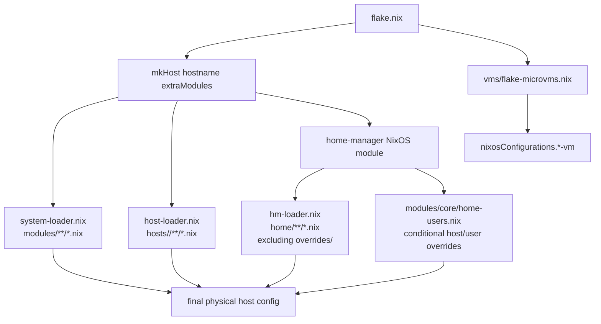
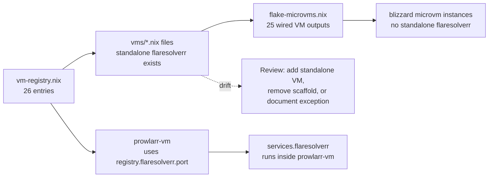
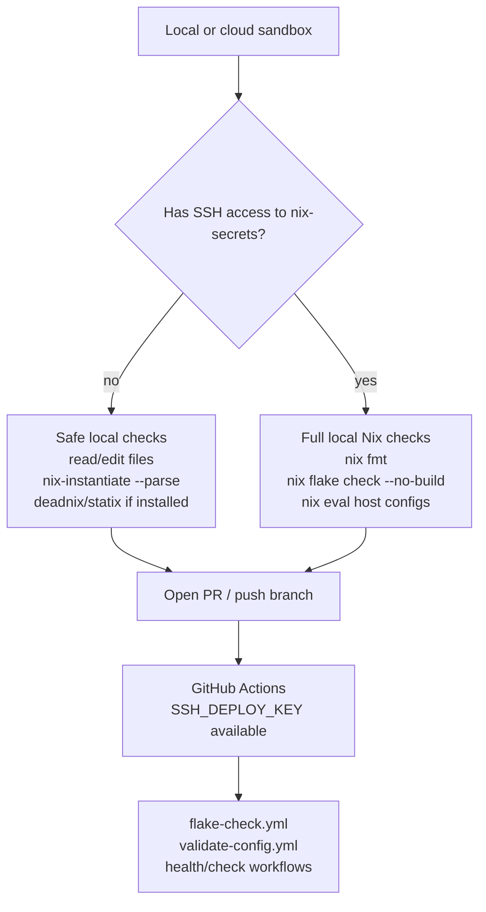

# Architecture Risks and Improvements

> **Last reviewed: 2026-06-01**

This report captures documentation drift, operational risks, and future
improvement opportunities discovered during a source-guided architecture
review. It is intentionally documentation-only: no code, secrets, flake inputs,
or workflow behavior were changed as part of this audit.

______________________________________________________________________

## Executive summary

The repository has a strong modular foundation: loader-based imports,
role-based host composition, a clear `sys.*` / `hm.*` option split, conditional
SOPS declarations, and centralized MicroVM allocation data. The main risks are
not architectural collapse points; they are drift and validation gaps around
implicit conventions.

Most important follow-ups:

1. Resolve or document the standalone `flaresolverr` MicroVM scaffold.
1. Add registry-level MicroVM validation for CID, MAC, IP, and port uniqueness.
1. Enforce mutually exclusive host roles or document the convention more
   strongly.
1. Add clearer validation for the private `VARS.users` shape.
1. Revisit default Traefik CSP compatibility trade-offs.

______________________________________________________________________

## Verified architecture strengths

- `flake.nix` is the single entry point for four physical hosts and the
  MicroVM outputs from `vms/flake-microvms.nix`.
- `system-loader.nix`, `host-loader.nix`, and `hm-loader.nix` remove most
  manual import bookkeeping.
- System options live under `sys.*`; Home Manager options live under `hm.*`.
- `modules/core/sops.nix` only declares service-specific secrets when their
  consumers are enabled, which avoids dangling SOPS requirements.
- `modules/virtualisation/microvm-base.nix` already validates many host-side
  exposure problems, including duplicate forwarded ports, duplicate Cloudflare
  ingress hosts, missing VM flakes for enabled instances, and missing IPs for
  port-forwarded instances.

______________________________________________________________________

## Repository evaluation flow

______________________________________________________________________

## Documentation drift

### MicroVM count and `flaresolverr`

Current source state:

- `vms/flake-microvms.nix` wires 25 `*-vm` outputs.
- `vms/vm-registry.nix` contains 26 registry entries.
- `vms/flaresolverr.nix` exists as a standalone VM definition.
- `hosts/blizzard/virtualisation/microvms.nix` does not enable a standalone
  `flaresolverr` instance.
- `vms/prowlarr.nix` runs `services.flaresolverr` inside `prowlarr-vm` using
  the registry port.

Recommended action: decide whether `flaresolverr` should be a standalone VM,
an intentionally embedded service inside `prowlarr-vm`, or removed as leftover
scaffolding. Until then, documentation should describe **25 wired MicroVM
outputs** and call out this exception.

### Stale architecture blueprint facts

`docs/Project_Architecture_Blueprint.md` contained old MicroVM counts and
older channel labels. Keep that blueprint tied to source facts whenever flake
inputs, VM outputs, or host roles change.

______________________________________________________________________

## Operational risks and improvements

| Area | Risk | Impact | Suggested improvement |
|------|------|--------|-----------------------|
| MicroVM registry | CID, MAC, IP, and port uniqueness are documented but not validated at registry level | Runtime network conflicts can be subtle | Add assertions or a CI script that checks `vms/vm-registry.nix` allocations |
| Registry/output drift | Registry entries and VM files can diverge from `flake-microvms.nix` outputs | Docs and host enablement can point at non-existent VM outputs | Validate registry entries against wired outputs, with explicit exceptions |
| Role selection | `sys.role.desktop.enable` and `sys.role.server.enable` are independent booleans | A host can accidentally enable both role bundles | Add an assertion that at most one role is enabled, or migrate to a role enum |
| Home overrides | `modules/core/home-users.nix` uses `builtins.pathExists` for conditional override imports | The behavior is convenient but implicit | Keep the pattern documented and consider a lightweight override inventory check |
| `VARS.users` | `modules/core/users.nix` directly consumes fields from the private `VARS.users` data | Missing fields fail during evaluation with generic context | Add explicit assertions for required fields and document the schema |
| CI host discovery | Workflows discover physical hosts with a grep for `name = mkHost` | Formatting or structure changes can drop a host from the matrix | Add a small host-discovery check or generate the matrix from Nix when feasible |

______________________________________________________________________

## Security and hardening risks

| Area | Risk | Current mitigation | Future improvement |
|------|------|--------------------|--------------------|
| Secret files | `.gitignore` excludes `nix-secrets/`, `vars/`, and `result`, but not `.env` variants | `security-audit.yml` runs secret scanning | Add `.env`, `.env.local`, `.env.*.local`, `*.key`, `*.pem`, and `*.crt` to `.gitignore` in a config cleanup pass |
| Traefik CSP | `lib/traefik.nix` default CSP permits `'unsafe-inline'` and `'unsafe-eval'` | Central helper makes future changes straightforward | Move toward nonce/hash-based CSP where service compatibility allows |
| SOPS access | Missing host recipients cause activation/runtime failures for secret consumers | Private `nix-secrets` and CI deploy key keep secrets out of this repo | Keep `docs/sops-setup-guide.md` as the single source of truth for recipient setup |
| Log redaction | `.github/scripts/redact-secrets.sh` handles common token/key patterns | CI failure output is filtered before summaries | Periodically expand patterns for new token formats and environment names |

______________________________________________________________________

## Local versus CI validation

Do not work around private flake failures by changing the `nix-secrets` input,
inlining secrets, or committing generated secret material. CI is the source of
truth for full evaluation when a local environment lacks the deploy key.

______________________________________________________________________

## Recommended next code/config changes

These are intentionally not implemented in this documentation pass.

1. Add MicroVM registry validation for duplicate CID, MAC, IP, and service
   ports.
1. Resolve the `flaresolverr` standalone VM drift.
1. Add a role exclusivity assertion in the role module layer.
1. Add `VARS.users` schema assertions with actionable error messages.
1. Extend `.gitignore` for common local secret file patterns.
1. Review Traefik CSP defaults and introduce stricter per-service policies
   where compatible.
1. Add a workflow or script check for host discovery and VM registry/output
   consistency.

______________________________________________________________________

## Source files reviewed

- [`flake.nix`](../flake.nix)
- [`system-loader.nix`](../system-loader.nix), [`host-loader.nix`](../host-loader.nix), [`hm-loader.nix`](../hm-loader.nix)
- [`modules/core/home-users.nix`](../modules/core/home-users.nix)
- [`modules/core/users.nix`](../modules/core/users.nix)
- [`modules/core/roles.nix`](../modules/core/roles.nix)
- [`modules/core/sops.nix`](../modules/core/sops.nix)
- [`modules/virtualisation/microvm-base.nix`](../modules/virtualisation/microvm-base.nix)
- [`vms/vm-registry.nix`](../vms/vm-registry.nix)
- [`vms/flake-microvms.nix`](../vms/flake-microvms.nix)
- [`vms/prowlarr.nix`](../vms/prowlarr.nix)
- [`vms/flaresolverr.nix`](../vms/flaresolverr.nix)
- [`hosts/blizzard/virtualisation/microvms.nix`](../hosts/blizzard/virtualisation/microvms.nix)
- [`lib/traefik.nix`](../lib/traefik.nix)
- [`treefmt.nix`](../treefmt.nix)
- [`.github/workflows/flake-check.yml`](../.github/workflows/flake-check.yml)
- [`.github/workflows/validate-config.yml`](../.github/workflows/validate-config.yml)
- [`.github/workflows/copilot-auto-merge.yml`](../.github/workflows/copilot-auto-merge.yml)
- [`.github/scripts/redact-secrets.sh`](../.github/scripts/redact-secrets.sh)