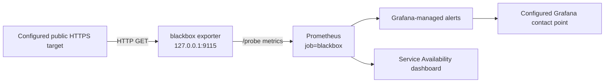

# Blackbox Monitoring Operations

The `sys.services.blackbox` module provides public HTTP/TLS availability
probes for Prometheus and Grafana. Blizzard currently uses it for the public
Matrix endpoints. The probes exercise the public route, including DNS,
Cloudflare Tunnel, Traefik/CrowdSec, and the Matrix service boundary.

## Data flow and security boundary



The exporter listens on loopback and does not expose a public firewall port.
Its HTTP modules use IPv4, accept only HTTP 200, and do not follow redirects.
This prevents a public endpoint from turning a probe into a redirect-based
request to loopback, a MicroVM, or another private destination. A redirect is
therefore a probe failure that must be investigated or represented explicitly
in the target configuration; do not enable redirect following as a routine
workaround.

The exporter has no capability requirement for these HTTP/TLS probes and is
configured with a read-only, restricted systemd service. Probe URLs are
configuration inputs and must remain public HTTPS endpoints. Never add a
private address, internal hostname, or secret-bearing URL.

## Configuration reference

Enable the service and declare targets under `sys.services.blackbox`:

```nix
sys.services.blackbox = {
  enable = true;
  targets = [
    {
      service = "example";
      name = "homepage";
      url = "https://example.com/health";
      requiredJsonFields = [ "status" ];
      expectedJsonFields.status = "ok";
    }
  ];
};
```

| Option | Meaning |
|--------|---------|
| `enable` | Enables the exporter, Prometheus scrape, and Grafana alert group |
| `targets` | Non-empty list of public endpoints |
| `targets.*.service` | Stable service label used by metrics and alert labels |
| `targets.*.name` | Stable probe label; the `service`/`name` pair must be unique |
| `targets.*.url` | URL fetched by the exporter; use a public HTTPS endpoint |
| `targets.*.requiredJsonFields` | JSON object keys that must be present in the response body |
| `targets.*.expectedJsonFields` | JSON string fields that must match exactly |

The module generates one exporter module and one Prometheus static target per
entry. Generated exporter module names must also be unique; evaluation fails
instead of silently discarding a colliding module.

The shared defaults are:

- exporter port: `127.0.0.1:9115`
- Prometheus job: `blackbox`
- scrape interval: 30 seconds
- probe timeout: 10 seconds
- scrape timeout: 15 seconds
- alert duration: five minutes

## Blizzard's Matrix probes

Blizzard probes these public contracts:

| Probe | Endpoint contract |
|-------|-------------------|
| `matrix/client-api` | Matrix client versions response contains `versions` |
| `matrix/oidc-discovery` | OIDC discovery `issuer` equals the public Matrix base URL with a trailing slash |
| `matrix/federation-discovery` | Matrix server discovery `m.server` equals the public Matrix federation host on port 443 |
| `matrix/federation-endpoint` | Federation version response contains `server` |

The host declaration is at
[`hosts/blizzard/monitoring/blackbox.nix`](../hosts/blizzard/monitoring/blackbox.nix).
The reusable option and hardening contract are at
[`modules/services/blackbox.nix`](../modules/services/blackbox.nix).

## Alert semantics

The `public-service-availability` Grafana group contains three related
contracts. Each alert uses a five-minute `for` window.

| Alert | Trigger | No-data behavior |
|-------|---------|------------------|
| `public-service-probe-failed` | A present `probe_success{job="blackbox"}` series is below 1 | Alerting; total loss of probe data is not healthy |
| `blackbox-exporter-scrape-failed` | The exporter scrape is down or its `up` series is absent | Alerting |
| `public-service-probe-missing` | An expected service/probe series is absent | Normal when all expected series exist; the exporter-scrape alert covers pipeline loss |

The first alert identifies an endpoint failure. The second identifies the
Prometheus-to-exporter pipeline. The third detects one target disappearing
while other targets continue to report, which a single aggregate over present
series cannot detect.

## Build and deploy

From a checkout with access to the private `nix-secrets` flake, run the focused
contract check before deployment:

```console
nix build --no-link .#checks.x86_64-linux.blackbox-observability --print-build-logs
```

Deploy Blizzard only through the repository's approved change process. The
usual activation command is:

```console
sudo nixos-rebuild switch --flake .#blizzard
```

Activation is not required for local evaluation or the focused check.

## Verify a deployment

Do not print credentials while verifying the service:

```console
systemctl is-active prometheus-blackbox-exporter.service prometheus.service grafana.service
systemctl show prometheus-blackbox-exporter.service --property=ExecStart,Listen,RestrictAddressFamilies
curl -fsS http://127.0.0.1:9115/metrics | rg 'probe_success|probe_http_status_code'
```

In Prometheus, verify both the exporter scrape and the probe series:

```promql
up{job="blackbox"}
probe_success{job="blackbox"}
probe_http_status_code{job="blackbox"}
```

Open the **Public Service Availability** dashboard in Grafana and confirm
that every configured `service / probe` label is present. Check the
`public-service-availability` alert group after a configuration change; a
missing target must not be treated as a healthy empty result.

The repository contract check also renders the exporter JSON, systemd
hardening, Prometheus relabeling, alert rules, exact Matrix JSON expectations,
and dashboard registration:

```console
nix build --no-link .#checks.x86_64-linux.blackbox-observability --print-build-logs
```

## Troubleshooting and recovery

1. Check `up{job="blackbox"}`. If it is `0` or absent, inspect
   `prometheus-blackbox-exporter.service` and its journal before investigating
   the public endpoint.
1. If the exporter is healthy, check `probe_success`, the HTTP status, and the
   probe error metrics for the affected `service` and `probe` labels.
1. Test the public URL from an independent public vantage point. A redirect,
   TLS failure, DNS issue, Cloudflare/Tunnel failure, reverse-proxy policy, or
   application response mismatch should be fixed at the owning boundary.
1. If a target was intentionally removed, update the declarative target list
   and deploy the reviewed change. Do not silence the missing-series alert by
   changing its no-data state.
1. After recovery, confirm that the target series returns, the alert resolves,
   and the dashboard shows current samples.

Useful local logs are:

```console
journalctl -u prometheus-blackbox-exporter.service -n 100 --no-pager
journalctl -u prometheus.service -n 100 --no-pager
```

No secret is required by this module. Keep all unrelated SOPS data in the
private `nix-secrets` repository.
