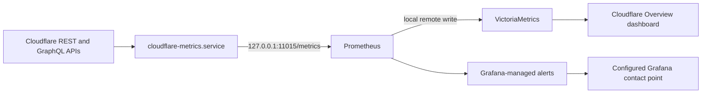

# Cloudflare Metrics Operations Runbook

This runbook covers the Cloudflare analytics and Access collector deployed on
`blizzard`. It is intended for operators enabling, deploying, validating, or
recovering the service.

______________________________________________________________________

## Purpose and data flow

The `cloudflare-metrics` service polls Cloudflare over HTTPS and exposes a
Prometheus endpoint on `127.0.0.1:11015` by default.



The collector reads:

- the active zone inventory and HTTP adaptive analytics
- the Access application inventory
- identity-based Access authentication logs
- non-identity Access login events, including service-token events, when the
  supplemental feed is explicitly enabled and the token is authorized for the
  account analytics dataset

Prometheus scrapes the collector once per minute. The collector defaults to a
five-minute analytics poll and a one-minute Access poll. HTTP analytics are
queried in completed five-minute buckets after a ten-minute availability
delay. Adaptive analytics values are Cloudflare estimates.

Identity-based Access logs come from the Access REST endpoint. Non-identity
events come from the account-scoped GraphQL
`accessLoginRequestsAdaptiveGroups` dataset. The identity feed is authoritative
for owner detection and continues when the supplemental GraphQL query is not
authorized. The feeds have independent high-water marks and success timestamps,
so a failure in either path cannot advance or roll back the other. Both sources
use Ray ID deduplication state, so a Ray returned by both paths is counted once.
REST rows without a user email remain `unknown` and alertable. The collector
does not assume that every contract-valid row with a missing email is reproduced
by the optional GraphQL feed.

Cloudflare's adaptive HTTP dataset exposes response data transfer through
`edgeResponseBytes`; it does not expose request-body bytes. The dashboard's
data-transfer panels therefore report response data transfer only.

Cloudflare's published GraphQL fields for this dataset do not include an
Access application ID or domain. Non-identity events therefore use
`app="unknown"`; do not interpret that label as an unknown application in the
Cloudflare inventory. A non-empty GraphQL `serviceTokenId` is classified as
`service-token`. Other rows are classified as `unknown` only when Cloudflare
explicitly identifies their `identityProvider` as `nonidentity`.

______________________________________________________________________

## Cloudflare API token

Create a dedicated token for this collector. Do not reuse a Global API Key or
a token that can modify Cloudflare resources.

The token needs these read-only permissions for core monitoring:

- Zone Read
- Analytics Read for each monitored zone
- Access Audit Logs Read
- Access Apps and Policies Read

If supplemental non-identity Access events are required, set
`sys.services.cloudflareMetrics.enableNonIdentityAccess = true` and add
`Account Analytics Read`. The feed is disabled by default, and the collector
does not query it or emit authorization errors while disabled. When enabled, a
failure is exposed as `operation="access_nonidentity"` but does not suppress
identity-login monitoring. While disabled, GraphQL-only non-identity
authentications are not collected. See Cloudflare's
[Analytics API token guide](https://developers.cloudflare.com/analytics/graphql-api/getting-started/authentication/api-token-auth/)
and [Access login GraphQL example](https://developers.cloudflare.com/analytics/graphql-api/tutorials/querying-access-login-events/).

Restrict the token to the Cloudflare account and zones monitored by
`blizzard`. Verify the resource scope as well as the permission list; a token
with the correct permissions but the wrong zone or account scope produces an
empty inventory or authorization failures.

______________________________________________________________________

## SOPS secrets

The values live in the private `nix-secrets` repository. Never add encrypted
or plaintext secret material to this repository. The collector requires these
keys under the `cloudflare` mapping:

| SOPS key | Expected decrypted file content |
|----------|---------------------------------|
| `cloudflare/accountId` | One Cloudflare account identifier; surrounding whitespace is ignored |
| `cloudflare/metrics_api_token` | One dedicated Cloudflare API token; surrounding whitespace is ignored |
| `cloudflare/access_owner_emails` | One expected owner email address per line; blank lines and lines beginning with `#` are ignored |

The owner list must contain at least one address. Matching is case-insensitive
after trimming whitespace. Keep the account identifier and owner list private
along with the token.

`modules/core/sops.nix` declares these secrets only while
`sys.services.cloudflareMetrics.enable` is true. It exposes their runtime
paths through `config.sys.secrets.*`; systemd then passes the files through
`LoadCredential`. The service does not receive secret values in command-line
arguments or environment variables.

Follow [the SOPS setup guide](sops-setup-guide.md) when adding recipients,
updating keys, or troubleshooting decryption.

______________________________________________________________________

## Owner and principal classification

The owner file is an allowlist for classification, not an authorization
policy. Access itself remains enforced by Cloudflare.

The exported Access identity labels have a bounded contract:

| Event identity | `principal_type` | `owner` |
|----------------|------------------|---------|
| Email exactly matches the owner list | `owner` | `true` |
| Other non-empty user email | `user` | `false` |
| Verified non-identity service-token event | `service-token` | `false` |
| Missing or ambiguous identity | `unknown` | `false` |

Raw email addresses must not appear in Prometheus labels, durable metric
series, dashboards, or alert notifications. An `unknown` identity is not
trusted and must remain eligible for the unexpected-login alert. Only a
verified non-identity event may be classified as `service-token`.

After changing the owner list, rebuild `blizzard` so SOPS refreshes the
credential and systemd restarts the service. The change affects newly
collected events; it does not rewrite samples already stored remotely.

______________________________________________________________________

## Enablement

The production configuration is in
`hosts/blizzard/monitoring/exporters.nix`:

```nix
sys.services.cloudflareMetrics = {
  enable = true;
  port = 11015;
  enableNonIdentityAccess = false;
  apiTokenFile = config.sys.secrets.cloudflareMetricsApiTokenFile;
  accountIdFile = config.sys.secrets.cloudflareAccountIdFile;
  ownerEmailsFile = config.sys.secrets.cloudflareAccessOwnerEmailsFile;
};
```

The module asserts that all three credential paths are set. It binds the HTTP
server to loopback, runs under a systemd dynamic user, and stores durable state
in a private state directory. The `cloudflare` Prometheus scrape job must point
to the same port. Set `enableNonIdentityAccess = true` only after granting the
dedicated token `Account Analytics Read`; leaving it false keeps the optional
query and its error counter inactive.

Intervals accept positive compact durations such as `30s`, `5m`, `2h`, or
`1d`:

```nix
sys.services.cloudflareMetrics = {
  analyticsInterval = "5m";
  accessInterval = "1m";
};
```

______________________________________________________________________

## Build and deploy

From this repository, build the `blizzard` configuration before switching:

```bash
nix build .#nixosConfigurations.blizzard.config.system.build.toplevel
```

Run the collector test check when the flake exposes it for the current system:

```bash
nix build .#checks.x86_64-linux.cloudflare-metrics --no-link --print-build-logs
```

Deploy on `blizzard`:

```bash
sudo nixos-rebuild switch --flake .#blizzard
```

Do not deploy until the three SOPS keys exist and `blizzard` is an age
recipient for their encrypted file. A missing recipient can allow evaluation
to succeed but fail secret installation or service startup on the host.

______________________________________________________________________

## Post-deployment verification

### Service and logs

```bash
systemctl status cloudflare-metrics.service
journalctl -u cloudflare-metrics.service -b --no-pager
```

The service should be `active (running)` without repeated API, credential,
duration, or state errors.

### HTTP endpoints

```bash
curl --fail --silent --show-error http://127.0.0.1:11015/-/healthy
curl --fail --silent --show-error http://127.0.0.1:11015/metrics
```

The health endpoint confirms that the HTTP server is serving. It does not
prove that Cloudflare polling is succeeding. In the metrics response, verify:

- `cloudflare_collector_last_success_timestamp_seconds` exists for
  `inventory`, `analytics`, and `access`; it also exists for
  `access_nonidentity` when that feed is enabled
- `cloudflare_collector_poll_enabled{poll="access_nonidentity"}` matches the
  configured state
- `cloudflare_collector_api_errors_total` is not increasing for `inventory`,
  `analytics`, or `access`; `access_nonidentity` indicates only the optional
  supplemental feed
- `cloudflare_collector_state_gap` is zero for every zone
- `cloudflare_collector_catch_up` returns to zero after recovery
- Access series use only the bounded `principal_type` values and contain no
  raw email label

### Prometheus scrape

```bash
curl --fail --silent --show-error \
  --get http://127.0.0.1:11009/api/v1/query \
  --data-urlencode 'query=up{job="cloudflare"}'
```

The result should contain a sample with value `1`. Then check Grafana's
Cloudflare folder for the provisioned dashboard and alert group. Dashboard
history comes from VictoriaMetrics, while Grafana-managed alerts use the local
Prometheus datasource.

______________________________________________________________________

## Alert thresholds

Grafana evaluates the Cloudflare alert group every minute.

| Alert | Severity | Condition |
|-------|----------|-----------|
| Unexpected Access login | Critical | A non-owner user or unknown identity observed by an enabled feed was allowed in the last 5 minutes; verified service tokens are excluded |
| Repeated Access denials | Warning | At least 5 denials for one application and principal class in 10 minutes |
| Security-action burst | Warning | At least 25 actions other than `allow`, `skip`, or `unknown` for one zone and host in 10 minutes |
| Origin failure anomaly | Warning | More than 5% of at least 20 requests returned 5xx in 10 minutes, sustained for 5 minutes |
| Collector failure | Warning | The scrape target is missing or down, or a required or explicitly enabled poll has not succeeded for 15 minutes |
| Unrecoverable history gap | Warning | Any zone or Access feed explicitly reports a state gap |

No-data is alerting for collector failure. A missing gap metric is covered by
the success checks for required and explicitly enabled polls; an intentionally
disabled optional poll is excluded. Missing gap telemetry is not itself proof
that history was lost. Alert notifications must contain bounded classifications
and application or host context, never a raw email address.

The unexpected-login rule always covers REST identity events, including
ambiguous REST rows retained as `unknown`. GraphQL-only non-identity events are
covered only when `enableNonIdentityAccess = true`.

______________________________________________________________________

## Durable state

systemd creates the `cloudflare-metrics` state directory with mode `0700`.
The logical state path is:

```text
/var/lib/cloudflare-metrics/state.json
```

With `DynamicUser=true`, systemd may back this path with
`/var/lib/private/cloudflare-metrics`. Use the logical path rather than
depending on the backing-directory implementation.

The JSON file contains metric counters, per-zone and per-feed Access high-water
marks, deduplication identifiers, gap status, and the bounded active metric
series.
Writes use a temporary file, `fsync`, and an atomic replacement. The collector
prunes expired deduplication entries and compacts excess metric series, but
compacting local state does not delete samples already remote-written to
VictoriaMetrics.

Treat the state and its backups as sensitive operational data. They contain
zone, host, application, authentication-decision, and identity-class metadata.
Legacy state or backups created before identity-label hardening may contain raw
email addresses.

### State schema migration

The current state schema is version 3. Before migrating an older state, the
collector creates a version-specific backup such as
`/var/lib/cloudflare-metrics/state.json.v1.bak` or `state.json.v2.bak` in the
same private state directory with mode `0600`. It never overwrites an existing
backup.

Version 1 to version 2 removes legacy principal labels and compacts excess
metric series. Version 2 to version 3 gives the identity and optional
non-identity Access feeds independent cursors and gap flags, and deletes the
retired `cloudflare_http_request_bytes_total` series from local durable state.
Because version 2 did not retain independent GraphQL continuity evidence, the
migration preserves its shared cursor but marks the non-identity gap when that
cursor is non-empty. A direct upgrade from version 1 applies both migrations in
order and retains the original version 1 backup. Later starts validate version
3 and rewrite it only if privacy sanitization or bounded-series compaction
repairs are still required; migration backups are never changed.

The collector applies registered migrations one version at a time. A state file
from a newer collector fails closed and is not reset, backed up, or overwritten.
Keep the file intact and deploy a compatible collector instead of deleting or
hand-editing it.

### Invalid state recovery

Malformed JSON, invalid UTF-8, non-finite metric values, invalid label keys,
and structurally invalid supported-version containers are treated as
corrupt evidence. The collector atomically renames the file beside the active
state as `state.json.corrupt-<timestamp>`, restricts it to mode `0600`, writes a
fresh valid version 3 state, and continues. The journal records the quarantine
filename and validation error without logging state contents.

Recovery has the same counter reset and limited-history consequences as state
loss, so preserve the quarantined file for investigation and check the history
gap indicators. Quarantine names are unique and existing evidence is never
overwritten. Permission errors, other storage I/O failures, migration-code
failures, and state from a newer collector are not auto-recovered; they remain
fatal so an operator cannot accidentally erase valid but unreadable or
incompatible state.

### First start

When no state file exists, the collector intentionally starts near the
present:

- analytics starts with the latest completed five-minute bucket, delayed by
  ten minutes
- each enabled Access feed starts with the latest minute
- counters start at zero

It does not backfill all available history on first start. Allow at least one
poll interval plus the analytics delay before declaring an empty dashboard a
failure.

### State loss and long outages

Deleting or losing `state.json` causes the same limited first-start behavior.
The missing interval is not reconstructed, counters reset, and rate queries
may show a reset. VictoriaMetrics retains previously written samples, but it
cannot recreate the collector's lost high-water and deduplication state.

On a normal restart, the collector resumes analytics with a ten-minute overlap
and each enabled Access feed with a five-minute overlap, deduplicating events
already recorded. Each Access source advances only its own cursor. If an
analytics or Access high-water mark is older than the collector's eight-day
recovery window, collection resumes from the oldest supported point and sets
`cloudflare_collector_state_gap` to `1` for the affected zone or poll. Gap
evidence is sticky; do not delete state merely to silence the alert.

### Backup

Stop the service so the backup has an unambiguous generation, copy the single
state file to a root-only location, and restart promptly:

```bash
sudo systemctl stop cloudflare-metrics.service
sudo install -m 600 \
  /var/lib/cloudflare-metrics/state.json \
  /root/cloudflare-metrics-state.json
sudo systemctl start cloudflare-metrics.service
```

Store the backup according to the same access controls as other monitoring
data. Do not place it in this repository.

### Restore

Validate the JSON, stop the service, restore the file, match the state
directory's ownership, and start the service:

```bash
sudo python3 -m json.tool /root/cloudflare-metrics-state.json >/dev/null
sudo systemctl stop cloudflare-metrics.service
sudo install -m 600 \
  /root/cloudflare-metrics-state.json \
  /var/lib/cloudflare-metrics/state.json
sudo chown --reference=/var/lib/cloudflare-metrics \
  /var/lib/cloudflare-metrics/state.json
sudo systemctl start cloudflare-metrics.service
```

Immediately repeat the service, journal, metrics, and Prometheus checks. If the
backup uses an unsupported state version, restore a compatible backup rather
than hand-editing the schema.

### Roll back across a state migration

The automatic `state.json.v1.bak` or `state.json.v2.bak` is specifically the
rollback point for the collector release that expects that version. A version 1
backup can contain raw Access email labels, so keep every migration backup
root-only. Stop the service, roll back the NixOS generation or collector
package first, then restore the matching backup without changing it:

```bash
sudo systemctl stop cloudflare-metrics.service
sudo nixos-rebuild switch --rollback
sudo systemctl stop cloudflare-metrics.service
sudo install -m 600 \
  /var/lib/cloudflare-metrics/state.json.v2.bak \
  /var/lib/cloudflare-metrics/state.json
sudo chown --reference=/var/lib/cloudflare-metrics \
  /var/lib/cloudflare-metrics/state.json
sudo systemctl start cloudflare-metrics.service
```

Choose the backup version expected by the rolled-back collector. Do not restore
an older backup while continuing to run the version 3 collector; it will
intentionally migrate the file again. After rollback, verify the service and
metrics as described below. Preserve the version 3 state separately if you may
roll forward again.

### Upgrade impact: response data transfer

Version 3 removes the retired `cloudflare_http_request_bytes_total` series from
local durable state. The collector now exports only
`cloudflare_http_response_bytes_total`, sourced from Cloudflare's
`edgeResponseBytes`. This is response data transfer, not a like-for-like rename
of request-body bytes.

Update downstream recording rules, alerts, and dashboards that referenced the
retired metric before deployment. Previously remote-written samples remain in
VictoriaMetrics until its retention policy removes them; the migration only
cleans the collector's local state.

______________________________________________________________________

## Privacy and cardinality

The collector intentionally exports operational dimensions including zone,
host, HTTP status, cache status, country, security action and source,
application, decision, principal type, and owner status. Application and host
names can still reveal infrastructure even when direct identifiers are
removed, so restrict access to Prometheus, VictoriaMetrics, Grafana, backups,
and alert destinations.

Raw Access email addresses are secret input used only for owner
classification. They must not cross the collector boundary into metric labels
or notifications. Search both local and long-term storage after upgrading from
an older collector if raw principal labels may already have been ingested.

Host and application labels can be influenced by request or Cloudflare
inventory data. Label values are normalized to at most 256 characters, and
each metric retains at most 512 durable series, including one fixed overflow
bucket. Overflowed counter values are summed and gauge values retain their
maximum, so aggregate health remains useful even when detailed dimensions are
compacted. `cloudflare_collector_series_overflow_total{metric="..."}` counts
updates redirected into an overflow bucket. Alert on or investigate any
increase rather than increasing the limit; it indicates lost dimensional
detail. Long-term storage retention is a separate policy and continues to
retain samples after local series compaction.

______________________________________________________________________

## Troubleshooting

### Service restart loop

Inspect the journal first. Common startup causes are:

- a missing or empty SOPS credential
- an empty owner-email list
- a malformed poll duration
- an unsupported newer durable-state version or state-directory I/O failure
- a local port conflict

Do not print credential contents into the terminal or journal. Confirm the
secret paths and permissions through the NixOS configuration and SOPS status.
Malformed supported-version state should instead produce a
`state.json.corrupt-*` file and a fresh active state. If it still causes a
restart loop, inspect the quarantine/save error and filesystem permissions.

### API authorization or empty inventory

An increasing `cloudflare_collector_api_errors_total` with operation
`inventory`, `analytics`, or `access` points to a core API or response problem.
`access_nonidentity` is the optional GraphQL feed and does not block identity
login monitoring. It should remain absent while
`enableNonIdentityAccess = false`. If the feed is enabled, confirm Account
Analytics Read in addition to the token's other read permissions, account
scope, zone scope, account ID, and Cloudflare API availability. Active zones
outside the token's resource scope are not collected.

### Healthy endpoint but stale metrics

`/-/healthy` only tests the local HTTP server. Check the three
required `cloudflare_collector_last_success_timestamp_seconds` series, the
optional `access_nonidentity` series when enabled, API error counters, and the
journal. The collector deliberately continues serving its last durable
snapshot when a poll fails.

### Access events are absent

Check Access Audit Logs Read, the account ID, and the token's account resource
scope. On first start only the latest minute is requested. The REST path covers
identity-based authentication and drives the Access success timestamp. The
GraphQL path is disabled by default; when explicitly enabled, it adds events
that Cloudflare marks as non-identity and requires Account Analytics Read.
Those supplemental events appear under `app="unknown"` because the published
dataset does not provide an application identifier. REST rows without a user
email remain conservatively classified as `unknown`; only the schema-backed
GraphQL feed can classify a verified service token. A REST failure leaves only
the identity cursor unchanged and increments `operation="access"`; a
GraphQL-only failure leaves only the non-identity cursor unchanged and
increments `operation="access_nonidentity"` while identity monitoring
continues. Malformed rows are isolated to their source transaction.

### Analytics are delayed or catching up

The normal ten-minute analytics delay avoids incomplete Cloudflare buckets.
A positive `cloudflare_collector_catch_up{poll="analytics"}` means completed
intervals were pending when the poll began. Monitor it until it returns to
zero. Large result sets are split into smaller time ranges; a single
five-minute bucket that reaches Cloudflare's row limit is rejected instead of
advancing the high-water mark past missing rows.

### History-gap alert

Back up the state and inspect the journal and gap metric by zone or poll. An
explicit value of `1` means the durable high-water mark fell outside that
source's bounded recovery window, so the omitted interval cannot be
reconstructed by this service. An absent metric means the corresponding source
has not succeeded yet or is disabled and is not by itself evidence of a gap.
Required and explicitly enabled poll failures are handled by the
collector-failure alert. Record a confirmed incident and continuity boundary.
Reset state only as a deliberate recovery decision after accepting the
additional counter reset and first-start data loss.

### Prometheus target is down

Verify that the service is listening on loopback and that the configured ports
match:

```bash
sudo ss -ltnp | grep ':11015'
systemctl status prometheus.service
```

The exporter is not intended to be exposed through the host firewall or a
reverse proxy.

______________________________________________________________________

## Implementation references

- [`modules/services/cloudflare-metrics.nix`](../modules/services/cloudflare-metrics.nix)
- [`modules/services/scripts/cloudflare_metrics.py`](../modules/services/scripts/cloudflare_metrics.py)
- [`hosts/blizzard/monitoring/exporters.nix`](../hosts/blizzard/monitoring/exporters.nix)
- [`hosts/blizzard/monitoring/prometheus.nix`](../hosts/blizzard/monitoring/prometheus.nix)
- [`hosts/blizzard/monitoring/cloudflare-alerts.nix`](../hosts/blizzard/monitoring/cloudflare-alerts.nix)
