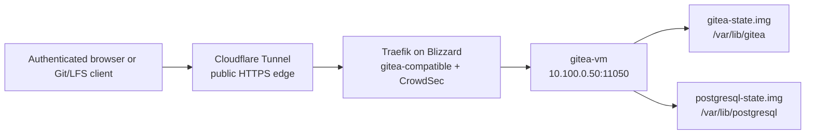

# Gitea Operations

Gitea runs in `gitea-vm` on Blizzard and is published at:

```text
https://git.<public-domain>
```

The public hostname is the `git` publication label in
[`hosts/blizzard/virtualisation/microvms.nix`](../hosts/blizzard/virtualisation/microvms.nix).
Resolve `<public-domain>` from the configured
`sys.virtualisation.microvm.publication.canonicalDomain`; do not copy private
secret values into this repository.

## Architecture and ownership



| Boundary | Owner | Checked-in contract |
|----------|-------|---------------------|
| VM identity and backend port | VM registry and MicroVM host module | `10.100.0.50:11050`; see [`vms/vm-registry.nix`](../vms/vm-registry.nix) |
| Public hostname and publication | Blizzard MicroVM inventory | `git.<canonical-domain>` with policy `gitea-compatible` |
| Cloudflare ingress | Host Cloudflare Tunnel plus generated publication ingress | Public traffic terminates at the existing Tunnel and enters Traefik on host port 80 |
| Response headers | Blizzard Traefik configuration | `gitea-headers`, `gitea-xfp-https`, then the automatically appended `crowdsec` middleware |
| Application URL and LFS behavior | Gitea VM configuration | HTTPS `ROOT_URL`, SSH disabled, LFS enabled; see [`vms/gitea.nix`](../vms/gitea.nix) |

The standard publication derives the backend from the registry and renders the
Tunnel ingress and Traefik route together. Gitea's service-level reverse proxy
is disabled in the VM, so do not add a second Gitea route or a public backend
port. The host-side MicroVM publication and middleware-name assertions are
covered by [`tests/microvm-publication.nix`](../tests/microvm-publication.nix).

## Header policy and CSP ownership

The `gitea-compatible` chain is intentionally route-scoped:

1. `gitea-headers` retains the shared response protections, including
   `X-Content-Type-Options`, `X-Frame-Options`, `X-XSS-Protection`,
   `Referrer-Policy`, and `Permissions-Policy`, but omits Traefik's static
   `Content-Security-Policy`.
1. `gitea-xfp-https` sends `X-Forwarded-Proto: https` to Gitea because TLS is
   terminated before the host-side HTTP entrypoint.
1. `crowdsec` is appended by the publication module.

The older `strict-forwarded-https` policy is retained as a compatibility name
for possible out-of-tree overlays, but no in-tree publication selects it. Use
`gitea-compatible` for Gitea; the legacy policy still injects Traefik's static
CSP.

Gitea's HTML contains a per-response nonce-bearing bootstrap script. A static
Traefik CSP cannot express that nonce, so the route delegates CSP ownership to
Gitea. This is a deliberate defense-in-depth exception, not a general waiver:
the exception must remain attached only to the Gitea publication, and an
effective application-owned CSP is a deployment prerequisite. If Gitea does
not return a CSP compatible with its bootstrap nonce, stop the deployment and
either restore a tested route-scoped policy or obtain explicit risk acceptance
for the reduced browser protection.

## Pre-deployment gate

Run the focused contract check from a checkout that can access the private
`nix-secrets` input:

```console
nix build --no-link .#checks.x86_64-linux.microvm-publication --print-build-logs
```

The check proves the declared hostname, backend, middleware chain, generated
ingress, and the rendered Gitea middleware's CSP omission. It cannot prove the
deployed Gitea response or browser behavior.

Before activation, use an authenticated administrator or disposable test
account in a browser. Do not paste session cookies or credentials into command
output. In the browser Network panel, inspect the final response for
`https://git.<public-domain>/` and confirm all of the following:

- `Content-Security-Policy` is present in the effective response and its
  `script-src` nonce matches the nonce on Gitea's inline bootstrap script.
- `X-Content-Type-Options`, `X-Frame-Options`, `Referrer-Policy`, and
  `Permissions-Policy` are present with the intended values; there is no
  conflicting duplicate CSP.
- The page has no Gitea JavaScript bootstrap error and browser-console errors
  do not show blocked bootstrap or module scripts.
- Login, logout, a CSRF-protected UI action, normal repository UI navigation,
  an authenticated API request, and an LFS upload/download all work.
- The public request is served through the Cloudflare Tunnel and Traefik route;
  no separate raw Gitea origin or guest port is exposed to the public network.

Blizzard also advertises the `10.100.0.0/24` MicroVM network over Tailscale and
the Gitea VM opens its service port on that private network. If private direct
access is allowed, verify its Tailscale ACLs and host-forwarding rules
separately: that path bypasses Cloudflare, Traefik, CrowdSec, and the public
response-header checks above, and is outside this PR's changes.

An unauthenticated request that returns a Cloudflare Access login page does not
prove the Gitea origin headers or nonce behavior. Repeat the checks with the
authenticated browser session and, where possible, inspect the origin-side
response separately through the approved operator path.

## Deployment and recovery

Use the repository's approved change process for activation. Do not activate a
configuration that has failed the authenticated CSP/nonce gate. If the gate
fails after deployment:

1. Keep the public route protected by Cloudflare Access/Tunnel and CrowdSec
   while collecting the authenticated document response and browser console.
1. Check whether the failure is an Access response returned for an asset, a
   missing Gitea CSP, a nonce mismatch, or a separate Gitea application error.
1. Roll back the reviewed configuration if the effective browser policy cannot
   be established, then add or test the narrowest compatible policy before
   retrying.
1. Re-run the focused publication check and the complete authenticated flow
   list after the corrective deployment.

Useful host and VM checks, with no secret output, are:

```console
systemctl is-active cloudflared.service traefik.service microvm@gitea-vm.service
systemctl status traefik.service microvm@gitea-vm.service --no-pager
journalctl -u traefik.service -n 100 --no-pager
journalctl -u microvm@gitea-vm.service -n 100 --no-pager
```

For application-side failures, inspect the Gitea VM journal through the
approved administrative connection. Never copy SOPS files, database contents,
session cookies, or private keys into this repository or into support output.
