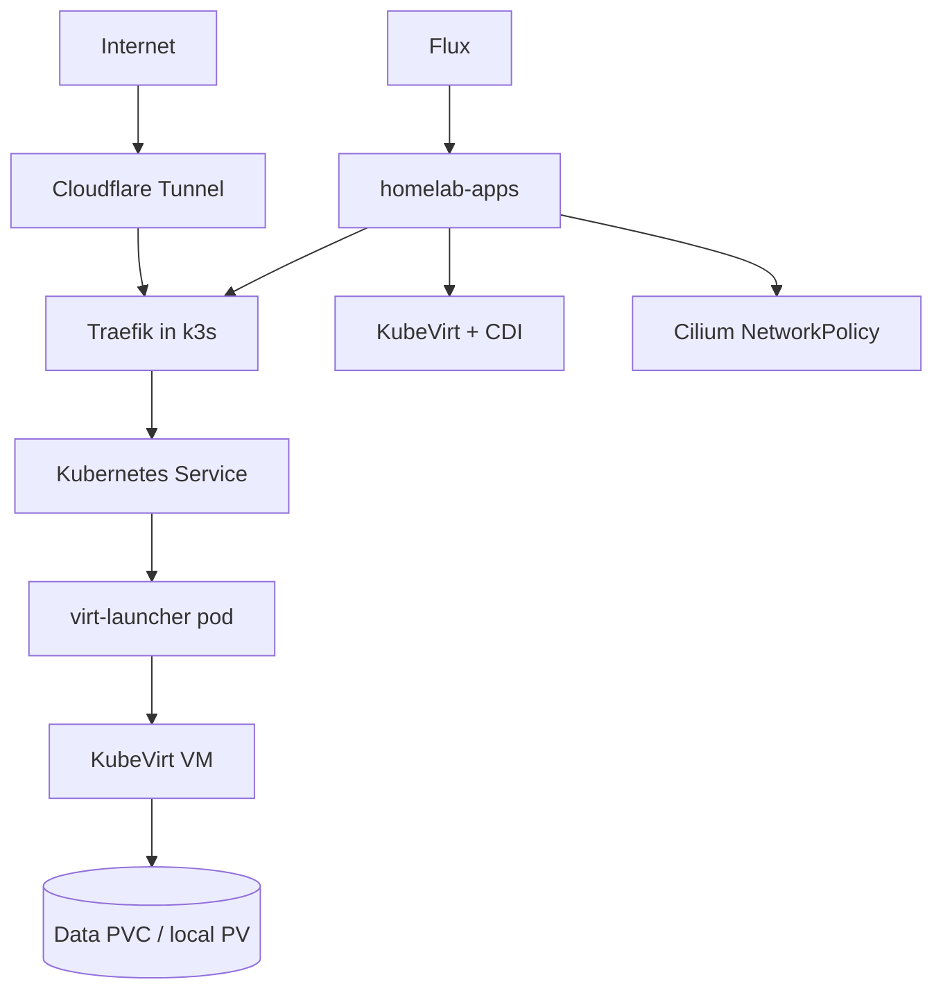

# KubeVirt Operations Runbook

This runbook covers day-2 operations for the `blizzard` KubeVirt migration. Workload manifests live in `telometto/homelab-apps`; host bootstrap and legacy MicroVM references live in this repo.

## Architecture summary



## Ownership boundaries

| Layer | Repo | Notes |
|---|---|---|
| NixOS host, k3s service, pre-Flux Cilium/Flux bootstrap | `nix-config` | `modules/virtualisation/k3s*.nix`, `hosts/blizzard/blizzard.nix` |
| Kubernetes operators and workloads | `homelab-apps` | Flux reconciles this repo from `flux/` |
| Secrets at host activation | `nix-secrets` | sops-nix remains for host/bootstrap secrets |
| Workload secrets | `homelab-apps` as SealedSecrets | Back up the Sealed Secrets private key before relying on this |

## Bootstrap order

1. k3s starts with Cilium-compatible flags from `sys.services.k3s.ciliumCni`.
2. `sys.services.k3s.bootstrap` installs Cilium via helmfile.
3. The bootstrap service waits for Cilium and runs a pod-to-API ClusterIP smoke test.
4. Flux operator and flux-instance are installed.
5. Flux reconciles `telometto/homelab-apps`.
6. KubeVirt, CDI, Sealed Secrets, ingress, storage, NetworkPolicies, and VMs are reconciled from `homelab-apps`.

Do not install Flux before Cilium. Flux controllers need pod networking and Kubernetes API Service routing.

## VM manifest pattern

Each VM directory in `homelab-apps/vms/<name>/` should eventually contain:

| File | Purpose |
|---|---|
| `kustomization.yaml` | Lists resources for the VM |
| `datavolume.yaml` | Imports Debian Stable cloud image for the boot disk |
| `pvc.yaml` | Defines one or more data disks |
| `virtualmachine.yaml` | KubeVirt `VirtualMachine` object |
| `service.yaml` | Stable Kubernetes Service for ingress/policy |
| `networkpolicy.yaml` | Minimal ingress/egress allowlist |
| `sealedsecret-cloudinit.yaml` | Encrypted cloud-init user data and per-VM secrets |
| `ingressroute.yaml` | Traefik route if publicly exposed |

Use hand-written manifests for the first pilot VMs. Factor common Kustomize components only after two successful cutovers.

## Debian guest baseline

Every VM should receive a baseline cloud-init profile that:

- locks the root account
- disables password and keyboard-interactive SSH auth
- enables SSH key-only admin access
- installs and starts `qemu-guest-agent`
- enables AppArmor
- enables unattended security upgrades
- configures UFW or nftables default-deny inbound
- allows only the VM's service port(s) and admin access path
- configures journald/log rotation
- mounts data disks by label or stable device path

Prefer running application workloads inside the VM with systemd units. Podman inside the VM is acceptable where it reduces migration risk; the isolation boundary remains the KubeVirt VM.

## Storage model

Phase 1 uses single-node local storage on `blizzard`:

- old MicroVM state: `/flash/enc/vms/<vm>/`
- new KubeVirt state: `/flash/enc/kubevirt/<vm>/`

Keep old and new storage separate. Do not mutate old MicroVM images during migration.

### Data migration procedure

1. Snapshot the relevant ZFS dataset or storage root.
2. Stop the old MicroVM.
3. Mount old image(s) read-only.
4. Start the KubeVirt VM without public ingress.
5. Copy data into the new data disk.
6. Fix ownership/permissions inside the guest.
7. Run app-specific checks.
8. Enable the public route.
9. Keep old images read-only until rollback is no longer needed.

## Network policy model

Default stance: deny ingress and egress in workload namespaces.

Required allow categories:

| Allow | Scope |
|---|---|
| DNS | VM pods to CoreDNS on TCP/UDP 53 |
| API/operator traffic | Only where required by KubeVirt/CDI/import jobs |
| Ingress | Traefik namespace to VM service port |
| Updates | Debian mirrors and container registries, preferably tightened over time |
| App dependencies | Explicit service-to-service allow rules only |
| VPN | WireGuard endpoint and no direct internet path for privacy-routed VMs |

Use Cilium/Hubble to verify that denied flows are expected and allowed flows are minimal.

## Ingress model

Public traffic must flow through:

```text
Cloudflare Tunnel -> Traefik -> Kubernetes Service -> KubeVirt VM
```

Do not expose VM services directly with public NodePorts. Use MetalLB only for deliberate raw TCP/UDP services such as WireGuard.

Before exposing any service publicly, verify:

- Cloudflare Tunnel is connected
- Traefik route points to the Kubernetes Service
- security middleware matches the old NixOS Traefik behavior
- CrowdSec bouncer is active
- access logs are visible
- VM firewall allows only intended ports

## Secrets

Host/bootstrap secrets continue to use sops-nix from `nix-secrets`.

Workload secrets should use Sealed Secrets in `homelab-apps`:

1. Create a normal Kubernetes Secret locally.
2. Seal it for the target namespace.
3. Commit only the `SealedSecret`.
4. Back up the Sealed Secrets controller private key after controller install and before migrating important secrets.

If the controller private key is lost, existing SealedSecrets cannot be decrypted after a cluster rebuild.

## Service-specific checks

| VM | Checks |
|---|---|
| `gitea` | HTTP login, repo clone over HTTPS, SSH clone, LFS token, webhook delivery |
| `matrix-synapse` | federation tester, login, E2E keys, MAS health, well-known endpoints |
| `immich` | library scan, upload, thumbnail jobs, Postgres health, photo count |
| `paperless` | document count, OCR task, login, CSRF headers |
| `firefly` | login, app key, Postgres, importer connectivity |
| `wireguard` | UDP reachability, handshake, route advertisement, DNS |
| `adguard` | DNS TCP/UDP, DoT/HTTPS if enabled, admin route exposure decision |
| `qbittorrent` / `sabnzbd` | external IP is VPN endpoint, kill switch blocks direct internet |
| browser VMs | authentication, noVNC/web route, VPN egress if required |

## Troubleshooting

### Cilium pod networking

Check:

- `networking.firewall.checkReversePath = false` on `blizzard`
- `networking.firewall.trustedInterfaces = [ "lxc+" ]`
- k3s has `--disable-kube-proxy`
- Cilium has `kubeProxyReplacement: true`
- pod-to-API ClusterIP smoke test returns HTTP 401 or 403, not timeout

### Flux auth

If `GitRepository/flux-system` is not ready, verify the `flux-system` pull secret exists and matches `hosts/blizzard/virtualisation/flux-instance-values.yaml`.

### KubeVirt KVM

If VM pods do not schedule with KVM, verify `/dev/kvm` on `blizzard` and KubeVirt node allocatable devices.

### CDI imports

If DataVolumes stall, check CDI pods, importer pod logs, storage class binding mode, image URL reachability, and local PV permissions.

### Traefik route failures

Check cloudflared logs, Traefik route status, Service endpoints, NetworkPolicy allows, and the in-guest firewall.

## Cleanup checklist

Only after every VM is accepted:

- remove MicroVM autostart
- remove `sys.virtualisation.microvm` config
- remove `microvm` input/module from `flake.nix`
- remove or archive `vms/`
- remove `10.100.0.0/24` routing if unused
- update all docs and CI assumptions
