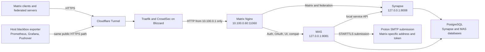

# Matrix hardening plan

This is the resumable implementation handoff for hardening the bespoke Matrix
deployment before adding Pocket ID as an upstream identity provider. It records
approved design decisions; it does not authorize a deployment, secret change,
network-policy transition, or OIDC cutover.

The separate [service mail architecture](service-mail-architecture.md) defines
the Proton Mail and SimpleLogin boundary used by Matrix and other services. The
existing [Pocket ID migration plan](pocket-id-migration-plan.md) remains the
authority for the later OIDC migration.

## Resume here

| Field | Value |
| --- | --- |
| Repository anchor | `60c86651f483cce78fb3b40714fb9e2655f07850` |
| Source review | 2026-08-13 |
| Current roadmap branch | `main` (Matrix baseline implementation merged) |
| Overall status | Baseline source implementation merged; local route/runtime compatibility follow-up validated; live acceptance and observation gates remain |
| Last verified | Repository source, upstream documentation, and read-only public-path probes on 2026-08-14 |
| Next action | Complete the remaining live Matrix acceptance matrix; begin the seven-day clean observation gate only after every capability passes |

On 2026-08-14, a read-only smoke check through the public path returned HTTP
200 for the Matrix client versions endpoint, MAS/OIDC discovery, root-domain
federation discovery, and the federation API version endpoint. Their required
`versions`, `issuer`, `m.server`, and `server` fields matched the configured
contracts. This is partial availability evidence from one operator vantage
point, not acceptance evidence for login, recovery, clients, federation
messaging, raw-port rejection, URL-preview isolation, restart/rotation
behavior, alert delivery, or the seven-day observation gate.

Before activation or further runtime work:

1. Treat the repository anchor above as the source-evidence baseline and review
   every intervening Matrix, MAS, Nginx, publication, backup, monitoring,
   mail, secret, and MicroVM network-policy change.
1. Confirm that the MicroVM network policy completed its explicitly approved
   audit gate, including any documented exception, was approved for `enforce`,
   and was merged.
1. Refresh all pinned-version claims against the current package sources and
   upstream primary documentation.
1. Stop if current evidence contradicts an invariant or acceptance gate below.

## Roadmap and change boundaries

The work is intentionally split so that failures and rollbacks have one clear
cause.

| Order | Change set | Runtime scope | Completion gate |
| --- | --- | --- | --- |
| 1 | MicroVM network hardening | Merged prerequisite; retain its live audit and enforcement evidence | Approved audit gate, every event investigated, explicit approval, `enforce` deployed, then merge |
| 2 | Matrix baseline hardening | Merged publication, listener, routing, authentication, systemd-hardening, and probe implementation | Live acceptance matrix passes, then seven clean days and explicit approval before another Matrix runtime change |
| 3 | Reusable MicroVM offsite backup | Extract the Immich pattern and add an isolated Matrix backup | First backup succeeds and a full isolated restore rehearsal passes |
| 4 | Pocket ID OIDC migration | Dedicated Pocket ID client and MAS upstream provider | All earlier gates pass; follow the service order and gates in the Pocket ID migration plan, with Matrix last |

The service-mail document and other planning work may proceed in parallel
because documentation does not alter the runtime. Runtime work must retain the
sequence above.

The planned WhatsApp bridge is tracked separately in the
[Matrix–WhatsApp bridge design](matrix-whatsapp-bridge.md). Its opt-in
implementation is a new Matrix runtime change and must wait for the current
Matrix acceptance and clean-observation gates; its linked-device state must
also be covered by the Matrix backup/restore evidence before login.

## Verified current state

The statements in this section are source observations, not claims about the
currently deployed generation.

| Area | Repository evidence | Consequence |
| --- | --- | --- |
| Workload boundary | [`vms/matrix-synapse.nix`](../vms/matrix-synapse.nix) runs Synapse, MAS, Nginx, and one PostgreSQL service with separate Synapse and MAS databases in one MicroVM | The approved target keeps this single-VM boundary |
| Durable state | The VM declares Synapse, PostgreSQL, and MAS images; [`mkMicrovmConfig.nix`](../vms/mkMicrovmConfig.nix) adds `persist.img`; enabling the bridge adds `mautrix-whatsapp-state.img` | A consistent offsite backup must include the four baseline images, or all five images when the bridge is enabled, from one snapshot |
| Managed publication | [`hosts/blizzard/virtualisation/microvms.nix`](../hosts/blizzard/virtualisation/microvms.nix) publishes `matrix.<domain>` through the standard Cloudflare Tunnel, Traefik, and CrowdSec path | This becomes the only public workload path |
| Raw publication | The Matrix instance declares no host TCP `11060` port-forward | The managed HTTP publication is the only public workload path |
| Guest ingress | Nginx binds `0.0.0.0:11060`, and the guest firewall accepts only the primary guest interface and Blizzard's `10.100.0.1` gateway | Nginx is reachable only through the managed host publication path |
| Internal listeners | MAS web and health, plus Synapse, bind to loopback; MAS trusts only `127.0.0.1/32` | Nginx is the only trusted MAS proxy and no Matrix backend has a guest-network listener |
| Routing | Nginx path-routes MAS compatibility/OIDC/UI endpoints and otherwise sends requests to Synapse | Nginx remains the deliberate compatibility router; it is not replaced by Traefik |
| Admin API | The Nginx route returns `403` for `/_synapse/admin` before the Synapse catch-all | Retain required client endpoints such as `/_synapse/client/rendezvous` |
| MAS GraphQL | `/graphql` is routed to MAS's frontend API, not the separately controlled MAS Admin API | Preserve the frontend API route without treating it as an administrative exposure |
| CORS | The hostname-wide Traefik wildcard CORS header is removed; Nginx retains explicit CORS only on Matrix well-known responses | Keep discovery CORS narrow and do not add it to token-bearing API routes |
| Registration | MAS sets `password_registration_enabled = false`, and the evaluated Synapse config also disables registration | New password registration is closed before OIDC work |
| Recovery | MAS has SMTP configured and explicitly sets `password_recovery_enabled = true` | Recovery remains available for retained password accounts, subject to live acceptance testing |
| Mail ownership | Synapse and MAS both consume `protonmail/smtp_token`; Synapse configures SMTP while `enable_notifs = false` | MAS becomes the sole Matrix mail sender and gets a Matrix-specific Proton SMTP token |
| Client compatibility | MAS dynamic client registration allows host mismatch and rejects insecure URIs; Synapse enables MSC4108 rendezvous | Preserve these settings until Element X login, refresh, logout, and QR linking pass |
| Media and previews | Synapse permits 90 MB uploads and enables URL previews with private, loopback, link-local, documentation, benchmark, multicast, and other special-use ranges blacklisted | Validate both the near-limit media path and the public-versus-private preview boundary |
| Federation | Synapse serves federation resources and root-domain discovery delegates to `matrix.<domain>:443` | Federation remains enabled and is part of health and acceptance testing |
| Calls | No TURN or MatrixRTC service is configured | Reliable cross-network voice and video are not promised by the baseline |
| Local recovery | Recursive Sanoid snapshots cover the VM state dataset | Local snapshots reduce recovery time but do not satisfy the approved offsite-backup gate |
| Offsite recovery | Only Immich has a dedicated Borg job and restore runbook | Extract the proven mechanism instead of copying its implementation |
| Monitoring | Blizzard already runs Prometheus, Grafana, and Pushover alert delivery; MAS exposes an unused loopback health listener | Add public-path probes as the primary signal and internal checks only for diagnosis |
| Runtime secret assembly | `sops-install-secrets.service` feeds `matrix-synapse-secret.service` and `mas-secret.service`; the generators write `/run/matrix-synapse-secret/shared-secret.yaml` and `/run/mas-secret/config.json` | Keep decrypted values out of the Nix-generated base configuration and verify the generator/consumer restart sequence during rotation |
| Service sandbox | PR #6581 hardens `matrix-authentication-service.service`, `mas-db-init.service`, `matrix-synapse-secret.service`, and `mas-secret.service` with restricted capabilities, namespaces, system paths, address families, and declared read/write paths | Preserve the declared filesystem and network boundaries while completing live compatibility checks |

## Approved target architecture

Security invariants:

- The public workload has one path: Cloudflare Tunnel to Traefik/CrowdSec to
  Nginx. TCP `11060` is not forwarded from Blizzard's external interfaces.
- Nginx is the only Matrix guest service reachable from the MicroVM network.
  Only Blizzard's gateway address may connect to it.
- Synapse, MAS web, and MAS health listeners are loopback-only. Only Nginx is a
  trusted MAS proxy.
- Nginx remains because the operator's earlier Traefik-only routing attempt did
  not work reliably. Replacing it is outside this plan.
- Synapse's public Admin API is denied. Administration uses SSH and a local
  loopback request path.
- MAS owns password login, recovery, account management, and all Matrix email.
  Synapse does not retain unused SMTP credentials.
- SOPS secret files are read by dedicated one-shot generator units. The Synapse
  generator writes only `/run/matrix-synapse-secret`, the MAS generator writes
  only `/run/mas-secret`, and the long-running MAS service writes durable state
  only under `/var/lib/mas`.
- New password registration is disabled. Existing password login and tested
  email recovery remain available through the baseline and initial OIDC
  linking period.
- Federation remains enabled. The baseline does not introduce TURN, MatrixRTC,
  or tracing.

## Work package A: Matrix baseline hardening

The checked items below are declarative source or evaluation-test changes. Items
that require deployment, live traffic, or retained-account inventory remain
unchecked until those acceptance gates are completed.

### Publication and guest ingress

- [x] Remove the Matrix `portForwards` entry for TCP `11060`.
- [x] Keep the standard `matrix` MicroVM publication and the bespoke
  root-domain Matrix discovery router.
- [x] Add an evaluation or integration check proving the Matrix publication is
  enabled without a raw forward.
- [x] Restrict the guest firewall so TCP `11060` accepts only source
  `10.100.0.1`. Reject other reachable MicroVM and routed sources.
- [x] Keep Nginx on `0.0.0.0:11060`; it is the intentional guest network
  boundary.
- [x] Bind Synapse to `127.0.0.1:8008` and correct the stale listener comment.
- [x] Keep MAS web and health listeners on loopback and narrow
  `trusted_proxies` to loopback.
- [x] Assert or test that no other Matrix process has a non-loopback listening
  socket.

### Nginx route contract

- [x] Keep explicit MAS compatibility routing for versioned Matrix
  login/logout/refresh endpoints.
- [x] Keep the MAS discovery, OAuth, account, human UI, assets, JWKS, GraphQL,
  and upstream-provider routes required by the installed MAS version.
- [x] Correct the `/graphql` comment: the route is used by MAS's frontend, not
  the separately controlled MAS Admin API.
- [x] Return a denial for `/_synapse/admin` before the Synapse catch-all.
- [x] Preserve `/_matrix`, federation, media, and
  `/_synapse/client/rendezvous` behavior.
- [x] Preserve the root-domain `/.well-known/matrix/server`,
  `/.well-known/matrix/client`, and `/.well-known/matrix/support` responses.
- [x] Add route-contract tests that identify the selected upstream or expected
  denial for every canonical path. The focused check renders the generated
  Nginx configuration and probes it with stub MAS and Synapse upstreams;
  shared contracts cover exact, prefix, regex, suffix, and near-miss paths.

### CORS and proxy headers

- [x] Remove wildcard CORS from the hostname-wide Traefik Matrix middleware.
- [x] Let Synapse and MAS emit CORS for their own application endpoints.
- [x] Retain explicit wildcard CORS on the public Matrix well-known discovery
  responses.
- [x] Preserve security headers that do not conflict with Matrix clients.
- [ ] Forward the original client chain only through the known proxies and
  verify that a direct guest request cannot spoof its client address to MAS or
  Synapse.
- [ ] Treat browser and native-client acceptance tests as the compatibility
  gate for the narrower policy.

### Registration, passwords, recovery, and mail

- [x] Set MAS `account.password_registration_enabled = false`.
- [x] Keep the MAS password database enabled for existing users.
- [x] Set MAS `account.password_recovery_enabled = true`.
- [ ] Inventory every retained account and confirm it has a controlled recovery
  address before deployment.
- [ ] Give MAS a permanent Matrix service address and unique Proton SMTP token
  as specified by the service-mail architecture.
- [ ] Remove the Synapse email block, SMTP token reads, and access to the shared
  mail secret while notifications remain disabled.
- [ ] Keep the registration shared secret only for the reviewed local
  administrative workflow; do not expose it through a public registration
  path.
- [ ] Send and complete a real recovery email for every retained account class.
  A successful SMTP connection or queued message is not sufficient.
- [ ] Verify that losing SMTP does not break an existing password login or an
  already established Matrix session.

### Client compatibility

- [x] Preserve MAS dynamic client registration.
- [x] Preserve `allow_host_mismatch = true` because Element X requires the
  current behavior; keep `allow_insecure_uris = false`.
- [x] Preserve Synapse MSC4108 rendezvous routing for QR device linking.
- [ ] Test Element X login, token refresh, logout, and QR linking before and
  after a service restart.
- [ ] Record the installed MAS and Synapse versions in the PR and rerun the
  route contract after either package changes.

### URL-preview boundary

- [ ] Keep the explicit URL-preview IP blacklist at least as restrictive as
  the current configuration.
- [ ] Test a normal public HTTPS preview.
- [ ] Test loopback, the MicroVM bridge, RFC 1918, Tailscale, link-local, and an
  attacker-controlled public DNS name resolving to a private address. All must
  fail without making a backend request.
- [ ] Recheck the blacklist if an outbound HTTP proxy is ever introduced;
  Synapse documents different resolution behavior through a proxy.

### systemd hardening

- [x] Add compatibility-tested source sandboxing to
  `matrix-authentication-service.service`, `mas-db-init.service`,
  `mas-secret.service`, and `matrix-synapse-secret.service`. PR #6581 also
  added evaluation assertions for the shared hardening and runtime path
  contracts.
- [x] Use narrow filesystem writes, read-only secret bindings,
  `NoNewPrivileges`, private temporary state, protected system/home paths, and
  only the address families each unit needs. The generator units are restricted
  to local Unix sockets; MAS additionally needs IPv4 and IPv6 for SMTP and
  other service traffic.
- [x] Verify that a non-default
  `sys.services.matrix-authentication-service.runtimeConfigFile` remains
  compatible with the service sandbox. The module derives the runtime file's
  parent directory, and the VM's secret generator writes through the same
  option. The focused contract check extends the production Matrix VM and
  exercises `/run/mas-alternate/config.json`, while the deployed VM uses
  `/run/mas-secret/config.json`.
- [ ] Exercise SOPS rotation end to end: re-materialize the changed secret,
  re-run both generator units as applicable, restart their consumers, and prove
  that no stale runtime configuration remains. Both generators are
  `Type=oneshot` with `RemainAfterExit=true`, so a successful initial boot is
  not rotation evidence.
- [ ] Compare `systemd-analyze security` before and after deployment, but use
  the full acceptance matrix—not the numeric score—as the deployment gate.
  Every directive must preserve database migrations, runtime config generation,
  email, dynamic client registration, and client flows.

### Availability monitoring

The host-side module and initial Matrix registrations are present in `main` from
the follow-up observability PR. Its public interface is a declarative target
list; exporter configuration, relabeling, common alerts, and dashboard labels
remain internal. Matrix is still the only initial service target. Add other
services in later, independently reviewable changes.

Primary probes must traverse public DNS, Cloudflare Tunnel, Traefik/CrowdSec,
Nginx, and the target service:

- [x] Matrix client API: a public `/_matrix/client/versions` request with JSON
  validation.
- [x] MAS/OIDC discovery: the public
  `/.well-known/openid-configuration` response, including issuer validation.
- [x] Federation discovery: the public root-domain
  `/.well-known/matrix/server` response and its delegated Matrix endpoint.
- [x] Federation API version: the public
  `/_matrix/federation/v1/version` response with native JSON validation.

Internal diagnostics may probe Nginx, Synapse loopback, and MAS `/health`, but
must not replace the public availability signal.

- [x] Export probe success, duration, HTTP/TLS status, and certificate-expiry
  metrics to the existing Blizzard Prometheus.
- [x] Provision a shared service-availability Grafana dashboard from the repo.
- [x] Alert only after a nonzero sustained-failure window; the current
  implementation uses five minutes with a 30-second scrape cadence.
- [x] Route firing and resolved states through the existing Grafana Pushover
  contact point.
- [ ] Force a failure for longer than the configured window and prove one
  firing and one resolved notification.
- [x] Do not add distributed tracing in this work package.

## Baseline acceptance matrix

All items are live runtime gates. A build, evaluation, unit test, or source
inspection cannot mark them complete.

| Capability | Required evidence |
| --- | --- |
| Existing login | Existing password user logs in through the public hostname; session survives a normal service restart |
| Recovery | A real MAS recovery email arrives, its link completes a password reset, and the new password logs in |
| Closed registration | Anonymous new password signup is rejected while the reviewed administrative registration path remains local |
| Element X | Login, refresh, logout, and QR device linking work through the public hostname |
| Local encrypted messaging | Two local accounts exchange encrypted messages and recover history on a verified second device |
| Federation | Encrypted messages and media travel in both directions with an external homeserver; external discovery resolves the delegated server |
| Media | A file near the configured 90 MB limit uploads and downloads through the managed public path |
| URL preview | A public URL previews; private, loopback, MicroVM, and rebinding-style targets are blocked |
| Admin denial | Public `/_synapse/admin` requests are denied; local SSH/loopback administration still works |
| Raw-path removal | External, LAN, Tailscale, and peer-MicroVM attempts to reach raw TCP `11060` fail; Traefik can still reach Nginx |
| CORS | Matrix well-known discovery works cross-origin; Synapse, MAS, Element X, and browser flows work without hostname-wide wildcard injection |
| Observability | Public probes populate Prometheus and Grafana; a forced sustained failure fires and later resolves Pushover |
| Restart behavior | Nginx, Synapse, MAS, PostgreSQL, secret generators, and probes recover cleanly after the planned restart sequence; a SOPS rotation proves new runtime material is consumed |

### Baseline rollback

- Keep the previous NixOS generation ready.
- If the managed route fails, roll back the baseline as one unit. Do not leave an
  undocumented imperative forward or broaden the guest firewall as a shortcut.
- If recovery email fails, keep existing password login available, roll back
  the recovery/mail changes, and rotate a token if exposure is suspected.
- If narrower CORS or route matching breaks a client, capture the exact request
  and response, then make the narrowest route-specific correction.
- A rollback or corrective Matrix deployment restarts the observation clock.

## Seven-day baseline observation gate

After the acceptance matrix passes, observe seven consecutive clean days before
another Matrix runtime change. Documentation may continue during this window.

Review at least:

- public Matrix, MAS/OIDC, and federation probes;
- Nginx, Synapse, MAS, and PostgreSQL restarts or failed units;
- password login, recovery, and SMTP failures;
- secret-generator completion, runtime-file freshness, and consumer restarts
  after any planned SOPS rotation;
- local and federated messaging or media failures;
- relevant `lateral_audit` or enforced MicroVM network-policy events;
- Grafana/Pushover alert firing and resolution behavior.

Reset the clock for an attributable Matrix failure, corrective deployment, or
material Matrix configuration change. A proven external transient does not
reset it; record the evidence that established the failure was external. At the
end, review the evidence and obtain explicit approval before proceeding.

## Work package B: reusable MicroVM offsite backup

This is a separate PR deployed only after the baseline observation gate. It
must preserve Immich's current behavior while moving the common mechanism into
a deep reusable module, tentatively
`modules/virtualisation/microvm-offsite-backup.nix`.

### Module boundary

Expose a small `sys.virtualisation.microvm.offsiteBackup.jobs.<name>` interface
containing only caller-owned facts:

- logical MicroVM instance;
- authoritative volume contract;
- Borg repository and archive name;
- staggered schedule;
- SSH key, pinned known-hosts, and passphrase file paths;
- remote Borg executable and optional existing Pushover integration.

The module should derive and own:

- the `microvm@<name>-vm.service` relationship;
- the ZFS dataset, temporary snapshot name, and read-only image paths;
- credential ownership/mode preflight;
- repository preflight before stopping a VM;
- stop, snapshot, image validation, immediate restart, and active-state check;
- failure-safe VM restoration and snapshot cleanup;
- Borg/systemd ordering, hardening, persistent timer behavior, and failure
  notification.

Do not expose shell fragments as the caller interface.

### Immich migration and Matrix caller

- [ ] Move the existing Immich job onto the module without changing its
  repository, schedule, archive name, credentials, volumes, failure behavior,
  or runbook contract.
- [ ] Add focused evaluation/tests comparing the generated Immich job and its
  safety assertions before and after extraction.
- [ ] Extract Matrix's volumes into an authoritative storage contract analogous
  to [`vms/immich-storage.nix`](../vms/immich-storage.nix).
- [ ] Include `matrix-synapse-state.img`, `postgresql-state.img`,
  `mas-state.img`, and `persist.img` from the same stopped-VM ZFS snapshot.
- [ ] When the WhatsApp bridge is enabled, include
  `mautrix-whatsapp-state.img` in that same snapshot. Its PostgreSQL database
  is already in `postgresql-state.img`; the generated registration under
  `/run` is rebuilt from the locked configuration and SOPS values.
- [ ] Use a separate Matrix Borg repository, append-only forced-command SSH
  key, and encryption passphrase. Never share Immich backup credentials.
- [ ] Schedule Matrix daily at a different time from Immich. The accepted
  offsite recovery-point objective is at most 24 hours; local ZFS snapshots
  cover shorter recovery windows.
- [ ] Add a Matrix backup and restore runbook. Do not put secret values in it.

### Restore gate

A Borg archive existing is not proof of recoverability.

- [ ] Restore the four baseline images from one archive into an isolated
  recovery location or disposable MicroVM environment. When the bridge is
  enabled, restore its fifth state image too. Do not loop-mount untrusted guest
  filesystems on Blizzard.
- [ ] Start the restored Matrix stack without publishing it to the production
  hostname or contacting production peers unexpectedly.
- [ ] Verify PostgreSQL, Synapse, MAS, local administrative access, existing
  password login, representative rooms/media, encryption keys, and the
  persisted SSH identity.
- [ ] When the bridge is enabled, verify the separate database, linked-device
  state, registration regeneration, and the documented re-login behavior if
  linked-device state is intentionally not restored.
- [ ] Record archive, date, duration, operator, result, and any manual steps.
- [ ] Repeat after a material storage/backup format change and at least every
  six months.

## Work package C: Pocket ID OIDC migration

OIDC remains a later PR and Matrix remains the last active service in the
Pocket ID rollout. Before starting it:

- [ ] Complete the Matrix baseline, its seven-day observation, offsite backup,
  and isolated restore rehearsal.
- [ ] Prove MAS recovery email and the global Pocket ID SMTP/recovery gates.
- [ ] Refresh both Pocket ID documents against the current repository and
  pinned service versions.
- [ ] Correct the migration plan's stale support-report digest: at the source
  snapshot used for this plan, the file hashes to
  `456037cc9d16de32f66b732a6995db3ecf22ca12fe527806d5870f0d51b1565a`,
  not the digest recorded in the plan. Recompute it again at implementation
  time rather than copying this value blindly.
- [ ] Complete and observe the earlier services in the approved migration
  order.

The later Matrix OIDC design must retain these approved invariants:

- one dedicated Pocket ID client and `oidc-matrix` admission group;
- one stable MAS upstream-provider ULID;
- explicit authenticated account linking, never automatic email adoption;
- lowercase Pocket ID username mapping to Matrix localpart;
- `on_conflict = fail`;
- existing passwords retained throughout linking, validation, recovery, and
  observation;
- password removal considered only in a later change with a fresh
  recommendation, explicit approval, and its own rollback evidence.

## Explicitly out of scope

- Replacing Nginx with Traefik path routing.
- Disabling federation.
- TURN or MatrixRTC deployment. Document reliable voice/video as unavailable
  until a separate network and abuse review approves the public relay ports,
  peer restrictions, quotas, monitoring, and secret handling.
- Distributed tracing.
- A central SMTP relay or shared Proton Bridge VM.
- `mautrix-whatsapp` runtime activation and linked-device credentials; see the
  separate [Matrix–WhatsApp bridge design](matrix-whatsapp-bridge.md).
- Pocket ID client, group, secret, or MAS upstream-provider creation in the
  baseline or backup PR.
- Automatic transition of the MicroVM network policy from `audit` to
  `enforce`.

## Primary upstream references

- [MAS reverse-proxy and compatibility routing](https://element-hq.github.io/matrix-authentication-service/setup/reverse-proxy.html)
- [MAS configuration reference](https://element-hq.github.io/matrix-authentication-service/reference/configuration.html)
- [Synapse Admin API exposure guidance](https://element-hq.github.io/synapse/latest/usage/administration/admin_api/)
- [Synapse installation security notes for URL previews and TURN](https://element-hq.github.io/synapse/latest/setup/installation.html)
- [Synapse TURN configuration](https://element-hq.github.io/synapse/latest/turn-howto.html)
- [Matrix server-server discovery specification](https://spec.matrix.org/latest/server-server-api/#getwell-knownmatrixserver)
- [Prometheus multi-target exporter pattern](https://prometheus.io/docs/guides/multi-target-exporter/)

## Repository sources reviewed

- [`vms/matrix-synapse.nix`](../vms/matrix-synapse.nix)
- [`modules/services/matrix-synapse.nix`](../modules/services/matrix-synapse.nix)
- [`modules/services/matrix-authentication-service.nix`](../modules/services/matrix-authentication-service.nix)
- [`tests/matrix-baseline.nix`](../tests/matrix-baseline.nix)
- [`vms/mkMicrovmConfig.nix`](../vms/mkMicrovmConfig.nix)
- [`vms/vm-registry.nix`](../vms/vm-registry.nix)
- [`hosts/blizzard/virtualisation/microvms.nix`](../hosts/blizzard/virtualisation/microvms.nix)
- [`hosts/blizzard/security/traefik.nix`](../hosts/blizzard/security/traefik.nix)
- [`hosts/blizzard/services/cloudflared.nix`](../hosts/blizzard/services/cloudflared.nix)
- [`hosts/blizzard/services/backup.nix`](../hosts/blizzard/services/backup.nix)
- [`hosts/blizzard/monitoring/prometheus.nix`](../hosts/blizzard/monitoring/prometheus.nix)
- [`hosts/blizzard/monitoring/grafana.nix`](../hosts/blizzard/monitoring/grafana.nix)
- [`modules/services/grafana-pushover.nix`](../modules/services/grafana-pushover.nix)
- [`docs/immich-backup.md`](immich-backup.md)
- [`docs/pocket-id-migration-plan.md`](pocket-id-migration-plan.md)
- [`docs/pocket-id-service-support.md`](pocket-id-service-support.md)
- [`docs/credential-lifecycle.md`](credential-lifecycle.md)
- [PR #6581 — Enhance service hardening and secret management](https://github.com/telometto/nix-config/pull/6581)
