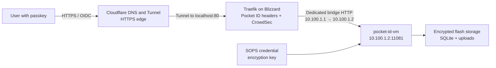

# Pocket ID Operations

Pocket ID runs as `pocket-id-vm` on Blizzard and provides passkey-based OpenID
Connect (OIDC) for services that support a configurable OIDC provider. It does
not replace fixed OAuth providers in applications that only support services
such as Google or GitHub.

The public issuer is:

```text
https://id.<public-domain>
```

The discovery document is:

```text
https://id.<public-domain>/.well-known/openid-configuration
```

______________________________________________________________________

## Architecture



The VM has no host port forward and is the only guest on the dedicated
`pocket-id-br0` Layer-2 segment (`10.100.1.0/30`). Blizzard uses `10.100.1.1`
and Pocket ID uses `10.100.1.2`; all peer MicroVMs remain on `microvm-br0`.
Symmetric host forwarding rules block routed traffic between the two bridges.
Pocket ID's nftables firewall additionally accepts TCP ports `22` and `11081`
only from Blizzard's `10.100.1.1` address. Peer MicroVMs therefore cannot join
the proxy-side Layer-2 path, route around it through Blizzard, or bypass
Traefik and CrowdSec by connecting directly to the service. Pocket ID is
published externally only through Cloudflare Tunnel and Traefik. The dedicated
subnet is not advertised through Tailscale.

Pocket ID trusts `CF-Connecting-IP` for audit logging and rate limiting only on
that restricted backend path; unrestricted proxy trust remains disabled.

______________________________________________________________________

## First deployment and SOPS bootstrap

Pocket ID cannot start until the VM can decrypt
`pocket-id/encryption_key`. The VM must boot once to create the persistent SSH
host key that is also used as its SOPS age identity.

### 1. Protect the initial setup endpoint

Before enabling the new route:

1. Create a temporary Cloudflare Access application for
   `id.<public-domain>` that allows only the administrator.
1. Disable Rocket Loader for this hostname with a Cloudflare configuration
   rule.
1. Ensure the hostname is routed to Blizzard's existing Cloudflare Tunnel.
   If the zone does not already have a wildcard tunnel record, add the public
   hostname or a proxied CNAME targeting the configured tunnel.

Cloudflare Access is only a bootstrap guard. Leaving it enabled after setup
would intercept OIDC discovery, authorization, token, and callback traffic.

### 2. Boot the VM and derive its age recipient

Apply the Blizzard configuration:

```bash
sudo nixos-rebuild switch --flake .#blizzard
```

The VM should boot even though `sops-install-secrets` and `pocket-id` initially
fail. On Blizzard, derive the age recipient from the VM's presented persistent
SSH host key without copying the private key:

```bash
ssh-keyscan -t ed25519 10.100.1.2 | cut -d ' ' -f 2- | ssh-to-age
```

Confirm that the VM is using the expected registry address before trusting the
result.

### 3. Add the private secret

In the private `nix-secrets` repository:

1. Add the new age recipient to the appropriate creation rule in `.sops.yaml`.

1. Add a 32-byte random value at the YAML key
   `pocket-id/encryption_key`:

   ```bash
   openssl rand -base64 32
   ```

1. Update the encrypted file's recipients:

   ```bash
   sops updatekeys path/to/affected-secret.yaml
   ```

1. Commit and push the private secrets change.

Never put the key, the decrypted secret file, or the private VM host key in
this repository. See [SOPS Setup Guide](sops-setup-guide.md) for the general
recipient workflow.

### 4. Refresh the locked private input

From this repository on a machine with access to `nix-secrets`:

```bash
nix flake update nix-secrets
sudo nixos-rebuild switch --flake .#blizzard
```

The second rebuild gives the VM the encrypted value and the recipient needed
to decrypt it. The Pocket ID host instance enables `vmConfig.restartIfChanged`,
so a switch restarts the VM when its generated configuration changes. On
Blizzard, verify that the new unit is active and consuming the updated
configuration:

```bash
systemctl status microvm@pocket-id-vm.service
ssh admin@10.100.1.2 systemctl is-active sops-install-secrets.service
ssh admin@10.100.1.2 systemctl is-active pocket-id.service
ssh admin@10.100.1.2 env HOST=127.0.0.1 PORT=11081 pocket-id healthcheck
```

Before opening `/setup`, verify the dedicated bridge membership on Blizzard:

```bash
bridge link show master pocket-id-br0
bridge link show master microvm-br0
```

The first command must list `vm-pocket-id` as the only guest tap. The second
must not list `vm-pocket-id`; if it does, do not continue with setup.

Then verify both sides of the backend firewall boundary. The first command runs
on Blizzard and must succeed. Run the remaining commands from any other
MicroVM; both must time out or be refused:

```bash
curl --fail --silent --show-error \
  http://10.100.1.2:11081/.well-known/openid-configuration

curl --connect-timeout 3 --fail --silent --show-error \
  http://10.100.1.2:11081/.well-known/openid-configuration

if timeout 3 bash -c 'exec 3<>/dev/tcp/10.100.1.2/22'; then
  echo "ERROR: Pocket ID SSH is reachable from a peer MicroVM" >&2
  exit 1
fi
```

On the Pocket ID VM, the active rule can also be inspected with:

```bash
sudo nft list chain inet nixos-fw input-allow
```

It must contain the `10.100.1.1/32` source restriction for TCP ports `22` and
`11081`. These checks describe the required post-switch state; they are not a
substitute for validating the deployed host.

______________________________________________________________________

## Initial administrator

1. Open `https://id.<public-domain>/setup` through the temporary Cloudflare
   Access policy.
1. Create the administrator and register at least one passkey.
1. Sign out and confirm that the passkey can sign in again.
1. Remove the temporary Cloudflare Access application.
1. From a client that is not already authenticated to Cloudflare Access,
   confirm that the discovery endpoint returns JSON rather than an Access
   login page.

Pocket ID requires HTTPS because passkeys use WebAuthn. If passkey enrollment
fails, first verify that the browser URL and configured `APP_URL` are exactly
`https://id.<public-domain>`.

______________________________________________________________________

## Onboard users

User signup is restricted to expiring tokens:

1. Sign in as a Pocket ID administrator.
1. Open **Users**, select **Add User**, then **Create Signup Token**.
1. Choose a short expiry and the required use count.
1. Send the generated link to the intended user through a trusted channel.
1. Have the user create their account and register their own passkey.

SMTP is intentionally not configured. Email-assisted recovery, email
verification, and login notifications therefore remain unavailable. The
administrator can create a one-time access link from the user menu or, from a
root shell in the VM, run:

```bash
pocket-id one-time-access-token <username-or-email>
```

______________________________________________________________________

## Add an OIDC client

Each relying application needs its own client:

1. In Pocket ID, open **Settings**, **Admin**, then **OIDC Clients**.

1. Create a client named for the application.

1. Copy the application's exact HTTPS callback URL from its documentation.
   Do not use callback wildcards unless the application genuinely needs them.

1. Store the generated client secret in `nix-secrets`, scoped to that
   application. Do not place it in a Nix setting or commit it here.

1. Configure the application with:

   ```text
   Issuer: https://id.<public-domain>
   Discovery: https://id.<public-domain>/.well-known/openid-configuration
   Scopes: openid profile email groups
   ```

1. Test login with a non-admin Pocket ID user before relying on OIDC as the
   application's only administrator login path.

Because SMTP and email verification are disabled, Pocket ID leaves the
`email_verified` claim false. Applications that require a verified email need
a deliberate per-application decision or a later SMTP rollout.

______________________________________________________________________

## Backup and recovery

The VM's persistent images live below `/flash/enc/vms` and are covered by the
existing recursive Sanoid policy for `flash`. Those snapshots are the primary
recovery mechanism in this deployment; no offsite Borg job is added.

### Logical export

Pocket ID's export/import feature is experimental. Keep a ZFS snapshot as the
authoritative rollback point and create logical exports for migration or
additional recovery options.

From a root shell inside the VM, export as the Pocket ID service account:

```bash
sudo -u pocket-id env \
  APP_URL="https://id.<public-domain>" \
  ENCRYPTION_KEY_FILE="/run/secrets/pocket-id/encryption_key" \
  DB_CONNECTION_STRING="/var/lib/pocket-id/pocket-id.db" \
  FILE_BACKEND="filesystem" \
  UPLOAD_PATH="/var/lib/pocket-id/uploads" \
  pocket-id export --path "/var/lib/pocket-id/pocket-id-export.zip"
```

Copy the resulting archive to encrypted storage outside the live VM. An export
left only inside the VM image is not protection against loss of that image.

### Logical restore

Before importing:

1. Stop `pocket-id-vm` or take a fresh snapshot of the exact ZFS dataset that
   contains its images.
1. Confirm the snapshot does not require rolling back unrelated VM state.
1. Place the export archive in `/var/lib/pocket-id` and make it readable by the
   `pocket-id` user.

Then stop the service and import from a root shell inside the VM:

```bash
systemctl stop pocket-id.service
sudo -u pocket-id env \
  APP_URL="https://id.<public-domain>" \
  ENCRYPTION_KEY_FILE="/run/secrets/pocket-id/encryption_key" \
  DB_CONNECTION_STRING="/var/lib/pocket-id/pocket-id.db" \
  FILE_BACKEND="filesystem" \
  UPLOAD_PATH="/var/lib/pocket-id/uploads" \
  pocket-id import --yes --path "/var/lib/pocket-id/pocket-id-export.zip"
systemctl start pocket-id.service
```

Verify the health check, discovery document, administrator login, and one OIDC
client before considering the restore complete.

______________________________________________________________________

## Troubleshooting

### SOPS fails or Pocket ID remains inactive

Check that:

- the VM recipient is present in private `.sops.yaml`
- the affected encrypted YAML was processed with `sops updatekeys`
- the locked `nix-secrets` input contains that commit
- `pocket-id/encryption_key` exists and is at least 16 bytes

### Discovery redirects to Cloudflare Access

Remove the temporary Access application or any broader Access policy covering
`id.<public-domain>`. Pocket ID itself must remain publicly reachable to users
and OIDC clients.

### The UI is blank or passkey setup fails

Disable Rocket Loader and other Cloudflare features that inject scripts or
styles. Confirm that the Pocket ID route uses `pocket-id-headers`, not the
repository's shared CSP middleware.

### An application rejects the callback

Compare the application's `redirect_uri` byte-for-byte with the callback URLs
registered in Pocket ID, including scheme, hostname, port, path, and trailing
slash.

______________________________________________________________________

## Upstream references

- [Pocket ID installation](https://pocket-id.org/docs/setup/installation)
- [Environment variables](https://pocket-id.org/docs/configuration/environment-variables)
- [User management](https://pocket-id.org/docs/setup/user-management)
- [Data export and import](https://pocket-id.org/docs/setup/data-export-import)
