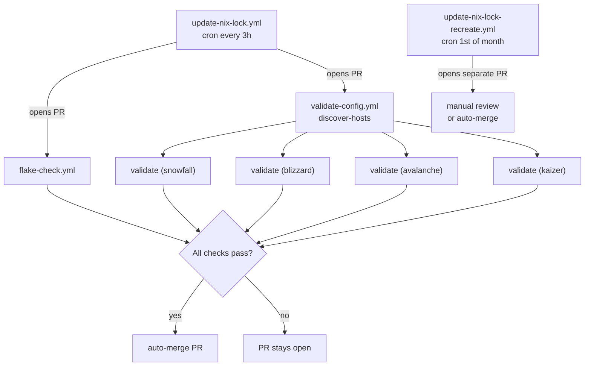

## CI/CD Reference

GitHub Actions automation for the nix-config repository. The pipelines handle
formatting, validation, compliance, security, and automatic flake lock updates.

______________________________________________________________________

### Introduction

All workflows that run `nix` commands against the flake require access to the
private `nix-secrets` SSH flake input. Without the deploy key, `nix flake check`
fails because Nix cannot fetch the private repository.

**SSH_DEPLOY_KEY requirement:** Every `nix`-touching workflow uses
`webfactory/ssh-agent@v0.9.1` with `secrets.SSH_DEPLOY_KEY`. To set this up:

1. Generate a dedicated SSH key pair: `ssh-keygen -t ed25519 -C "github-actions"`
1. Add the **public key** as a deploy key on the `nix-secrets` repository
   (Settings → Deploy keys, read-only is sufficient).
1. Add the **private key** as a repository secret named `SSH_DEPLOY_KEY` on
   this repository (Settings → Secrets and variables → Actions).

Without this secret, any workflow that evaluates the flake will fail with an
SSH authentication error.

______________________________________________________________________

### Auto-Merge Chain

The primary lock-file automation (`update-nix-lock.yml`) opens a PR, then
blocks on the full validation suite before enabling auto-merge. A separate
monthly workflow recreates the lock file from scratch.

______________________________________________________________________

### Full Workflow Reference

| Workflow | Trigger | Purpose | Auto-commits? |
|----------|---------|---------|--------------|
| `auto-format.yml` | PR / push to main / manual | Runs `nix fmt`, commits formatted changes back to the branch, comments on PR, enables auto-merge | Yes — formats in-place |
| `flake-check.yml` | PR / push to main / manual (paths: `**.nix`, `flake.lock`, `treefmt.nix`) | Runs `nix flake check --no-build`, redacts secrets in failure output | No |
| `validate-config.yml` | PR / push to main / manual | Discovers hosts via `mkHost` grep, evaluates each host's `config.system.build.toplevel` with `nix eval` in a matrix, and evaluates the Home Manager users attrset | No |
| `change-impact-analysis.yml` | PR | Diffs changed files under `hosts/`, `modules/`, `home/`, `vms/`, `lib/`, `flake.*`, posts impact report as a PR comment | No |
| `compliance-check.yml` | PR / push / cron Mon 09:00 | Runs `deadnix` and other Nix linters, comments results | No |
| `doc-drift.yml` | PR | Warns if code changes ship without any `docs/*.md` or `*.md` updates | No |
| `flake-freshness.yml` | cron Mon 08:00 / manual | Walks `flake.lock`, flags inputs older than 90 days via a GitHub Issue | No (opens Issue) |
| `health-check.yml` | cron daily 06:00 / manual | Discovers hosts, builds `config.system.build.toplevel` for each | No |
| `security-audit.yml` | cron Mon 02:00 / manual | Runs `gitleaks`; greps for `openFirewall.*true` | No |
| `cloudflare-ip-check.yml` | cron 1st of month 04:00 / manual | Diffs hardcoded CF IPs in `hosts/blizzard/security/traefik.nix` against cloudflare.com/ips-v4 | No (opens Issue/PR) |
| `update-nix-lock.yml` | cron every 3h / manual | Runs `update-flake-lock`, opens PR, waits for `flake-check` + full validate matrix, then auto-merges | Yes — lock file |
| `update-nix-lock-recreate.yml` | cron 1st of month 03:00 / manual | `nix flake update --recreate-lock-file`, opens PR via `peter-evans/create-pull-request@v7`, auto-merge | Yes — lock file |
| `update-dashboards.yml` | cron Mon 09:00 / manual | Polls Grafana.com API for new revisions of dashboards 1860 and 315, opens PR if newer revision found | No (opens PR) |

______________________________________________________________________

### Scheduled Workflows

These run on a cron schedule without a PR trigger:

**Daily**

- **`health-check.yml`** (06:00) — Full host build to catch regressions that
  slipped through PR checks. Fails loudly if any host fails to build.

**Weekly (Monday)**

- **`flake-freshness.yml`** (08:00) — Opens a GitHub Issue listing any flake
  inputs that have not been updated in more than 90 days.
- **`compliance-check.yml`** (09:00) — Re-runs linters on the current main
  branch, not just on PRs.
- **`update-dashboards.yml`** (09:00) — Checks for upstream Grafana dashboard
  updates and opens a PR when a new revision is available.
- **`security-audit.yml`** (02:00) — Secret scanning and firewall hygiene check.

**Every 3 hours**

- **`update-nix-lock.yml`** — The primary lock-file automation. Uses
  DeterminateSystems/update-flake-lock@v28. Opens a PR only when inputs have
  actually changed, then blocks on the full validation suite before merging.

**Monthly (1st of month)**

- **`cloudflare-ip-check.yml`** (04:00) — Ensures the hardcoded Cloudflare IP
  allowlist in Traefik config stays current.
- **`update-nix-lock-recreate.yml`** (03:00) — Regenerates the lock file from
  scratch (not just an incremental update), as a safety net for any inputs that
  the incremental updater might have pinned to a stale state.

______________________________________________________________________

### PR Workflows

These run on every pull request:

| Workflow | What it checks |
|----------|---------------|
| `auto-format.yml` | Formats all files and commits back; if this commits, the PR diff is automatically clean |
| `flake-check.yml` | Evaluates the flake for Nix errors (paths filter: only runs when `.nix`, `flake.lock`, or `treefmt.nix` files change) |
| `validate-config.yml` | Evaluates each host's `config.system.build.toplevel` with `nix eval` in a matrix (does not perform a full build) |
| `change-impact-analysis.yml` | Posts a comment summarising which layer (hosts, modules, home, vms, lib, flake) is affected |
| `compliance-check.yml` | Dead-code linting and other Nix hygiene checks |
| `doc-drift.yml` | Warns when code changes land without documentation updates |

The `update-nix-lock.yml` workflow explicitly waits for `flake-check`,
`discover-hosts`, and every `validate (<hostname>)` matrix job before it
enables auto-merge on lock-file PRs. Adding a new host to `flake.nix` therefore
automatically extends the gate — no workflow file changes needed.

______________________________________________________________________

### Adding a New Host

When a new host is registered in `flake.nix` via `mkHost`, the CI matrix
workflows (`validate-config.yml`, `health-check.yml`, `update-nix-lock.yml`)
discover it automatically via a `grep mkHost flake.nix` step. No workflow file
edits are required.
