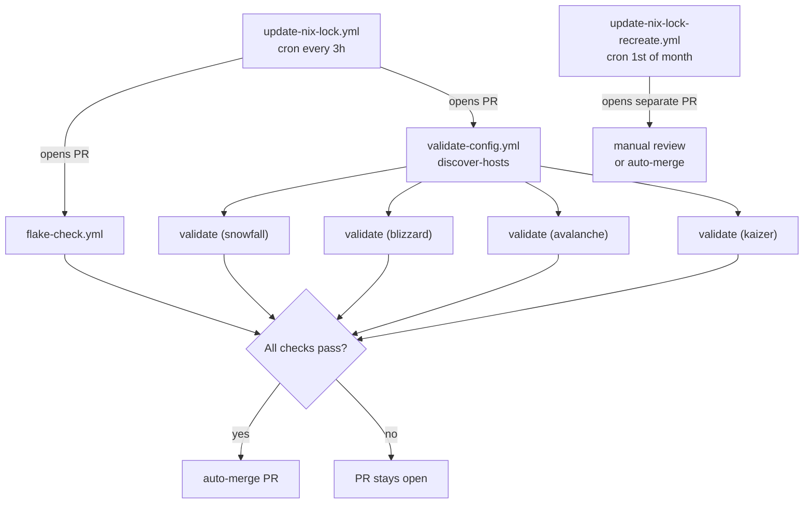

## CI/CD Reference

GitHub Actions automation for the nix-config repository. The pipelines handle
formatting, validation, compliance, security, and automatic flake lock updates.

______________________________________________________________________

### Introduction

Workflows that evaluate the flake or `nixosConfigurations` require access to
the private `nix-secrets` SSH flake input. Without the deploy key,
`nix flake check` fails because Nix cannot fetch the private repository.

Note: not every workflow that runs a `nix` command needs this key. `auto-format.yml`
runs `nix fmt` (formatting only, no evaluation), and `update-dashboards.yml` uses
`nix-hash` only — neither requires the SSH deploy key.

**SSH_DEPLOY_KEY requirement:** Workflows that evaluate the flake —
`flake-check`, `validate-config`, `update-nix-lock`, `health-check`, and
`update-nix-lock-recreate` — use `webfactory/ssh-agent@v0.10.0` with
`secrets.SSH_DEPLOY_KEY`. To set this up:

1. Generate a dedicated SSH key pair: `ssh-keygen -t ed25519 -C "github-actions"`
1. Add the **public key** as a deploy key on the `nix-secrets` repository
   (Settings → Deploy keys, read-only is sufficient).
1. Add the **private key** as a repository secret named `SSH_DEPLOY_KEY` on
   this repository (Settings → Secrets and variables → Actions).

Without this secret, any workflow that evaluates the flake will fail with an
SSH authentication error.

**PAT_TOKEN requirement:** `update-nix-lock.yml` uses a personal access token
when it creates or updates the lock-file pull request. A PR opened with the
built-in `GITHUB_TOKEN` does not trigger the validation workflows that gate
auto-merge.

For a fine-grained token, grant this repository read/write access to
**Contents** and **Pull requests**. For a classic token, grant the `repo` scope.
Store it as the repository Actions secret `PAT_TOKEN`, and rotate the secret
before the token expires. The workflow validates the token before installing
Nix and reports whether it is missing, invalid, or lacks push access.

______________________________________________________________________

### Auto-Merge Chain

The primary lock-file automation (`update-nix-lock.yml`) opens a PR, then
blocks on the full validation suite before enabling auto-merge. A separate
monthly workflow recreates the lock file from scratch.


```mermaid
flowchart TD
    A[update-nix-lock.yml\ncron every 3h] -->|opens PR| B[flake-check.yml]
    A -->|opens PR| C[validate-config.yml\ndiscover-hosts]
    C --> D["validate (snowfall)"]
    C --> E["validate (blizzard)"]
    C --> F["validate (avalanche)"]
    C --> G["validate (kaizer)"]
    B --> H{All checks pass?}
    D --> H
    E --> H
    F --> H
    G --> H
    H -->|yes| I[auto-merge PR]
    H -->|no| J[PR stays open]

    K[update-nix-lock-recreate.yml\ncron 1st of month] -->|opens separate PR| L[manual review\nor auto-merge]
```

______________________________________________________________________

### Full Workflow Reference

| Workflow | Trigger | Purpose | Auto-commits? |
|----------|---------|---------|--------------|
| `auto-format.yml` | PR / push to main / manual | Runs `nix fmt`, commits formatted changes back to the branch, comments on PR, enables auto-merge | Yes — formats in-place |
| `flake-check.yml` | Every PR / push to main / manual / nightly 02:17 UTC | Classifies the complete diff, evaluates all flake outputs for Nix/shared changes, builds selected checks with lifecycle on a separate runner, and preserves the stable `flake-check` gate; full runs discover and build every declared check | No |
| `validate-config.yml` | PR / push to main / manual | Discovers hosts via `mkHost` grep, evaluates each host's `config.system.build.toplevel` with `nix eval` in a matrix, and evaluates the Home Manager users attrset | No |
| `change-impact-analysis.yml` | PR | Diffs changed files under `hosts/`, `modules/`, `home/`, `vms/`, `lib/`, `flake.*`, posts impact report as a PR comment | No |
| `compliance-check.yml` | PR / push / cron Mon 09:00 | Runs `deadnix` and other Nix linters, comments results | No |
| `doc-drift.yml` | PR | Warns if code changes ship without any `docs/*.md` or `*.md` updates | No |
| `flake-freshness.yml` | cron Mon 08:00 / manual | Walks `flake.lock`, flags inputs older than 90 days via a GitHub Issue | No (opens Issue) |
| `health-check.yml` | cron daily 06:00 / manual | Discovers hosts, builds `config.system.build.toplevel` for each, opens or updates a bot-created infrastructure Issue on failure, and closes matching Issues after an authoritative recovery | No (opens, comments on, and closes Issues) |
| `security-audit.yml` | cron Mon 02:00 / manual | Runs `gitleaks`; greps for `openFirewall.*true` | No |
| `update-nix-lock.yml` | cron every 3h / manual | Runs `update-flake-lock`, opens PR, waits for `flake-check` + full validate matrix, then auto-merges | Yes — lock file |
| `update-nix-lock-recreate.yml` | cron 1st of month 03:00 / manual | `nix flake update --recreate-lock-file`, opens PR via `peter-evans/create-pull-request@v7`, auto-merge | Yes — lock file |
| `update-dashboards.yml` | cron Mon 09:00 / manual | Polls Grafana.com API for new revisions of dashboards 1860 and 315, opens PR if newer revision found | No (opens PR) |
| `copilot-auto-merge.yml` | PR review submitted | Arms auto-merge when `copilot-pull-request-reviewer[bot]` submits a review with zero inline comments; disabled when inline comments exist. Merge still gated by branch protection. | No |

______________________________________________________________________

### Conditional Flake Check

Every PR and push to main creates the required `flake-check` gate; there are
no workflow-level path filters. The classifier uses the PR merge-base to head
diff, or the complete push before-to-after range. Rename detection is disabled
so both old and new paths contribute requirements, including deleted inputs.
Mixed changes select the union. Missing commits, invalid endpoints, or unavailable
history select the full suite. Manual dispatch and the nightly 02:17 UTC run
always select full coverage.

The dependency map lives in `.github/scripts/flake_ci.py`. It deliberately uses
exact filenames for configuration modules: new auto-loaded files default to
full coverage until their dependencies are reviewed. The executable contracts
under `.github/tests/` run before classification on every invocation.

| Changed inputs | Selected work |
|----------------|---------------|
| Markdown documentation | Formatting; no global output evaluation |
| Cloudflare collector, fixtures, dashboard, service module, or alerts | Cloudflare metrics and formatting |
| CrowdSec packages, Python fixtures, dashboard, monitoring, or contract definitions | CrowdSec HTTP/observability, three runtime fixtures, and formatting where applicable |
| CrowdSec service/security configuration | CrowdSec checks and fixtures, Matrix, publication, blackbox, network-policy, and formatting |
| Matrix service modules and VM/storage files | Matrix baseline/WhatsApp, publication, blackbox, network-policy, and formatting |
| Jellyfin service/GPU/web modules and VM/settings files | Jellyfin firewall and MicroVM contracts, and formatting |
| Blackbox module, target configuration, or availability dashboard | Blackbox observability and formatting |
| Other existing check definitions | Their check and formatting |
| Lockfile, flake, treefmt, CI control scripts/tests/workflow, shared helpers/loaders/core/VM infrastructure, or any unmapped runtime file | Full suite |

Every Nix file change retains global output evaluation, even when its check
builds are targeted. Documentation and mapped Python/fixture changes avoid that
global evaluation; building their selected checks still evaluates those checks'
dependencies. Unmapped non-Nix runtime changes also select full evaluation.
Formatting selection follows the current treefmt extensions and excludes
workflow YAML and lockfiles; a full run always builds formatting.

The `grouped` job first runs `evaluate-flake-outputs.sh` when selected. It keeps
each output evaluation in a separate Nix process to bound memory. It then builds
short checks sequentially on that runner for cache reuse. The
`microvm-lifecycle` check runs concurrently on its own runner whenever selected.
Its QEMU configuration and lifecycle coverage are unchanged.

Full runs discover the current `checks.x86_64-linux` attribute names from Nix
and build every declaration, including future checks, formatting, and
`jellyfin-microvm`. Lifecycle is excluded from the grouped loop because its
separate job builds it. The Jellyfin MicroVM check evaluates assertions and
builds a marker; it does not boot a guest.

For CrowdSec selections, all grouped Nix builds and fixture preparation finish
with private-input SSH available. The workflow then stops the agent, clears its
credential environment, and runs all three Python runtime fixtures explicitly
without `SSH_AUTH_SOCK` or `SSH_AGENT_PID`. No later Nix work requires an agent
restart. Evaluation and Nix build failures pass diagnostics through
`redact-secrets.sh`; fixture preparation failures also propagate to the gate.

The final job is named exactly `flake-check` and uses `always()`. It requires
classifier success, a valid selection plan, and success for each selected
worker. Only unselected workers may be skipped; selected skips, failures,
cancellations, missing results, and inconsistent plans fail the gate. The
lock-update workflow continues to require this check on the exact PR head SHA.

The separate host and Home Manager validation workflow remains in place.
Daily health-check host builds supplement the nightly explicit check builds.
Auto-format's Python filter omission, tolerated formatter failures, and bot
commits that do not trigger another CI run make it insufficient as a strict
formatting gate. Conditional Flake Check therefore builds the formatting check
when relevant changes select it.

For local classifier and gate validation without Nix or the private input:

```bash
python3 -B -m unittest discover -s .github/tests -v
git diff --check
```

These tests cover real multi-commit Git histories, divergent PR bases, renames,
deletions, missing history, conservative selection, future check discovery, and
final-gate success/failure behavior. They do not validate Linux Nix evaluation,
builds, credentials, or runner behavior; use current CI for that evidence.
Parallelism may reduce wall time but can increase runner minutes. No timing
improvement has been measured for this workflow.

______________________________________________________________________

### Scheduled Workflows

These scheduled runs supplement event and manual triggers:

**Daily**

- **`flake-check.yml`** (02:17 UTC) — Full output evaluation and every declared
  check, with lifecycle on a separate runner and all three CrowdSec fixtures.

- **`health-check.yml`** (06:00) — Full host build to catch regressions that
  slipped through PR checks. On failure, opens an `infrastructure` / `urgent`
  GitHub Issue or comments on every matching open bot-created Issue. A successful
  run closes those Issues only when it tested the current default-branch head,
  after adding a recovery comment with the workflow-run link.

**Weekly (Monday)**

- **`flake-freshness.yml`** (08:00) — Opens a GitHub Issue listing any flake
  inputs that have not been updated in more than 90 days.
- **`compliance-check.yml`** (09:00) — Re-runs linters on the current main
  branch, not just on PRs.
- **`update-dashboards.yml`** (09:00) — Checks for upstream Grafana dashboard
  updates and opens a PR when a new revision is available.
- **`security-audit.yml`** (02:00) — Secret scanning and firewall hygiene check.

**Every 3 hours**

- **`update-nix-lock.yml`** — The primary lock-file automation. Uses
  DeterminateSystems/update-flake-lock@v28. Opens a PR only when inputs have
  actually changed, then blocks on the full validation suite before merging.

**Monthly (1st of month)**

- **`update-nix-lock-recreate.yml`** (03:00) — Regenerates the lock file from
  scratch (not just an incremental update), as a safety net for any inputs that
  the incremental updater might have pinned to a stale state.

______________________________________________________________________

### PR Workflows

These run on every pull request:

| Workflow | What it checks |
|----------|---------------|
| `auto-format.yml` | Formats all files and commits back; if this commits, the PR diff is automatically clean |
| `flake-check.yml` | Selects checks from the complete PR diff, retains global evaluation for Nix changes, runs relevant CrowdSec fixtures without SSH credentials, and always creates the required final gate |
| `validate-config.yml` | Evaluates each host's `config.system.build.toplevel` with `nix eval` in a matrix (does not perform a full build) |
| `change-impact-analysis.yml` | Posts a comment summarising which layer (hosts, modules, home, vms, lib, flake) is affected |
| `compliance-check.yml` | Dead-code linting and other Nix hygiene checks |
| `doc-drift.yml` | Warns when code changes land without documentation updates |

The `update-nix-lock.yml` workflow explicitly waits for `flake-check`,
`discover-hosts`, and every `validate (<hostname>)` matrix job before it
enables auto-merge on lock-file PRs. Adding a new host to `flake.nix` therefore
automatically extends the gate — no workflow file changes needed.

______________________________________________________________________

### Adding a New Host

When a new host is registered in `flake.nix` via `mkHost`, the CI matrix
workflows (`validate-config.yml`, `health-check.yml`, `update-nix-lock.yml`)
discover it automatically via a `grep mkHost flake.nix` step. No workflow file
edits are required.
