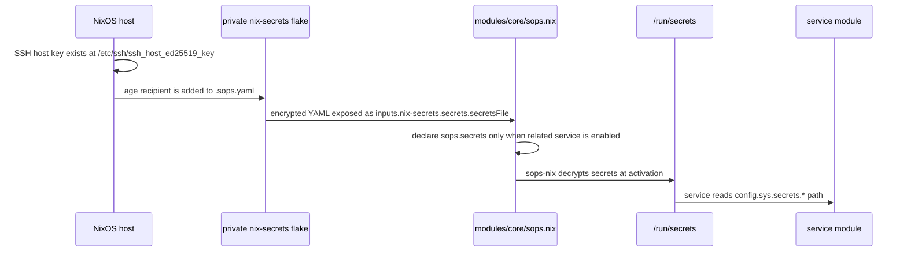
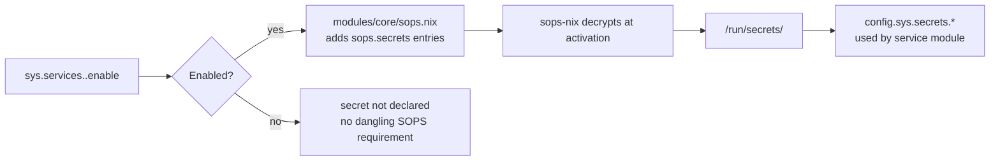

# SOPS Setup Guide

This guide is the canonical reference for adding a host to the private
`nix-secrets` age recipient set and understanding how secrets flow into this
NixOS flake.

The secret values and `.sops.yaml` mappings live in the private
`nix-secrets` repository, not in this repository. Never copy encrypted or
plaintext secret material here.

______________________________________________________________________

## Secret flow



`modules/core/sops.nix` bridges SOPS into the repository's `sys.secrets.*`
option namespace. Consumer modules should read those runtime path strings
instead of importing SOPS details directly.

______________________________________________________________________

## Add a new host recipient

Run these steps on the target machine and in the private `nix-secrets`
checkout.

### 1. Derive the age recipient

Derive the age public key from the host's SSH host key:

```bash
ssh-keygen -y -f /etc/ssh/ssh_host_ed25519_key | ssh-to-age
```

If `ssh-to-age` is not installed on the target machine, use the dev shell or
run it from Nix:

```bash
ssh-keygen -y -f /etc/ssh/ssh_host_ed25519_key | nix run nixpkgs#ssh-to-age --
```

### 2. Update `.sops.yaml` in `nix-secrets`

In the private `nix-secrets` repository, add the resulting age recipient to
the host's entry in `.sops.yaml`.

Do not add `.sops.yaml`, host age keys, or decrypted secret files to this
repository.

### 3. Re-encrypt affected files

Still inside the private `nix-secrets` checkout, update the recipient metadata
for every secret file the host should read:

```bash
sops updatekeys path/to/affected-secret.yaml
```

Repeat the command for each affected SOPS file. Until this is done, the host
can evaluate but secret-consuming services may fail during activation or
startup.

______________________________________________________________________

## Service enablement and secret declarations

Secrets are intentionally conditional. `modules/core/sops.nix` only declares a
service-specific `sops.secrets` entry when the related service is enabled.



This avoids forcing every host to decrypt secrets for services it does not run.

______________________________________________________________________

## Troubleshooting

### SOPS decryption fails on a new host

Check that:

- the host's SSH host key exists at `/etc/ssh/ssh_host_ed25519_key`
- the derived age recipient is present in `nix-secrets/.sops.yaml`
- each required secret file was updated with `sops updatekeys`
- the host is using the same SSH host key that was registered

### A service cannot find its secret path

Check that the service option is enabled. If the service is disabled,
`modules/core/sops.nix` will not declare its secret, and the corresponding
`config.sys.secrets.*` path will not exist.

### Local flake evaluation fails with SSH errors

This repository imports `nix-secrets` via SSH. Cloud sandboxes and machines
without the deploy key cannot run full flake evaluation commands reliably.
Use syntax-only checks locally and rely on CI for host evaluation.

### A secret was renamed or moved

Update all three places together:

1. the encrypted file or key in `nix-secrets`
1. the matching entry in `modules/core/sops.nix`
1. any consumer module that reads `config.sys.secrets.*`

______________________________________________________________________

## Related files

- [`modules/core/sops.nix`](../modules/core/sops.nix) — conditional secret declarations and `sys.secrets.*` bridge
- [`modules/security/secrets.nix`](../modules/security/secrets.nix) — option declarations for runtime secret paths
- [`docs/reference-architecture.md`](reference-architecture.md#secrets-flow) — architecture reference
- [`docs/reference-ci.md`](reference-ci.md) — CI and SSH deploy-key requirements
