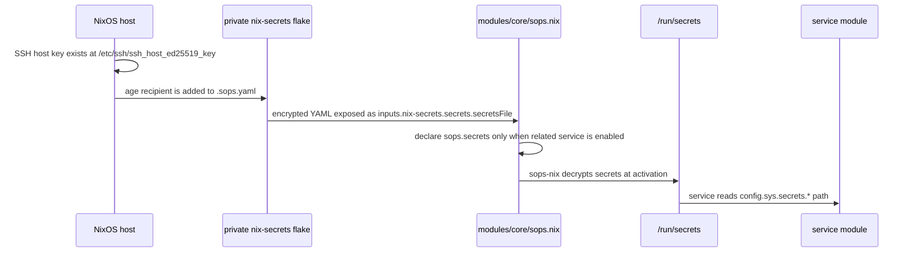
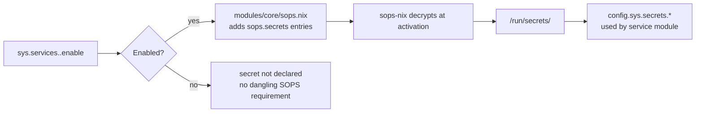

# SOPS Setup Guide

This guide is the canonical reference for adding a host to the private
`nix-secrets` age recipient set and understanding how secrets flow into this
NixOS flake.

The secret values and `.sops.yaml` mappings live in the private
`nix-secrets` repository, not in this repository. Never copy encrypted or
plaintext secret material here.

______________________________________________________________________

## Secret flow


```mermaid
sequenceDiagram
    participant Host as NixOS host
    participant Secrets as private nix-secrets flake
    participant Sops as modules/core/sops.nix
    participant Runtime as /run/secrets
    participant Service as service module

    Host->>Host: SSH host key exists at /etc/ssh/ssh_host_ed25519_key
    Host->>Secrets: age recipient is added to .sops.yaml
    Secrets->>Sops: encrypted YAML exposed as inputs.nix-secrets.secrets.secretsFile
    Sops->>Sops: declare sops.secrets only when related service is enabled
    Sops->>Runtime: sops-nix decrypts secrets at activation
    Runtime->>Service: service reads config.sys.secrets.* path
```

`modules/core/sops.nix` bridges SOPS into the repository's `sys.secrets.*`
option namespace. Consumer modules should read those runtime path strings
instead of importing SOPS details directly.

______________________________________________________________________

## Add a new host recipient

Run these steps on the target machine and in the private `nix-secrets`
checkout.

### 1. Derive the age recipient

Derive the age public key from the host's SSH host key:

```bash
ssh-keygen -y -f /etc/ssh/ssh_host_ed25519_key | ssh-to-age
```

If `ssh-to-age` is not installed on the target machine, use the dev shell or
run it from Nix:

```bash
ssh-keygen -y -f /etc/ssh/ssh_host_ed25519_key | nix run nixpkgs#ssh-to-age --
```

### 2. Update `.sops.yaml` in `nix-secrets`

In the private `nix-secrets` repository, add the resulting age recipient to
the host's entry in `.sops.yaml`.

Do not add `.sops.yaml`, host age keys, or decrypted secret files to this
repository.

### 3. Re-encrypt affected files

Still inside the private `nix-secrets` checkout, update the recipient metadata
for every secret file the host should read:

```bash
sops updatekeys path/to/affected-secret.yaml
```

Repeat the command for each affected SOPS file. Until this is done, the host
can evaluate but secret-consuming services may fail during activation or
startup.

______________________________________________________________________

## Rotate a host key or age recipient

Do not rotate host SSH keys or SOPS age recipients on a calendar. Rotate them
only after host reinstallation, persistent storage loss, suspected compromise,
or a deliberate algorithm/key-management upgrade. A missing recipient can break
activation for every service that needs SOPS secrets.

Use an overlap-and-remove sequence:

1. Generate or confirm the replacement host SSH key on the target host.

1. Derive the replacement age recipient:

   ```bash
   ssh-keygen -y -f /etc/ssh/ssh_host_ed25519_key | ssh-to-age
   ```

1. Add the replacement recipient to the host's entry in private
   `nix-secrets/.sops.yaml` while keeping the old recipient.

1. Re-encrypt every affected SOPS file:

   ```bash
   sops updatekeys path/to/affected-secret.yaml
   ```

1. Rebuild or deploy the host and verify that `sops-nix` decrypts its secrets.

1. Remove the old recipient from `.sops.yaml`.

1. Run `sops updatekeys` again for the same files.

1. Rebuild or deploy once more and verify dependent services.

For MicroVMs that use persistent host keys under `/persist/ssh`, derive the age
recipient from the VM's persistent key, not from an ephemeral boot-time key.

______________________________________________________________________

## Service enablement and secret declarations

Secrets are intentionally conditional. `modules/core/sops.nix` only declares a
service-specific `sops.secrets` entry when the related service is enabled.


```mermaid
flowchart LR
    A["sys.services.<name>.enable"] --> B{"Enabled?"}
    B -->|yes| C["modules/core/sops.nix\nadds sops.secrets entries"]
    C --> D["sops-nix decrypts at activation"]
    D --> E["/run/secrets/<path>"]
    E --> F["config.sys.secrets.*\nused by service module"]
    B -->|no| G["secret not declared\nno dangling SOPS requirement"]
```

This avoids forcing every host to decrypt secrets for services it does not run.

______________________________________________________________________

## Home Manager user secrets

The system SOPS layer above is separate from user-profile secrets. The
repository's [`home/security/sops.nix`](../home/security/sops.nix) wrapper
maps `hm.security.sops.*` into the Home Manager SOPS-Nix module. Enabled user
profiles use the runtime paths `%r/secrets.d` for generations and `%r/secrets`
for stable symlinks; these are user-runtime paths, not system `/run/secrets`
paths and not `sys.secrets.*` options.

The Gitea Git integration is the concrete opt-in example:

- module: [`home/programs/gitea.nix`](../home/programs/gitea.nix)
- enablement: `hm.programs.gitea.enable = true`
- current scope: zeno on snowfall via
  [`home/overrides/user/zeno-snowfall.nix`](../home/overrides/user/zeno-snowfall.nix)
- private SOPS keys: `gitea/cf_access_id` and `gitea/cf_access_secret`
- rendered template: `$XDG_CONFIG_HOME/sops-nix/secrets/rendered/gitea-git-http`, mode `0400`
- consumer: Git configuration for `https://git.<public-domain>/`, using
  `libsecret` after clearing inherited helpers for that URL

The module asserts that `hm.security.sops.enable` and `programs.git.enable`
remain enabled. Do not enable the feature on a profile that intentionally
disables SOPS; remove the feature or keep the assertion failure visible.
The user `sops-nix` service is ordered before its `default.target` or
`graphical-session-pre.target` installation target so the rendered include is
available before the normal session starts.

### Provision and rotate the Gitea user credentials

1. Create or rotate the Cloudflare Access service-token pair in the provider
   console.
1. Add or update only the two named keys in the private `nix-secrets` SOPS
   file, then re-encrypt it for the snowfall recipient. Never copy plaintext
   values into this repository.
1. Rebuild snowfall and activate Home Manager for zeno.
1. As zeno, check `systemctl --user status sops-nix`, confirm the rendered
   template is mode `0400`, and run an authenticated `git ls-remote` against
   Gitea. Do not enable curl tracing or verbose Git logging because the
   rendered include contains bearer-like headers.
1. Revoke the old provider token after the replacement has been verified.

If `hm.security.sops.enable = false` is required for a profile, the Gitea
feature must also be disabled. Its test contract covers both the normal path
and this rejected combination so it cannot silently leave a dangling include.

______________________________________________________________________

## Troubleshooting

### SOPS decryption fails on a new host

Check that:

- the host's SSH host key exists at `/etc/ssh/ssh_host_ed25519_key`
- the derived age recipient is present in `nix-secrets/.sops.yaml`
- each required secret file was updated with `sops updatekeys`
- the host is using the same SSH host key that was registered

### A service cannot find its secret path

Check that the service option is enabled. If the service is disabled,
`modules/core/sops.nix` will not declare its secret, and the corresponding
`config.sys.secrets.*` path will not exist.

### A Home Manager user secret or template is missing

Check that:

- the relevant opt-in module is enabled for the intended user and host
- `hm.security.sops.enable` is true for that profile
- the exact key exists in the private SOPS file and is encrypted for the
  user's configured age identity
- `systemctl --user status sops-nix` succeeds after Home Manager activation
- secret symlinks are under `%r/secrets`, while rendered templates are under
  `$XDG_CONFIG_HOME/sops-nix/secrets/rendered`

### Local flake evaluation fails with SSH errors

This repository imports `nix-secrets` via SSH. Cloud sandboxes and machines
without the deploy key cannot run full flake evaluation commands reliably.
Use syntax-only checks locally and rely on CI for host evaluation.

### A secret was renamed or moved

Update all three places together:

1. the encrypted file or key in `nix-secrets`
1. the matching entry in `modules/core/sops.nix`
1. any consumer module that reads `config.sys.secrets.*`

______________________________________________________________________

## Related files

- [`modules/core/sops.nix`](../modules/core/sops.nix) — conditional secret declarations and `sys.secrets.*` bridge
- [`modules/security/secrets.nix`](../modules/security/secrets.nix) — option declarations for runtime secret paths
- [`docs/reference-architecture.md`](reference-architecture.md#secrets-flow) — architecture reference
- [`docs/reference-ci.md`](reference-ci.md) — CI and SSH deploy-key requirements
