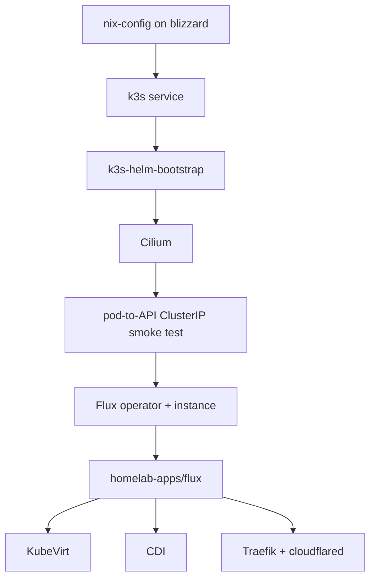

# KubeVirt Migration — Plan 1: Cluster Bootstrap

Status: current plan for the `dev-kubevirt` branch.

This plan covers only the `blizzard` cluster bootstrap. It keeps all legacy MicroVMs available while k3s, Cilium, Flux, KubeVirt, CDI, Sealed Secrets, Traefik, and cloudflared are brought under control. Service migration happens in later plans and is tracked in `docs/kubevirt-migration-plan.md`.

## Architecture

`nix-config` owns the host and pre-Flux bootstrap. `homelab-apps` owns long-lived Kubernetes resources through Flux. Cilium must be installed before Flux because Flux controller pods need working pod networking and Kubernetes API Service routing.



## Files in this repo

| File | Purpose |
|---|---|
| `modules/virtualisation/k3s.nix` | k3s service module; appends Cilium-only flags when `ciliumCni = true` |
| `modules/virtualisation/k3s-bootstrap.nix` | helmfile bootstrap for Cilium, smoke test, then Flux |
| `hosts/blizzard/blizzard.nix` | enables k3s, Cilium bootstrap, firewall exceptions, and Flux values |
| `hosts/blizzard/virtualisation/cilium-values.yaml` | OS-bootstrap Cilium values; keep in sync with `homelab-apps/network/cilium-helmrelease.yaml` |
| `hosts/blizzard/virtualisation/flux-instance-values.yaml` | Flux instance config pointing at `telometto/homelab-apps` |
| `hosts/blizzard/security/traefik.nix` | stub: NixOS-managed Traefik is disabled while Kubernetes Traefik is introduced |
| `hosts/blizzard/virtualisation/gvisor.nix` | inert note-only stub; gVisor is not part of this migration |

## Files in `homelab-apps`

The imported repo now contains bootstrap directories/manifests for:

- `flux/`
- `network/`
- `namespaces/`
- `sealed-secrets/`
- `ingress/`
- `kubevirt/`
- `cdi/`
- `storage/`
- `vms/`

Known follow-up after the first pilot reconciles:

- add Traefik middleware/routes with parity to the old NixOS Traefik behavior
- tighten per-VM NetworkPolicies before adding VPN-routed or high-risk services
- add additional per-VM manifests after the manual-control `actual` pilot is accepted

## Task 1 — Verify k3s Cilium mode

`modules/virtualisation/k3s.nix` must keep Cilium flags opt-in. The defaults should not force Cilium on other hosts.

Required behavior:

- `sys.services.k3s.ciliumCni = false` keeps normal k3s networking behavior.
- `sys.services.k3s.ciliumCni = true` appends:
  - `--disable-kube-proxy`
  - `--flannel-backend=none`
  - `--disable-network-policy`

`blizzard` sets:

```nix
sys.services.k3s = {
  enable = true;
  ciliumCni = true;
  bootstrap.enable = true;
};
```

## Task 2 — Keep Cilium values canonical

The OS bootstrap values and Flux-managed values must agree:

| Setting | Required value |
|---|---|
| `kubeProxyReplacement` | `true` |
| `k8sServiceHost` | `127.0.0.1` |
| `k8sServicePort` | `6443` |
| `routingMode` | `native` |
| `ipv4NativeRoutingCIDR` | `10.42.0.0/16` |
| `autoDirectNodeRoutes` | `true` |
| `hubble.relay.enabled` | `true` |
| `hubble.ui.enabled` | `true` |

Do not set `kubeProxyReplacement: false`; kube-proxy is disabled in k3s for this cluster.

## Task 3 — Keep host firewall Cilium-compatible

`blizzard` must allow Cilium's veth/device model without trusting every pod veth
interface unconditionally:

```nix
networking.firewall = {
  checkReversePath = false;
  interfaces."lxc+".allowedTCPPorts = [
    6443 # k3s API backend after Cilium Service translation
    4240 # Cilium health check
    4244 # Hubble server
    4245 # Hubble relay
  ];
};
```

The `lxc+` pattern is intentional for Cilium interfaces in this environment, but
it must remain scoped to the required pod-to-host ports instead of being added to
`trustedInterfaces`.

## Task 4 — Bootstrap Cilium before Flux

`modules/virtualisation/k3s-bootstrap.nix` uses a generated helmfile with release labels:

1. run `helmfile sync` with selector `phase=cni`
1. wait for the Cilium DaemonSet
1. discover the Kubernetes Service ClusterIP at runtime and run a pod that curls it
1. run `helmfile sync` with selector `phase=flux`
1. wait for Cilium and the Flux controller Deployments to roll out, then disable the retry timer

The smoke test succeeds on HTTP 401 or 403 because that proves pod networking and Service routing work; authentication is not the point of the test.

## Task 5 — Stage Flux SSH auth safely

`fluxGitAuthSecretFile` optionally links a sops-nix decrypted Secret manifest into k3s's auto-apply directory.

Safety requirements:

- Always remove the old staged manifest when the option is unset.
- Use `L+` so path changes replace the symlink.
- Do not commit the decrypted Secret to this repo.
- Keep the SSH deploy key in `nix-secrets`.

## Task 6 — Validate operators through Flux

After bootstrapping, validate these Flux Kustomizations from `homelab-apps`:

| Kustomization | Dependency |
|---|---|
| `namespaces` | none |
| `network` | Cilium initially installed by NixOS bootstrap; Flux adopts it |
| `sealed-secrets` | none |
| `ingress` | `namespaces`, `sealed-secrets` |
| `kubevirt` | `namespaces` |
| `cdi` | `kubevirt` |

Do not start VM manifests until KubeVirt and CDI report Available.

## Task 7 — Preserve legacy public ingress until parity is proven

The old NixOS Traefik config is stubbed, but migration must not silently reduce public-route protection.

Before any KubeVirt service is exposed, confirm Kubernetes Traefik has equivalent:

- security headers
- CrowdSec/bouncer behavior where used today
- redirect/TLS behavior
- access logging
- Cloudflare Tunnel integration
- no unintended NodePort exposure

## Task 8 — Keep gVisor out of scope

gVisor was previously attempted by writing a k3s containerd `config.toml.tmpl`. That broke pod sandbox creation because the template replaced k3s defaults instead of extending them.

For this all-KubeVirt migration:

- `hosts/blizzard/virtualisation/gvisor.nix` remains inert.
- `homelab-apps/kubevirt/runtimeclass-gvisor.yaml` has been removed from the active GitOps tree.
- No workload migration should depend on `RuntimeClass: gvisor`.

## Validation commands

Local sandbox validation is limited because the flake depends on the private `nix-secrets` input. Prefer syntax checks for changed Nix files and rely on CI for full evaluation.

Useful local checks:

```bash
nix-instantiate --parse modules/virtualisation/k3s.nix
nix-instantiate --parse modules/virtualisation/k3s-bootstrap.nix
nix-instantiate --parse hosts/blizzard/security/traefik.nix
nix-instantiate --parse hosts/blizzard/virtualisation/gvisor.nix
```

Expected live-cluster checks on `blizzard`:

```bash
kubectl -n kube-system rollout status daemonset/cilium --timeout=5m
kubectl -n flux-system get pods
kubectl get kustomizations -A
kubectl get kubevirt -n kubevirt
kubectl get cdi
```

## What comes next

Plan 2 is not container migration. It is the KubeVirt VM template and pilot VM plan:

1. reconcile the `kubevirt-local` and `kubevirt-local-immediate` storage classes
1. import the Debian cloud image for the manual-control `actual` VM
1. start and validate the `actual` pilot VM
1. migrate Actual data from the old MicroVM state if needed
1. validate rollback

Plan 3 migrates the remaining VMs in waves. Plan 4 removes the MicroVM stack after the rollback window closes.

## References

- `docs/superpowers/specs/2026-05-04-microvms-to-kubevirt-design.md`
- `docs/kubevirt-migration-plan.md`
- `docs/kubevirt-operations.md`
