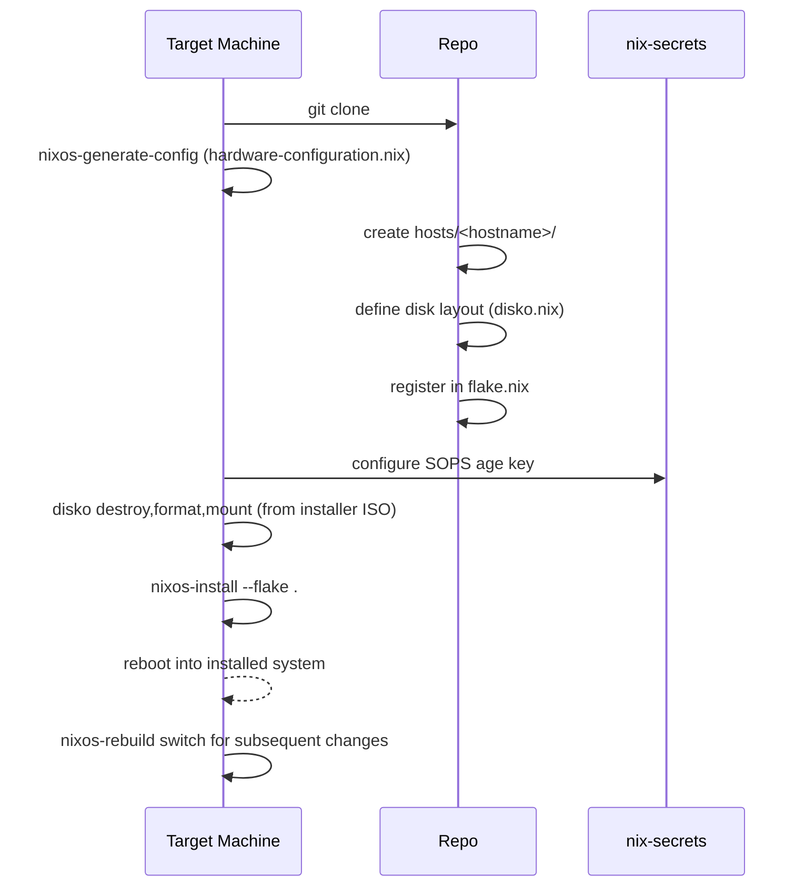

# Tutorial: Provision a New Host

Goal: Bring a new machine under this repo, with auto-loaded system and Home Manager modules, a desktop flavor (optional), and enabled users from `VARS`.

## Provisioning Flow



## Prerequisites

  - Fresh install: boot the target machine from a NixOS installer ISO with network access.
  - Existing install: use `nixos-rebuild switch` after adding the host to the repo; do not run disko unless you intend to repartition.
- SSH access to this repo (`github.com/telometto/nix-config`).
- SSH access to the private `nix-secrets` repo (provides `VARS`).

## Step 1: Clone the Repo

```bash
git clone https://github.com/telometto/nix-config.git
cd nix-config
```

## Step 2: Generate Hardware Config

Run on the target machine and place the output in the new host directory:

```bash
mkdir -p hosts/<hostname>
nixos-generate-config --show-hardware-config > hosts/<hostname>/hardware-configuration.nix
```

## Step 2.5: Define Disk Layout (disko)

Copy the nearest host's `disko.nix` as a starting point and update the `device` path.

Find the NVMe by-id path on the target machine:

```bash
ls -l /dev/disk/by-id/ | grep -i nvme
```

Create `hosts/<hostname>/disko.nix` with the correct `device = "/dev/disk/by-id/nvme-…"`.
The file is auto-imported by `host-loader.nix` — no explicit `imports` needed.

Do not apply the layout yet. Run disko only after the host file is created,
secrets are prepared, and the host is registered in `flake.nix`.

## Step 3: Create Host Directory

Create `hosts/<hostname>/` and populate it with at minimum:

- `hardware-configuration.nix` — generated above
- `packages.nix` — optional per-host package list
- `<hostname>.nix` — role, desktop flavor, and user toggles

Example `<hostname>.nix`:

```nix
{ lib, ... }:
{
  networking.hostName = lib.mkForce "<hostname>";

  sys.role.desktop.enable = true;      # or sys.role.server.enable
  sys.desktop.flavor = "gnome";       # none | kde | gnome | cosmic | hyprland; `none` is the default for servers/headless installs

  sys.users.zeno.enable = true;
}
```

All `.nix` files in the host directory (including `hardware-configuration.nix`
and `packages.nix`) are auto-imported by
[host-loader.nix](../host-loader.nix) — no explicit `imports` needed for local
files.

## Step 4: Configure SOPS

Any service that uses secrets (Tailscale, borgbackup, etc.) requires the
host's age key to be registered in `.sops.yaml` before secrets will decrypt.

These files live in the **private `nix-secrets` repository**, not in this repo.

1. Derive the age public key from the host's SSH host key:

```bash
ssh-keygen -y -f /etc/ssh/ssh_host_ed25519_key | ssh-to-age
```

2. In the `nix-secrets` repository, add the resulting age key to `.sops.yaml`
   under the new host entry.

1. Still in `nix-secrets`, re-encrypt all affected secret files:

```bash
cd ../nix-secrets
sops updatekeys path/to/affected-secret.yaml
```

Repeat `sops updatekeys` for any other secret files that should be readable
by the new host.

Until this step is complete, any secrets-enabled service will fail to start
with a SOPS decryption error.

## Step 5: Register in flake.nix

Add an entry to `nixosConfigurations` in `flake.nix`:

```nix
nixosConfigurations = {
  # ... existing hosts ...
  <hostname> = mkHost "<hostname>" [ ];
};
```

## Step 6: Install, then Rebuild After First Boot

For a fresh install from the NixOS installer ISO, run disko and then
`nixos-install` after Steps 1–5 are complete:

```bash
sudo nix run github:nix-community/disko/latest -- \
  --mode destroy,format,mount \
  /path/to/nix-config/hosts/<hostname>/disko.nix
sudo nixos-install --flake /path/to/nix-config#<hostname>
```

> **Warning:** `--mode destroy` wipes all data on the declared disk(s). Verify
> the `device` path before running. The snowfall data disk carries `destroy = false`
> and is protected even if disko is re-run.

After `nixos-install` finishes, reboot into the installed system.

Use `nixos-rebuild switch` only for subsequent changes after the host has booted
into its installed system, or when onboarding an already-installed machine that
does not need repartitioning:

```bash
sudo nixos-rebuild switch --flake .#<hostname>
```

Both `nixos-install` and later `nixos-rebuild switch` evaluate the same flake
configuration with all modules auto-imported and Home Manager set up for enabled
users.

## Verify

- Desktop flavor applies (if enabled): KDE/GNOME/Hyprland HM bits auto-enable.
- Users exist and can log in; HM profiles are active.
- Services enabled via `sys.services.*` are running:
  ```bash
  systemctl status tailscaled   # example
  journalctl -u <service> -n 50
  ```
- Check that secrets decrypted correctly — no `sops` errors in the journal.

## Next Steps

- Add host-wide HM overrides: `home/overrides/host/<hostname>.nix`
- Add user-specific overrides: `home/overrides/user/<user>-<hostname>.nix`
- Enable additional services via `sys.services.*` in the host file or
  dedicated files under `hosts/<hostname>/`
