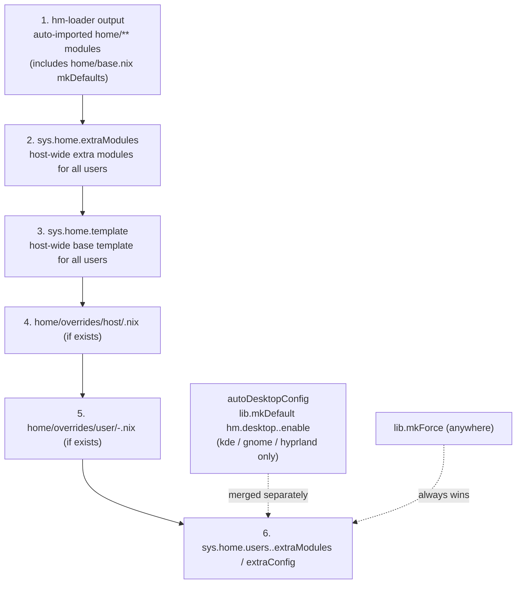

## Home Manager Modules

Auto-loaded Home Manager modules providing user-level configuration via the
`hm.*` option namespace.

### How It Works

All `.nix` files in this directory (except overrides) are automatically
imported by [hm-loader.nix](../hm-loader.nix). Home Manager is integrated as a
NixOS module, building user configurations automatically for enabled users.

### Directory Structure

| Directory | Purpose | Example Options |
|-----------|---------|-----------------|
| [accounts/](accounts/) | PIM account definitions | `hm.accounts.email.enable`, `hm.accounts.calendar.enable` |
| [desktop/](desktop/) | Desktop environment integration | `hm.desktop.gnome.enable`, `hm.desktop.kde.enable` |
| [files/](files/) | Managed dotfiles and themes | File management, Vesktop themes |
| [programs/](programs/) | User applications | `hm.programs.terminal.enable`, `hm.programs.browsers.enable` |
| [security/](security/) | User-level SOPS secrets | `hm.security.sops.*` |
| [services/](services/) | User services | `hm.services.gpgAgent.enable`, `hm.services.sshAgent.enable` |
| [overrides/](overrides/) | Per-host and per-user overrides | Not auto-loaded — see Override System |

### Base Configuration

[base.nix](base.nix) provides shared defaults for all users:

- Home Manager state version
- Common program settings
- Default enabled modules

### Desktop Auto-Enablement

When a host sets `sys.desktop.flavor`, the corresponding HM desktop module is
automatically enabled for `kde`, `gnome`, and `hyprland`:

```nix
# In host config:
sys.desktop.flavor = "kde";

# Automatically enables:
hm.desktop.kde.enable = true;
```

> **Note:** `sys.desktop.flavor = "cosmic"` does **not** auto-enable an HM
> desktop module. Only `kde`, `gnome`, and `hyprland` are mapped in
> `modules/core/home-users.nix`. A `cosmic` host must enable any HM desktop
> integration explicitly.

### Override System

#### Host Overrides

Apply settings to all users on a specific host:

```
home/overrides/host/<hostname>.nix
```

#### User Overrides

Apply settings to a specific user on a specific host:

```
home/overrides/user/<username>-<hostname>.nix
```

#### Shared Override Exception: `ssh-common.nix`

`home/overrides/host/ssh-common.nix` is a shared SSH configuration file that
does **not** follow the `<hostname>.nix` naming convention. It is not picked
up automatically — host override files that need it import it explicitly. This
is the only shared cross-host override file; it cannot be placed in `home/`
directly because it is user-environment-specific rather than a general module.

### Module Pattern

```nix
{ lib, config, ... }:
let
  cfg = config.hm.<category>.<name>;
in
{
  options.hm.<category>.<name> = {
    enable = lib.mkEnableOption "Feature description";
  };

  config = lib.mkIf cfg.enable {
    # Home Manager configuration
    programs.<program>.enable = true;
  };
}
```

### Adding a New Module

1. Create `home/<category>/<name>.nix`
1. Define options under `options.hm.<category>.<name>.*`
1. Implement `config = lib.mkIf cfg.enable { ... };`
1. Module auto-loads via `hm-loader.nix`

### Configuration Precedence

Layers are applied from lowest priority (bottom) to highest (top):



As a numbered list (low → high):

1. Auto-imported HM modules (output of `hm-loader.nix`, includes `home/base.nix` with `lib.mkDefault` values)
1. Host-wide extra modules (`sys.home.extraModules`)
1. Base HM template (`sys.home.template`)
1. Host overrides (`home/overrides/host/<hostname>.nix`)
1. User overrides (`home/overrides/user/<user>-<host>.nix`)
1. Per-user `extraModules` / `extraConfig` (`sys.home.users.<name>.*`)

`autoDesktopConfig` (`hm.desktop.<flavor>.enable = lib.mkDefault true`) is merged separately — it uses `lib.mkDefault` so any explicit `hm.desktop.*.enable` setting in any layer takes precedence.

`lib.mkForce` overrides everything regardless of layer.

### Related Documentation

- [Home users module](../modules/core/home-users.nix) — Builds HM configs
- [Home options module](../modules/core/home-options.nix) — `sys.home.*` options
- [Architecture Blueprint](../docs/Project_Architecture_Blueprint.md)
