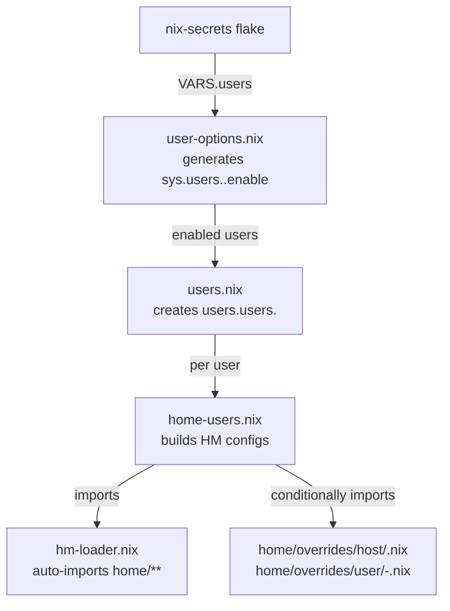

## Core Modules

Essential system configuration modules that form the foundation of every host.

### Modules Overview

| Module | Purpose | Key Options |
|--------|---------|-------------|
| [roles.nix](roles.nix) | Role option definitions | `sys.role.desktop.enable`, `sys.role.server.enable` |
| [users.nix](users.nix) | NixOS user account creation | Creates accounts from VARS |
| [user-options.nix](user-options.nix) | Per-host user enable toggles | `sys.users.<name>.enable` |
| [home-options.nix](home-options.nix) | Home Manager integration options | `sys.home.enable`, `sys.home.template`, `sys.home.users.*` |
| [home-users.nix](home-users.nix) | Builds HM configs for users | Auto-imports modules, applies overrides, auto-desktop |
| [sops.nix](sops.nix) | Secrets management | Conditional `sops.secrets` definitions + `sys.secrets` bridge |
| [overlays.nix](overlays.nix) | Nixpkgs overlays | `sys.overlays.fromInputs`, `sys.overlays.custom` |
| [distributed-builds.nix](distributed-builds.nix) | Remote build configuration | `sys.nix.distributedBuilds.*` |
| [nix.nix](nix.nix) | Nix daemon configuration | Flakes, caches, garbage collection |
| [locale.nix](locale.nix) | Localization settings | Timezone, locale, keyboard |
| [boot.nix](boot.nix) | Boot loader configuration | Bootloader settings |
| [environment.nix](environment.nix) | System environment | Shell aliases, variables |
| [packages.nix](packages.nix) | Base system packages | Essential tools |
| [security.nix](security.nix) | Security settings | Sudo, polkit |

> **Note:** `home-manager-integration.nix` lives at `modules/home-manager-integration.nix`
> (root of `modules/`, not inside `modules/core/`). It wires in the HM nixosModule,
> sets `useGlobalPkgs`, and adds shared modules.

### User Management Flow



### Home Manager Integration

[home-options.nix](home-options.nix) provides:

```nix
sys.home = {
  enable = true;              # Enable HM integration
  template = { };             # Base config for all users
  users.<name> = {
    extraModules = [ ];       # Additional HM modules
    extraConfig = { };        # Per-user configuration
  };
};
```

[home-users.nix](home-users.nix) automatically:

1. Imports all modules via [hm-loader.nix](../../hm-loader.nix)
1. Applies host overrides from `home/overrides/host/<hostname>.nix`
1. Applies user overrides from `home/overrides/user/<user>-<host>.nix`
1. Enables desktop modules based on `sys.desktop.flavor`

### Secrets Management

[sops.nix](sops.nix) conditionally defines secrets based on enabled services:

```nix
whenEnabled = cond: attrs: if cond then attrs else { };

sops.secrets = { }
  // (whenEnabled hasTailscale { "tsKeyFilePath" = { }; })
  // (whenEnabled hasGrafana { "grafana/adminPassword" = { }; });
```

Secrets are decrypted at activation and available at `/run/secrets/<path>`.

### Related Documentation

- [Architecture Blueprint](../../docs/Project_Architecture_Blueprint.md) — Full system design
- [hm-loader.nix](../../hm-loader.nix) — Home Manager module loading
- [Home directory](../../home/) — Home Manager modules
