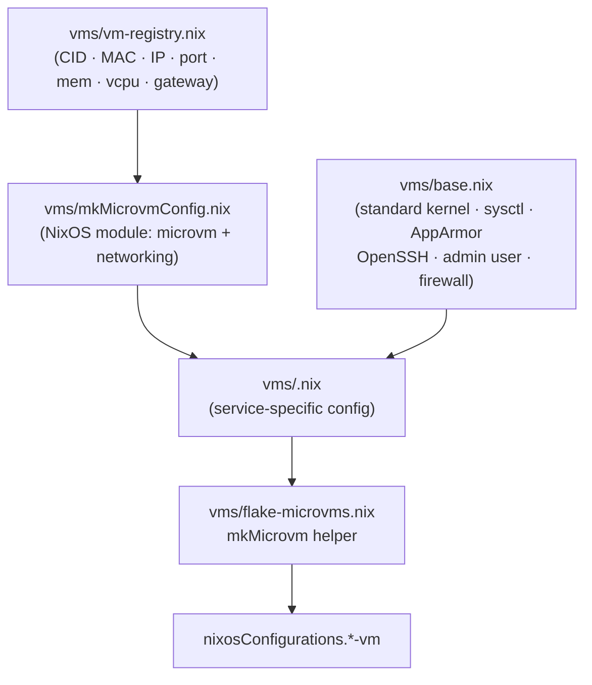
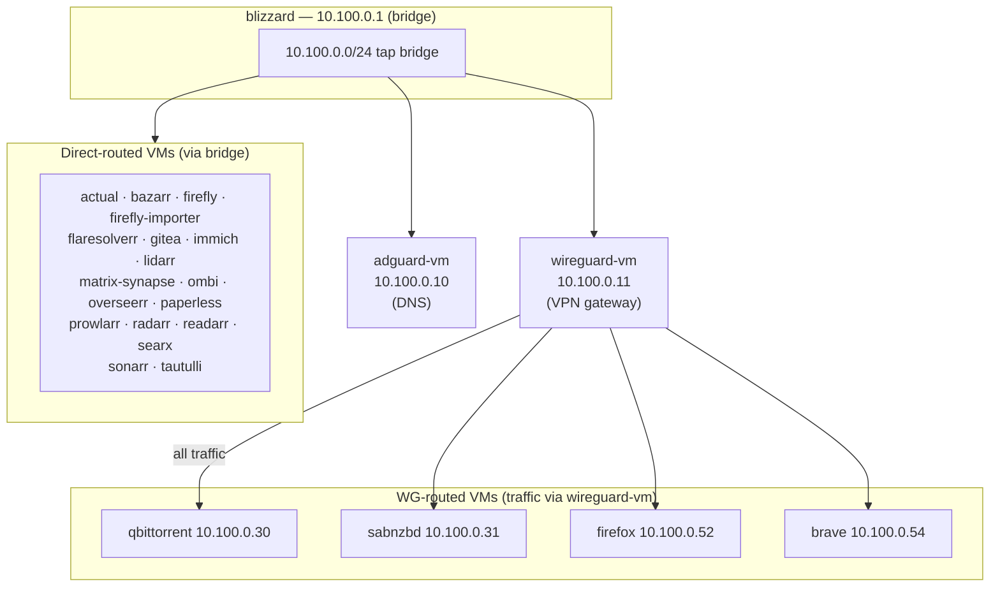

## MicroVM Configurations

Isolated service VMs using [microvm.nix](https://github.com/astro/microvm.nix)
for lightweight virtualization. All 24 VMs run on the `blizzard` host inside
a `10.100.0.0/24` tap bridge.

______________________________________________________________________

### VM build pipeline



______________________________________________________________________

### Network topology



______________________________________________________________________

### VM inventory

| VM | IP | Service port | RAM | vCPU | Network | Purpose |
|----|----|----------- |-----|------|---------|---------|
| adguard | 10.100.0.10 | 11010 | 3 GB | 1 | Direct | DNS sinkhole / ad blocker |
| actual | 10.100.0.51 | 11051 | 1 GB | 1 | Direct | Actual Budget (personal finance) |
| bazarr | 10.100.0.23 | 11023 | 1 GB | 1 | Direct | Subtitle management |
| brave | 10.100.0.54 | 11054 | 4 GB | 4 | Via WG | Containerized Brave browser |
| firefly | 10.100.0.62 | 11062 | 2 GB | 2 | Direct | Firefly III finance |
| firefly-importer | 10.100.0.63 | 11063 | 512 MB | 1 | Direct | Firefly data importer |
| firefox | 10.100.0.52 | 11052 | 4 GB | 4 | Via WG | Containerized Firefox browser |
| flaresolverr | 10.100.0.13 | 11013 | 512 MB | 1 | Direct | Cloudflare bypass for indexers |
| gitea | 10.100.0.50 | 11050 | 2 GB | 2 | Direct | Self-hosted git forge |
| immich | 10.100.0.70 | 11070 | 8 GB | 4 | Direct | Photo library |
| lidarr | 10.100.0.26 | 11028 | 1 GB | 1 | Direct | Music PVR |
| matrix-synapse | 10.100.0.60 | 11060 | 4 GB | 4 | Direct | Matrix homeserver |
| ombi | 10.100.0.41 | 11041 | 1 GB | 1 | Direct | Media request portal (legacy) |
| overseerr | 10.100.0.40 | 11040 | 1 GB | 1 | Direct | Media request portal |
| paperless | 10.100.0.61 | 11061 | 8 GB | 4 | Direct | Document management |
| prowlarr | 10.100.0.20 | 11020 | 1 GB | 1 | Direct | Indexer aggregator |
| qbittorrent | 10.100.0.30 | 11030 | 2 GB | 1 | Via WG | Torrent client |
| radarr | 10.100.0.22 | 11022 | 1 GB | 1 | Direct | Movie PVR |
| readarr | 10.100.0.24 | 11024 | 1 GB | 1 | Direct | Books PVR |
| sabnzbd | 10.100.0.31 | 11031 | 1 GB | 1 | Via WG | Usenet client |
| searx | 10.100.0.12 | 11012 | 2 GB | 1 | Direct | Meta-search engine |
| sonarr | 10.100.0.21 | 11021 | 1 GB | 1 | Direct | TV PVR |
| tautulli | 10.100.0.42 | 11042 | 1 GB | 1 | Direct | Plex statistics |
| wireguard | 10.100.0.11 | 56943 | 512 MB | 1 | Direct | VPN gateway (routes qb/sabnzbd/firefox/brave) |

______________________________________________________________________

### Base configuration (vms/base.nix)

[base.nix](base.nix) provides a hardened-but-compatible foundation for every VM:

- **Standard kernel** (`pkgs.linuxPackages`) — intentionally not the hardened
  variant; chosen for broad driver compatibility. The comment at line 19 of
  `base.nix` makes this explicit.
- **sysctl hardening** — rp_filter=1, no ICMP redirects/broadcasts, no source
  routing, kptr_restrict=2, dmesg_restrict=1, core dumps disabled
  (`kernel.core_pattern = "|/bin/false"`)
- **Kernel module blacklist** — bluetooth, btusb, uvcvideo
- **AppArmor** — enabled with `apparmor-profiles`, killUnconfinedConfinables=true
- **Hardened OpenSSH** — no root, password-only auth disabled, no X11/agent/TCP
  forwarding, MaxAuthTries=3, host keys at `/persist/ssh/`
- **Immutable users** — single `admin` account (wheel group) with
  `VARS.users.zeno.sshPubKey`; sudo requires a password
- **Firewall** — enabled, allowPing=false, logRefusedConnections=false
- **journald caps** — SystemMaxUse=100M, RuntimeMaxUse=50M
- **coredump** — systemd coredump disabled
- **stateVersion** — `"24.11"`

______________________________________________________________________

### Architecture

MicroVMs do **not** use `system-loader.nix` (which would pull in host-only
modules). Their outputs are assembled in [vms/flake-microvms.nix](flake-microvms.nix)
and merged into `nixosConfigurations` from [flake.nix](../flake.nix):

```nix
microvmConfigurations = import ./vms/flake-microvms.nix { inherit inputs system VARS; };

nixosConfigurations = {
  # hosts ...
} // microvmConfigurations;
```

______________________________________________________________________

### Host-side enablement

On `blizzard`, each VM is enabled and exposed via:

```nix
sys.virtualisation.microvm.instances.<name> = {
  enable = true;
  # Optional overrides:
  autostart = true;
  portForward.enable = true;
  cfTunnel.enable = true;
  reverseProxy.enable = true;
};
```

Each instance toggle is independent, so a VM can remain active while
selectively disabling its Cloudflare Tunnel or Traefik routing.

______________________________________________________________________

### WG-routed VMs

`qbittorrent`, `sabnzbd`, `firefox`, and `brave` route all outbound traffic
through `wireguard-vm` (10.100.0.11). This ensures downloads and browser
sessions exit via the VPN rather than the host's public IP. Their default
gateway is set to 10.100.0.11 in the registry.

______________________________________________________________________

### Creating a new VM

1. Add an entry to [vm-registry.nix](vm-registry.nix) with a unique CID, MAC,
   IP, service port, memory, and vCPU count.
1. Create `vms/<service>.nix` importing `./base.nix` and adding the
   service-specific NixOS config.
1. Wire it up in [flake-microvms.nix](flake-microvms.nix) using `mkMicrovm`.
1. Enable on the host: `sys.virtualisation.microvm.instances.<name>.enable = true`.

______________________________________________________________________

### Security considerations

- Each VM has an isolated filesystem; the host shares volumes via virtiofs.
- Secrets are injected per-VM via sops-nix. Services that read
  `/run/secrets/*` at startup should declare `after` and `requires` on
  `sops-install-secrets.service` to avoid boot-order races.
- Network access is limited to the tap bridge; inter-VM traffic is only
  possible where explicitly configured (e.g. firefly-importer → firefly over
  the internal bridge).

______________________________________________________________________

### Related documentation

- [microvm.nix upstream](https://github.com/astro/microvm.nix)
- [modules/services/README.md](../modules/services/README.md) — Service module catalog
- [Blizzard host config](../hosts/blizzard/blizzard.nix) — VM host example
- [vm-registry.nix](vm-registry.nix) — Single source of truth for all VM parameters
