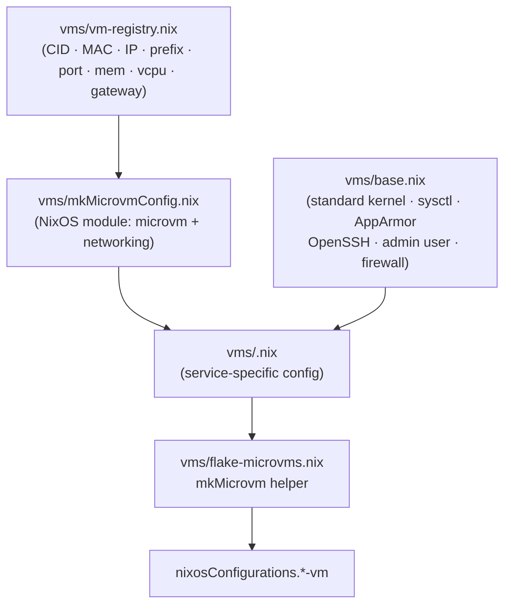
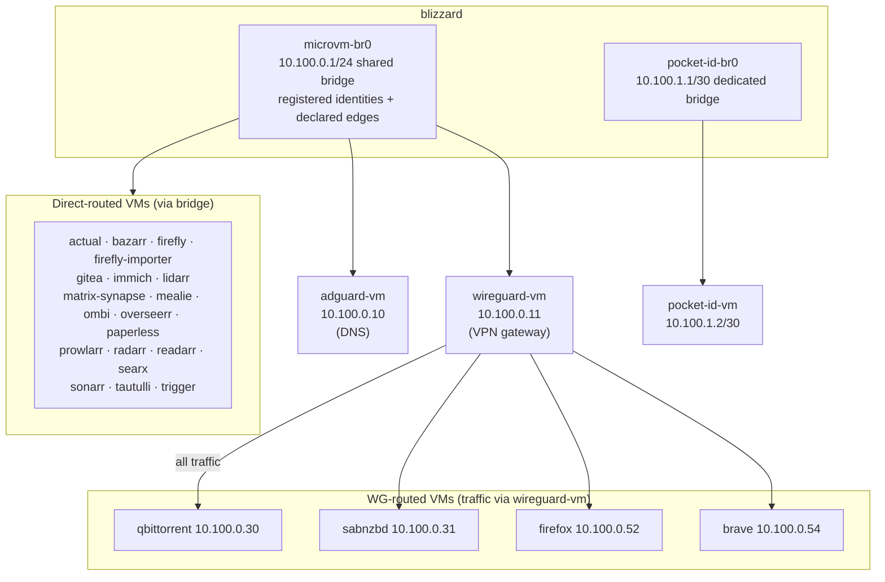
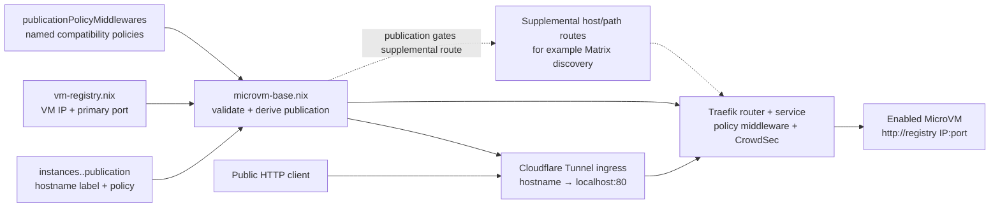

## MicroVM Configurations

Isolated service VMs using [microvm.nix](https://github.com/microvm-nix/microvm.nix)
for lightweight virtualization. The flake currently defines 26 MicroVM
configurations for the `blizzard` host. Most use the shared `10.100.0.0/24`
tap bridge behind a host-owned identity and lateral-access policy; Pocket ID
uses a dedicated `10.100.1.0/30` host-to-VM bridge.

______________________________________________________________________

### VM build pipeline


```mermaid
flowchart TD
    A["vms/vm-registry.nix\n(CID · MAC · IP · prefix · port · mem · vcpu · gateway)"]
    B["vms/mkMicrovmConfig.nix\n(NixOS module: microvm + networking)"]
    C["vms/base.nix\n(standard kernel · sysctl · AppArmor\nOpenSSH · admin user · firewall)"]
    D["vms/<name>.nix\n(service-specific config)"]
    E["vms/flake-microvms.nix\nmkMicrovm helper"]
    F["nixosConfigurations.*-vm"]

    A --> B
    B --> D
    C --> D
    D --> E
    E --> F
```

______________________________________________________________________

### Network topology


```mermaid
flowchart TB
    subgraph host["blizzard"]
        bridge["microvm-br0\n10.100.0.1/24 shared bridge\nregistered identities + declared edges"]
        idbridge["pocket-id-br0\n10.100.1.1/30 dedicated bridge"]
    end

    adguard["adguard-vm\n10.100.0.10\n(DNS)"]
    wg["wireguard-vm\n10.100.0.11\n(VPN gateway)"]

    subgraph direct["Direct-routed VMs (via bridge)"]
        d1["actual · bazarr · firefly · firefly-importer\ngitea · immich · lidarr\nmatrix-synapse · mealie · ombi · overseerr · paperless\nprowlarr · radarr · readarr · searx\nsonarr · tautulli · trigger"]
    end

    subgraph wgrouted["WG-routed VMs (traffic via wireguard-vm)"]
        w1["qbittorrent 10.100.0.30"]
        w2["sabnzbd 10.100.0.31"]
        w3["firefox 10.100.0.52"]
        w4["brave 10.100.0.54"]
    end

    bridge --> adguard
    bridge --> wg
    bridge --> direct
    wg -->|"all traffic"| w1
    wg --> w2
    wg --> w3
    wg --> w4

    pocket["pocket-id-vm\n10.100.1.2/30"]
    idbridge --> pocket
```

______________________________________________________________________

### VM inventory

| VM | IP | Service port | RAM | vCPU | Network | Purpose |
|----|----|-----------|-----|------|---------|---------|
| adguard | 10.100.0.10 | 11010 | 3 GB | 1 | Direct | DNS sinkhole / ad blocker |
| actual | 10.100.0.51 | 11051 | 1 GB | 1 | Direct | Actual Budget (personal finance) |
| bazarr | 10.100.0.23 | 11023 | 1 GB | 1 | Direct | Subtitle management |
| brave | 10.100.0.54 | 11054 | 4 GB | 4 | Via WG | Containerized Brave browser |
| firefly | 10.100.0.62 | 11062 | 2 GB | 2 | Direct | Firefly III finance |
| firefly-importer | 10.100.0.63 | 11063 | 512 MB | 1 | Direct | Firefly data importer |
| firefox | 10.100.0.52 | 11052 | 4 GB | 4 | Via WG | Containerized Firefox browser |
| gitea | 10.100.0.50 | 11050 | 2 GB | 2 | Direct | Self-hosted git forge |
| immich | 10.100.0.70 | 11070 | 8 GB | 4 | Direct | Photo library |
| lidarr | 10.100.0.26 | 11028 | 1 GB | 1 | Direct | Music PVR |
| matrix-synapse | 10.100.0.60 | 11060 | 4 GB | 4 | Gateway only | Matrix homeserver |
| mealie | 10.100.0.71 | 11071 | 1 GB | 1 | Direct | Recipe manager and meal planner |
| ombi | 10.100.0.41 | 11041 | 1 GB | 1 | Direct | Media request portal (legacy) |
| overseerr | 10.100.0.40 | 11040 | 1 GB | 1 | Direct | Media request portal |
| paperless | 10.100.0.61 | 11061 | 8 GB | 4 | Direct | Document management |
| pocket-id | 10.100.1.2 | 11081 | 1 GB | 1 | Dedicated | Passkey-based OIDC identity provider |
| prowlarr | 10.100.0.20 | 11020 | 1 GB | 1 | Direct | Indexer aggregator |
| qbittorrent | 10.100.0.30 | 11030 | 2 GB | 1 | Via WG | Torrent client |
| radarr | 10.100.0.22 | 11022 | 1 GB | 1 | Direct | Movie PVR |
| readarr | 10.100.0.24 | 11024 | 1 GB | 1 | Direct | Books PVR |
| sabnzbd | 10.100.0.31 | 11031 | 1 GB | 1 | Via WG | Usenet client |
| searx | 10.100.0.12 | 11012 | 2 GB | 1 | Direct | Meta-search engine |
| sonarr | 10.100.0.21 | 11021 | 1 GB | 1 | Direct | TV PVR |
| tautulli | 10.100.0.42 | 11042 | 1 GB | 1 | Direct | Plex statistics |
| trigger | 10.100.0.80 | 11080 | 12 GB | 6 | Direct | Trigger.dev v4 background job platform |
| wireguard | 10.100.0.11 | 56943 | 512 MB | 1 | Direct | VPN gateway (routes qb/sabnzbd/firefox/brave) |

______________________________________________________________________

### Matrix network and authentication boundary

The Matrix VM's TCP `11060` port is a guest service port, not a host
port-forward. Nginx listens on `0.0.0.0:11060` inside the VM, while the guest
firewall accepts that port only from Blizzard's MicroVM gateway
`10.100.0.1` on the primary `ens6` interface. The public path is the managed
`matrix` publication through Cloudflare Tunnel and Traefik; no raw host
forward bypasses those controls.

Synapse and MAS web/health listeners are loopback-only. Nginx is the only
trusted MAS proxy, and the public `/_synapse/admin` path returns `403`. MAS
owns password login and email recovery: anonymous password registration is
disabled, while existing password login, recovery, password changes, and
account-profile changes remain enabled during the OIDC migration. OAuth client
registration is a separate dynamic MAS policy used by OIDC-native clients.

Runtime secrets follow a separate, guest-local pipeline. After
`sops-install-secrets.service`, `matrix-synapse-secret.service` and
`mas-secret.service` read their declared SOPS files and write only
`/run/matrix-synapse-secret/shared-secret.yaml` and
`/run/mas-secret/config.json`, respectively. MAS reads the generated config as
well as the Nix-generated base config and writes durable state only to
`/var/lib/mas`; the base config contains no decrypted secret values. The
generator units, `mas-db-init.service`, and MAS itself use systemd sandboxing
with explicit read-only and writable paths. See the [Matrix hardening plan](../docs/matrix-hardening-plan.md)
for the remaining runtime compatibility and rotation gates.

The generators are `Type=oneshot` units with `RemainAfterExit=true`. Treat a
SOPS rotation as an explicit generator-and-consumer restart operation and verify
the resulting runtime files; an initial successful boot does not prove that a
later rotation was consumed.

______________________________________________________________________

### Base configuration (vms/base.nix)

[base.nix](base.nix) provides a hardened-but-compatible foundation for every VM:

- **Standard kernel** (`pkgs.linuxPackages`) — intentionally not the hardened
  variant; chosen for broad driver compatibility. The comment at line 19 of
  `base.nix` makes this explicit.
- **sysctl hardening** — rp_filter=1 (strict; trigger-vm overrides to 2 via `sys.services.trigger.looseRpFilter` in `modules/services/trigger.nix`), no ICMP redirects/broadcasts, no source
  routing, kptr_restrict=2, dmesg_restrict=1, core dumps disabled
  (`kernel.core_pattern = "|/bin/false"`)
- **Kernel module blacklist** — bluetooth, btusb, uvcvideo
- **AppArmor** — enabled with `apparmor-profiles`, killUnconfinedConfinables=true
- **Hardened OpenSSH** — no root, password-only auth disabled, no X11/agent/TCP
  forwarding, MaxAuthTries=3, host keys at `/persist/ssh/`
- **Immutable users** — single `admin` account (wheel group) with
  `VARS.users.zeno.sshPubKey`; sudo requires a password
- **Firewall** — enabled, allowPing=false, logRefusedConnections=false
- **journald caps** — SystemMaxUse=100M, RuntimeMaxUse=50M
- **coredump** — systemd coredump disabled
- **stateVersion** — `"24.11"`

______________________________________________________________________

### Architecture

MicroVMs do **not** use `system-loader.nix` (which would pull in host-only
modules). Their outputs are assembled in [vms/flake-microvms.nix](flake-microvms.nix)
and merged into `nixosConfigurations` from [flake.nix](../flake.nix):

```nix
microvmConfigurations = import ./vms/flake-microvms.nix { inherit inputs system VARS; };

nixosConfigurations = {
  # hosts ...
} // microvmConfigurations;
```

______________________________________________________________________

### Host-side enablement

On `blizzard`, VMs are managed via
`sys.virtualisation.microvm.instances.<name>`. Some instances are currently
disabled (for example `adguard`, `actual`, `lidarr`, and `brave`).

```nix
sys.virtualisation.microvm.instances.<name> = {
  enable = true;

  # Defaults to enable; override when the VM should be defined but not
  # started automatically.
  autostart = false;

  # Optional transport-layer reachability:
  portForward.ports = [ ... ];

  # Optional standard public HTTP publication:
  publication = {
    enable = true;
    hostname = "service";
    policy = "strict";
  };

  # Optional directional private service access. The target IP, MAC, tap, and
  # primary TCP port are derived from vm-registry.nix.
  networkPolicy.allowedPeers.target-vm = {
    primaryService = true;
    reason = "Describe the operational dependency";
  };
};
```

Enabling an instance starts it automatically by default; set `autostart = false`
to keep the VM defined without starting it on boot. Instance enablement never
publishes the VM automatically. A standard publication is an independent
opt-in that maps one hostname under the canonical public domain to the VM's IP
and primary port from
[vm-registry.nix](vm-registry.nix). The host module renders both Cloudflare
Tunnel ingress and the matching Traefik router and service, applies CrowdSec,
and uses strict security headers unless a registered compatibility policy is
selected.


```mermaid
flowchart LR
    DECL["instances.<name>.publication\nhostname label + policy"]
    REG["vm-registry.nix\nVM IP + primary port"]
    POL["publicationPolicyMiddlewares\nnamed compatibility policies"]
    PUB["microvm-base.nix\nvalidate + derive publication"]
    CF["Cloudflare Tunnel ingress\nhostname → localhost:80"]
    TR["Traefik router + service\npolicy middleware + CrowdSec"]
    VM["Enabled MicroVM\nhttp://registry IP:port"]
    CLIENT["Public HTTP client"]
    BESPOKE["Supplemental host/path routes\nfor example Matrix discovery"]

    DECL --> PUB
    REG --> PUB
    POL --> PUB
    PUB --> CF
    PUB --> TR
    CLIENT --> CF --> TR --> VM
    PUB -.->|publication gates supplemental route| BESPOKE
    BESPOKE -.-> TR
```

Compatibility-policy middleware mappings live in
`hosts/blizzard/security/traefik.nix`. Matrix's `matrix.<domain>` workload route
uses the standard publication path. Its root-domain `/.well-known/matrix/`
discovery route remains explicit in the host Traefik configuration, but is
enabled only while the Matrix publication is enabled.

Legacy host-wide MicroVM options were removed in favor of instance-local
intent. Using one of them now fails evaluation with a targeted migration
message:

| Removed option | Replacement |
|---|---|
| `microvm.hypervisor` | Configure the hypervisor in the guest when required |
| `microvm.autostart` | `instances.<name>.autostart` |
| `microvm.vms` | `instances.<name>.flake` and `instances.<name>.vmConfig` |
| `microvm.expose` | `instances.<name>.portForward` and `instances.<name>.publication` |
| `instances.<name>.cfTunnel` | `instances.<name>.publication` or a bespoke host ingress |
| `instances.<name>.reverseProxy` | `instances.<name>.publication` or a bespoke host route |

`immich` is published at `https://photos.zzxyz.no` through Cloudflare Tunnel
and Traefik. Blizzard also forwards TCP `11070` to the same registry service
for direct home-LAN access; `10.100.0.70:11070` remains reachable on the
MicroVM network and through the advertised Tailscale subnet route.

______________________________________________________________________

### Host-side network policy

`modules/virtualisation/microvm-base.nix` owns the MicroVM network policy while
leaving NixOS's standard firewall and NAT backend unchanged. It derives every
enabled VM's bridge, tap, MAC, IP, gateway, and primary service from
`vm-registry.nix` and renders:

- non-aging static FDB entries, permanent networkd neighbor entries, and
  unknown-unicast and multicast flooding disabled on all `vm-*` ports
- a native nftables `bridge` table for Ethernet, ARP, IPv4 identity, declared
  service edges, derived WireGuard clients, unknown taps, and broadcast or
  multicast filtering
- a native nftables `inet` table that blocks routing from `microvm-br0` back to
  itself and between MicroVM bridges

The default mode is `enforce`, and Blizzard is configured explicitly for
`enforce` in `hosts/blizzard/virtualisation/microvms.nix`. The dated
[deployment audit](../docs/deployment-audit-2026-08-08-microvm-networking.md)
records the preceding audit window and the explicit decision to enable
enforcement; it is historical evidence rather than the current runtime mode.

An allowed peer is directional. `primaryService = true` permits new TCP
connections only to the target registry port; `tcpPorts` and `udpPorts` add
explicit ports. Stateful replies are allowed, but a new reverse connection
needs its own declaration. Peer ICMP is not implied. Dedicated-bridge VMs
cannot receive exceptions, and a newly enabled VM receives no lateral access
by default. Gateway pairs such as `qbittorrent -> wireguard` are derived from
the registry rather than declared manually.

Operational inspection on Blizzard:

```bash
systemctl status microvm-network-policy.service
sudo nft list table bridge microvm_policy
sudo nft list table inet microvm_policy
journalctl -u microvm-network-policy.service
journalctl -k -g 'microvm-policy'
```

In `enforce`, inspect the named `lateral_drops` counter and
`microvm-policy lateral-drop:` messages. Historical audit counters and ruleset
snapshots are retained under `/var/lib/microvm-network-policy/` when the policy
is reloaded. The supported rollback is declarative: return to `audit` or
switch/boot the previous NixOS generation. Stopping the policy service does not
delete its tables.

______________________________________________________________________

### WG-routed VMs

`qbittorrent`, `sabnzbd`, `firefox`, and `brave` are configured to route all
outbound traffic through `wireguard-vm` (10.100.0.11); Brave is currently
disabled on Blizzard. This ensures enabled download and browser sessions exit
via the VPN rather than the host's public IP. Their default gateway is set to
10.100.0.11 in the registry.

### Firefox transfer directory

The Firefox VM has a dedicated persistent `firefox-downloads.img` volume mounted
at `/home/admin/Downloads`. The LinuxServer Firefox container exposes only that
directory at `/downloads`; its Selkies file manager is configured for both
uploads and downloads. The Firefox browser itself must be pointed at `/downloads`
once in its Settings → General → Downloads panel. This keeps browser transfer
data separate from the `/config` profile volume and avoids changing the VM's
passworded `wheel` sudo policy.

The same directory is available to the VM's `admin` account, so ordinary SSH
file transfer works without sudo or SSH forwarding. For example, from a device
that can reach the VM:

```bash
sftp admin@10.100.0.52
put local-file /home/admin/Downloads/
get /home/admin/Downloads/remote-file
```

The web UI's file sidebar and SFTP both operate on the dedicated directory. Do
not mount the whole `/home/admin` directory into the container: the LinuxServer
Firefox interface includes a terminal with passwordless sudo inside the
container, so its access should remain limited to the intended transfer path.

______________________________________________________________________

### Creating a new VM

1. Add an entry to [vm-registry.nix](vm-registry.nix) with a unique CID, MAC,
   IP, service port, memory, and vCPU count.
1. Create `vms/<service>.nix` importing `./base.nix` and adding the
   service-specific NixOS config.
1. Wire it up in [flake-microvms.nix](flake-microvms.nix) using `mkMicrovm`.
1. Enable on the host: `sys.virtualisation.microvm.instances.<name>.enable = true`.
1. Declare each required private peer service under
   `instances.<source>.networkPolicy.allowedPeers.<target>`; the default is no
   lateral access.
1. If it needs the standard public HTTP path, explicitly enable
   `instances.<name>.publication` with one hostname and a registered
   compatibility policy.

______________________________________________________________________

### Security considerations

- Each VM has an isolated filesystem; the host shares directories via virtiofs (`microvm.shares`), and VM state is stored in per-VM disk images (`microvm.volumes`).
- Secrets are injected per-VM via sops-nix. Services that read
  `/run/secrets/*` at startup should declare `after` and `requires` on
  `sops-install-secrets.service` to avoid boot-order races.
- VMs may share `microvm-br0`, but the host validates their registry MAC and
  ARP identity, and validates IPv4 sources for ordinary VMs. The WireGuard
  gateway is intentionally exempt from the ordinary source-IP check so it can
  originate traffic for its derived VPN clients; its host input path remains
  constrained. Static FDB/neighbor bindings prevent unknown-unicast observation
  and host ARP-cache poisoning. The guest firewall remains an independent
  defense.
- Pocket ID additionally uses a dedicated bridge. Host-level nftables routing
  filters prevent shared-bridge peers from reaching it, and its guest firewall
  accepts TCP ports `22` and `11081` only from Blizzard's dedicated bridge
  address.

______________________________________________________________________

### Related documentation

- [microvm.nix upstream](https://github.com/microvm-nix/microvm.nix)
- [Immich backup and recovery](../docs/immich-backup.md) — Offsite image backup, retention, and restore runbook
- [modules/services/README.md](../modules/services/README.md) — Service module catalog
- [Blizzard host config](../hosts/blizzard/blizzard.nix) — VM host example
- [vm-registry.nix](vm-registry.nix) — Single source of truth for all VM parameters
- [Infrastructure context](../CONTEXT.md) — Canonical publication terminology
- [ADR 0001](../docs/adr/0001-model-public-http-publication-as-instance-intent.md) — Publication interface decision
- [ADR 0002](../docs/adr/0002-enforce-host-owned-microvm-network-policy.md) — Host-owned identity and lateral-access policy
